# Tradutor.IA

**Pipeline local para transformar capítulos ilustrados em versões traduzidas para PT-BR, com OCR híbrido, validação de qualidade e geração de PDF.**


Tradutor.IA organiza em um único fluxo a coleta de páginas, o reconhecimento de texto, a classificação semântica, a tradução, a reconstrução visual e a geração do PDF. O projeto foi desenhado para preservar evidências de cada etapa e encaminhar resultados duvidosos para revisão, em vez de tratá-los silenciosamente como corretos.

O fluxo principal atual é voltado a capítulos web com texto-fonte em inglês e tradução para português brasileiro. Ele pode ser operado por uma interface local ou pela linha de comando.

## Demonstração visual

> Uma demonstração pública ainda não está versionada no repositório. Isso evita publicar páginas de terceiros ou artefatos de usuários. Uma futura demonstração deverá usar somente material próprio ou autorizado.

## Principais recursos

- **Aquisição HTTP-first:** para fontes cujo leitor é servido no HTML inicial, a descoberta de páginas usa um GET limitado e sem cookies; Chrome/Selenium só entra como fallback quando esse caminho não se aplica ou não conclui.
- **Análise de fonte controlada:** adapters específicos têm prioridade; uma URL pública sem adapter pode ser analisada por evidências e, conforme o score, seguir, pedir confirmação das páginas ou falhar fechada.
- **OCR RapidOCR:** RapidOCR é o engine primário da configuração Beta, com recuperação regional limitada. PaddleOCR é compatibilidade legacy, desligada por padrão.
- **Classificação contextual:** diferencia fala, narração, SFX e elementos decorativos antes de decidir o que deve ser traduzido.
- **Tradução em lote:** o provedor padrão é o **DeepL**; Riva e Nemotron (NVIDIA) continuam selecionáveis por capítulo. Cache, controle de requisições e retries em todos, e nenhum fallback silencioso entre providers.
- **Memória de capítulo:** um ledger de terminologia e um registro de personagens preservam nomes próprios e formas canônicas ao longo do capítulo; um candidato que contradiz uma entidade já estabelecida é rejeitado ou marcado para revisão.
- **Validação multilíngue:** procura texto-fonte residual, traduções parciais e outros sinais de mistura de idiomas sem reescrever a resposta do modelo.
- **Reconstrução protegida:** aplica máscaras, inpainting, ajuste de fonte e verificações visuais para limitar alterações fora da área de texto.
- **Artefatos de revisão:** produz PDF, relatórios JSON/HTML, progresso persistido, métricas e um quality gate com estados explícitos.
- **Fila persistente:** o pipeline roda num worker independente da UI; fechar o navegador não interrompe um capítulo.
- **Execução supervisionada:** o launcher canônico reinicia o worker que ele criou sob política limitada (2s/5s/15s, 3 tentativas, depois degradado) e persiste o exit code real controlando a árvore de processos no Windows.

## Como funciona

```mermaid
flowchart LR
    A[URL do capítulo] --> B[Descoberta de fonte HTTP-first]
    B --> C[Download e validação]
    C --> D[OCR RapidOCR e recuperação]
    D --> E[Classificação de regiões]
    E --> F[Tradução em lote]
    F --> G[Validação semântica, terminologia e resíduo]
    G --> H[Reconstrução de arte e tipografia]
    H --> I[Validação pós-render]
    I --> J[PDF e relatórios]
    J --> K{Quality gate}
    K -->|Aprovado| L[finished]
    K -->|Revisão necessária| M[review_required]
    L --> N[Leitor e Histórico]
    M --> N
```



A ordem detalhada, com os módulos reais de cada etapa, está em
[Arquitetura](docs/ARCHITECTURE.md).

O pipeline mantém o texto reconhecido, os candidatos de OCR, as decisões de fallback, os motivos de validação e as métricas visuais nos artefatos de execução. Assim, uma conclusão técnica pode gerar um PDF e ainda terminar como `review_required` quando houver itens que mereçam inspeção humana.

## Início rápido

O ambiente auditado usa **Windows 64 bits e Python 3.11**. São necessários Git e uma chave do DeepL para o provedor de tradução padrão. Google Chrome é opcional: ele só é usado quando a descoberta HTTP não se aplica à fonte.

O passo a passo completo de ambiente, comandos e testes está em
[Desenvolvimento](docs/DEVELOPMENT.md).

```powershell
git clone https://github.com/HenriquePvAr/Tradutor.Ia.git
cd Tradutor.Ia

py -3.11 -m venv .venv
.\.venv\Scripts\Activate.ps1
python -m pip install --upgrade pip
pip install -r requirements.txt
pip install -r requirements-rapidocr.txt
pip install -r requirements-ui.txt

Copy-Item .env.example .env
```

Edite `.env` e preencha `DEEPL_API_KEY` (provedor padrão) e as variáveis do Supabase, que o login exige. As demais opções possuem defaults conservadores e podem ser ajustadas depois. Nunca versione valores reais de chave.

Para iniciar o sistema local (worker supervisionado + interface):

```powershell
python start_tradutor.py            # canônico: worker + UI
python start_tradutor.py status     # saúde do worker e da fila
python start_tradutor.py stop       # parada graciosa do worker
```

No Windows há também `start_tradutor.bat`. A aplicação escuta por padrão em `http://127.0.0.1:8080`.

> `python app_ui.py` sobe apenas a interface, sem worker; nesse caso os capítulos ficam `queued` até que um worker seja iniciado.

Para executar pela CLI:

```powershell
python run_webtoon.py "<URL_DO_CAPITULO>" --mode fast --no-context
```

O cache é reutilizado por padrão. Use `--force` somente quando quiser reprocessar download, OCR, tradução e renderização. Consulte o [guia de instalação](docs/INSTALLATION.md) antes da primeira execução completa e a [referência de configuração](docs/CONFIGURATION.md) para ajustar recursos e qualidade.

Uma URL HTTP(S) pública sem adapter específico pode passar pela análise universal, mas isso
não significa que o site seja suportado. O sistema só continua quando encontra evidência
suficiente **e completa dentro dos limites** para o conjunto de páginas; em confiança média,
a UI pede confirmação antes do OCR. Cobertura incompleta, autenticação, challenges, conteúdo
protegido e leitores não observáveis falham fechados. Consulte as limitações de segurança e
de formatos em [Adaptador universal de capítulos](docs/UNIVERSAL_CHAPTER_ADAPTER.md) antes de
usar esse fallback.

## Modos de execução

Em ambos os modos o engine primário é **RapidOCR** (`config.BETA_OCR_ENGINE`). O modo não
troca o engine; ele decide quanto esforço de recuperação é permitido.

| Modo | Estratégia | Indicação |
| --- | --- | --- |
| `fast` | RapidOCR com fallbacks pesados desativados por padrão; uma leitura duvidosa vira revisão em vez de bloquear o capítulo | Uso geral e iteração mais rápida |
| `quality` | RapidOCR com os caminhos de recuperação e validação mais caros habilitados, incluindo validação de OCR pós-render | Comparações conservadoras e diagnóstico |

PaddleOCR não é dependência obrigatória de nenhum dos modos: é compatibilidade legacy
explicitamente opt-in (`OCR_LEGACY_PADDLE_FALLBACK`, desligado por padrão).

Exemplos:

```powershell
# Execução rápida com cache
python run_webtoon.py "<URL_DO_CAPITULO>" --mode fast

# OCR inicial com PaddleOCR e saída nomeada
python run_webtoon.py "<URL_DO_CAPITULO>" --mode quality --output "meu_capitulo"

# Apenas coleta e auditoria do download
python run_webtoon.py "<URL_DO_CAPITULO>" --download-only
```

A referência completa das flags está disponível em `python run_webtoon.py --help`.

## Arquitetura em poucas linhas

| Área | Responsabilidade principal |
| --- | --- |
| `start_tradutor.py`, `worker_supervisor.py` | Launcher canônico e supervisão limitada do worker |
| `app_ui.py` e `ui_bridge.py` | Interface local, progresso, revisão e histórico (não executa o pipeline) |
| `worker_service.py`, `job_runner.py`, `job_store.py` | Fila persistente, worker independente e execução isolada por capítulo |
| `run_webtoon.py` | Entrada simplificada da CLI e seleção de modo |
| `benchmark_pipeline.py` | Orquestração do fluxo ponta a ponta e relatórios |
| `chapter_source.py`, `http_source_discovery.py` | Seleção de adapter e descoberta de páginas HTTP-first |
| `down.py` | Coleta, validação, fallback de navegador e teardown |
| `ocr_engine.py` e `ocr_balloon.py` | OCR, recuperação, agrupamento, classificação, validação e reconstrução |
| `translator_deepl.py`, `translator_nvidia.py` | Tradução em lote, rate limit, retries e cache |
| `session_context.py` | Ledger de terminologia e registro de personagens do capítulo |
| `semantic_fidelity.py`, `linguistic_audit.py` | Veredito semântico e auditoria linguística do candidato |
| `art_text_inpainting.py`, `advanced_art_inpainting.py` | Remoção do lettering de origem e reconstrução de arte |
| `pipeline_cache.py`, `resource_monitor.py` | Cache versionado, persistência atômica e métricas de recursos |
| `pdf.py`, `pdf_naming.py`, `pdf_reader.py` | Páginas lógicas, geração, nomeação e leitura do PDF |
| `process_launcher.py` | Execução supervisionada de um processo e persistência do exit code |

O desenho completo está em [Documentação Técnica](docs/technical/DOCUMENTACAO_TECNICA.md); a visão por módulos do pipeline continua em [Arquitetura](docs/ARCHITECTURE.md).

## Filosofia de qualidade

O princípio central do pipeline é **fail-closed**: quando ele não consegue *provar* que uma
alteração é segura, ele prefere sinalizar dúvida a produzir um resultado plausível.

Na prática, diante de evidência insuficiente o sistema escolhe uma destas saídas:

- marcar a região como `review_required`, ou
- preservar os pixels de origem.

E nunca:

- inventa uma tradução para preencher a lacuna;
- apaga texto da origem sem ter um substituto válido para colocar no lugar;
- aceita um candidato semanticamente duvidoso só porque é gramatical.

**`review_required` não significa job quebrado.** Uma execução pode terminar com PDF válido,
completo e legível e ainda assim carregar regiões marcadas para inspeção humana. O estado
separa *sucesso técnico* de *aprovação de qualidade*; `failed` é que indica falha técnica ou
artefato essencial ausente.

Quando a evidência é não apenas incerta mas inutilizável, a região recebe `REVIEW_UNUSABLE`
e **não renderiza**: os pixels de origem permanecem. É preferível uma página com o texto
original visível a uma página com texto errado apresentado como correto.

O mesmo vale para a reconstrução de arte: se o modelo local de reconstrução não estiver
disponível ou não passar na verificação, o resultado é indisponibilidade/revisão, nunca um
render forçado.

## Qualidade e execução segura

O sistema combina verificações em vários níveis:

- score de qualidade do OCR e comparação entre engines para regiões suspeitas;
- preservação de SFX por padrão e decisão de tradução baseada em classificação;
- validação de resíduos em inglês ou espanhol e de fragmentos parcialmente traduzidos;
- retries controlados, rejeição do candidato inválido e marcação para revisão manual;
- validação de overflow, bordas, mudanças fora da máscara e páginas inválidas;
- consistência de terminologia e de nome próprio ao longo do capítulo;
- escrita atômica dos principais JSONs e do exit code do launcher;
- teardown limitado do navegador e controle da árvore de processos no Windows.

Os estados terminais têm significados distintos:

| Estado | Significado |
| --- | --- |
| `finished` | Execução técnica concluída e quality gate aprovado |
| `review_required` | Execução concluída, com PDF disponível, mas há revisão de qualidade pendente |
| `failed` | Falha técnica ou artefato essencial ausente (exibido como "erro" na interface) |
| `cancelled` | Cancelamento explícito |

A taxonomia completa (14 estados, incluindo `staging`, `awaiting_source_review`, `interrupted` e `resumable`) está em [Documentação Técnica §8](docs/technical/DOCUMENTACAO_TECNICA.md#8-máquina-de-estados-do-job).

Esses mecanismos reduzem falsos positivos, mas não garantem tradução perfeita. Veja [Qualidade e validação](docs/QUALITY_AND_VALIDATION.md) para o contrato completo.

## Status do projeto

O Tradutor.IA está em **beta técnica**. O pipeline principal está sob
**[Quality Freeze](docs/QUALITY_FREEZE.md)**: comportamento de produção, dependências
pinadas e evidência de qualidade são tratados como um contrato único, e nenhum dos três muda
sem novo E2E real.

| Área | Estado |
| --- | --- |
| Pipeline ponta a ponta | Funcional, sob Quality Freeze |
| Descoberta de fonte HTTP | Funcional para as fontes cujo adapter a suporta |
| Fallback de navegador | Disponível para as demais fontes |
| OCR — RapidOCR | Engine primário |
| OCR — PaddleOCR | Desligado por padrão (compatibilidade legacy opt-in) |
| Tradução — DeepL | Provider padrão |
| Reconstrução visual | Funcional; fidelidade em regiões texturizadas continua um eixo aberto |
| PDF final | Funcional |
| Leitor interno | Implementado (aba **Leitor**, ação **LER** no Histórico) |
| Histórico | Implementado |
| Comunidade (Supabase + Drive) | Implementado; fail-closed quando não configurado |
| Refinamento natural PT-BR (Nemotron) | **Não automático** — sugestão manual, explicitamente autorizada, na revisão; nunca aplica tradução sozinha |
| Retomada de job interrompido pela UI | Parcial — a API existe, o controle na interface não |
| Instalador para usuário final | **Não existe** |
| Instalação limpa em Windows | **Não provada** |
| Updater | Parcial — staging, ativação atômica e rollback existem; canal assinado e UI pendentes |
| Distribuição Beta | Em preparação |

Nada nesta tabela deve ser lido a partir do roadmap: um item só aparece como implementado
quando há código correspondente no repositório.

A revisão humana continua importante. SFX com tipografia complexa, texto decorativo,
naturalidade do PT-BR, fontes incomuns e páginas visualmente densas podem exigir ajuste ou
inspeção. O suporte end-to-end foi auditado no Windows; outros sistemas não fazem parte do
contrato validado atual. Use apenas conteúdo que você tenha autorização para processar.

## Empacotamento e distribuição

A baseline de empacotamento está pronta — pipeline congelado, manifests pinados e evidência
de E2E registrada. **A instalação limpa ainda não foi provada:** não existe validação em uma
máquina Windows limpa, nem instalador no repositório.

A próxima fase planejada inclui distribuição única de OpenCV, runtime empacotado,
instalador, teste em Windows limpo, updater e distribuição Beta controlada. Detalhes e
estado por item em [Desenvolvimento](docs/DEVELOPMENT.md#empacotamento-e-distribuição).

## Riscos conhecidos

Riscos técnicos abertos e formalmente registrados, com detalhe em
[Desenvolvimento](docs/DEVELOPMENT.md#riscos-conhecidos):

- `OPENCV-THRESHOLD-SENSITIVITY-001` — limiares de pixel calibrados contra o `cv2`
  congelado; trocar versão ou variante exige reexecutar o E2E de qualidade.
- `OPENCV-VARIANT-SHADOWING-001` — três variantes de OpenCV coexistem no ambiente de
  desenvolvimento e o `cv2` efetivamente importado vem da variante `-headless`, não da
  declarada como contratual. **Aberto e não resolvido.**
- `CLEAN-INSTALL-NOT-YET-PROVEN` — nenhuma instalação limpa em Windows foi validada.
- Chrome/Selenium pode falhar ao iniciar em máquinas afetadas por problemas de Microsoft
  Platform Crypto Provider / TPM, inutilizando o fallback de navegador. A descoberta HTTP
  evita essa dependência para as fontes que a suportam.
- Reconstrução de arte em textura e naturalidade semântica PT-BR permanecem eixos abertos.

## Documentação

Página inicial da documentação: **[docs/README.md](docs/README.md)**.

- [Guia do Usuário](docs/user/GUIA_DO_USUARIO.md) — para Scans, tradutores e testadores da Beta.
- [Documentação Técnica](docs/technical/DOCUMENTACAO_TECNICA.md) — arquitetura, processos, estados, segurança, testes e dívida técnica.
- [Política de Documentação](docs/DOCUMENTATION_POLICY.md) — regras de sincronização entre código e documentação.
- [Arquitetura](docs/ARCHITECTURE.md) — detalhe técnico do pipeline e das fronteiras entre componentes.
- [Desenvolvimento](docs/DEVELOPMENT.md) — setup, execução, testes, dependências externas, empacotamento e riscos conhecidos.
- [Qualidade e validação](docs/QUALITY_AND_VALIDATION.md) — gates, estados terminais e limites conhecidos.
- [Quality Freeze](docs/QUALITY_FREEZE.md) — o que está congelado, a evidência e como sair do freeze.
- [Instalação](docs/INSTALLATION.md) · [Configuração](docs/CONFIGURATION.md) · [Testes](docs/TESTING.md) · [Adaptador universal](docs/UNIVERSAL_CHAPTER_ADAPTER.md) · [Segurança](docs/SECURITY.md) · [Troubleshooting](docs/TROUBLESHOOTING.md).

## Testes

Os testes padrão são offline. Smokes que acessam rede ficam em `scripts/`, exigem opt-in
explícito e estão documentados em [Testes](docs/TESTING.md).

```powershell
python -m pytest                                     # suíte hermética Python
node --experimental-vm-modules test_chapter_reader.mjs   # suítes de frontend
```

A flag `--experimental-vm-modules` é obrigatória para as suítes `.mjs`. Comandos completos em
[Desenvolvimento](docs/DEVELOPMENT.md#testes).

## Roadmap

> Esta seção descreve **intenções**, não comportamento disponível. Nada aqui deve ser lido como recurso existente. Empacotamento (`Setup.exe`) e distribuição externa ainda **não existem** nesta versão. O licenciamento remoto já tem schema/RPC/RLS, mas o primeiro entitlement real de tester ainda não foi criado.

- criar exatamente um entitlement real controlado de tester antes de Setup/Beta externa;
- melhorar reconstrução de arte em regiões texturizadas/open-art; sentinelas: página 5
  com texto fantasma/contraste ruim e página 25 com patch retangular claro sobre textura;
- criar gate semântico/natural PT-BR para traduções gramaticais mas erradas; sentinelas:
  “rato do slim”, sintaxe quebrada e perda de sentido do caso P068;
- adicionar visualizador PDF integrado com zoom, fit-width, thumbnails, teclado, tela cheia
  e abertura direta pelo Histórico;
- entregar instalador para usuário final e canal de atualização assinado;
- expor a retomada de capítulo interrompido na interface;
- aprimorar a classificação de SFX e elementos decorativos;
- melhorar naturalidade e consistência da tradução PT-BR;
- ampliar a validação visual e os relatórios de revisão;
- simplificar a instalação e o gerenciamento de modelos;
- evoluir os testes end-to-end automatizados com material autorizado;
- adicionar uma demonstração pública reproduzível.

## Autor

Desenvolvido por [Henrique Araujo](https://github.com/HenriquePvAr).
