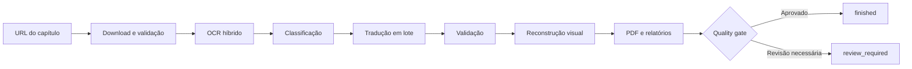

# Tradutor.IA

**Pipeline local para transformar capítulos ilustrados em versões traduzidas para PT-BR, com OCR híbrido, validação de qualidade e geração de PDF.**


Tradutor.IA organiza em um único fluxo a coleta de páginas, o reconhecimento de texto, a classificação semântica, a tradução, a reconstrução visual e a geração do PDF. O projeto foi desenhado para preservar evidências de cada etapa e encaminhar resultados duvidosos para revisão, em vez de tratá-los silenciosamente como corretos.

O fluxo principal atual é voltado a capítulos web com texto-fonte em inglês e tradução para português brasileiro. Ele pode ser operado por uma interface local ou pela linha de comando.

## Demonstração visual

> Uma demonstração pública ainda não está versionada no repositório. Isso evita publicar páginas de terceiros ou artefatos de usuários. Uma futura demonstração deverá usar somente material próprio ou autorizado.

## Principais recursos

- **Aquisição auditável:** coleta páginas com Selenium, valida quantidade, integridade e ordem e registra o teardown do navegador.
- **OCR híbrido:** o modo rápido combina RapidOCR com análise de qualidade e fallbacks seletivos para PaddleOCR Mobile e PaddleOCR completo.
- **Classificação contextual:** diferencia fala, narração, SFX e elementos decorativos antes de decidir o que deve ser traduzido.
- **Tradução em lote:** usa por padrão uma API compatível com OpenAI hospedada pela NVIDIA, com cache, controle de requisições e retries.
- **Validação multilíngue:** procura texto-fonte residual, traduções parciais e outros sinais de mistura de idiomas sem reescrever a resposta do modelo.
- **Reconstrução protegida:** aplica máscaras, inpainting, ajuste de fonte e verificações visuais para limitar alterações fora da área de texto.
- **Artefatos de revisão:** produz PDF, relatórios JSON/HTML, progresso persistido, métricas e um quality gate com estados explícitos.
- **Execução supervisionada:** inclui um launcher que persiste o exit code real e controla a árvore de processos no Windows.

## Como funciona



O pipeline mantém o texto reconhecido, os candidatos de OCR, as decisões de fallback, os motivos de validação e as métricas visuais nos artefatos de execução. Assim, uma conclusão técnica pode gerar um PDF e ainda terminar como `review_required` quando houver itens que mereçam inspeção humana.

## Início rápido

O ambiente auditado usa **Windows 64 bits e Python 3.11**. É necessário ter Git, Google Chrome e uma chave da NVIDIA para o provedor de tradução padrão.

```powershell
git clone https://github.com/HenriquePvAr/Tradutor.Ia.git
cd Tradutor.Ia

py -3.11 -m venv .venv
.\.venv\Scripts\Activate.ps1
python -m pip install --upgrade pip
pip install -r requirements.txt
pip install -r requirements-rapidocr.txt
pip install -r requirements-ui.txt

Copy-Item .env.example .env
```

Edite `.env` e substitua o valor de `NVIDIA_API_KEY`. As demais opções possuem defaults conservadores e podem ser ajustadas depois.

Para abrir a interface local:

```powershell
python app_ui.py
```

A aplicação escuta por padrão em `http://127.0.0.1:8080`.

Para executar pela CLI:

```powershell
python run_webtoon.py "<URL_DO_CAPITULO>" --mode fast --no-context
```

O cache é reutilizado por padrão. Use `--force` somente quando quiser reprocessar download, OCR, tradução e renderização. Consulte o [guia de instalação](docs/INSTALLATION.md) antes da primeira execução completa e a [referência de configuração](docs/CONFIGURATION.md) para ajustar recursos e qualidade.

## Modos de execução

| Modo | Estratégia de OCR | Indicação |
| --- | --- | --- |
| `fast` | RapidOCR, salvaguardas de qualidade e fallback Paddle seletivo | Uso geral e iteração mais rápida |
| `quality` | PaddleOCR como engine inicial | Comparações conservadoras e diagnóstico |

Exemplos:

```powershell
# Execução rápida com cache
python run_webtoon.py "<URL_DO_CAPITULO>" --mode fast

# OCR inicial com PaddleOCR e saída nomeada
python run_webtoon.py "<URL_DO_CAPITULO>" --mode quality --output "meu_capitulo"

# Apenas coleta e auditoria do download
python run_webtoon.py "<URL_DO_CAPITULO>" --download-only
```

A referência completa das flags está disponível em `python run_webtoon.py --help`.

## Arquitetura em poucas linhas

| Área | Responsabilidade principal |
| --- | --- |
| `app_ui.py` e `ui_bridge.py` | Interface local, fila, progresso e histórico |
| `run_webtoon.py` | Entrada simplificada da CLI e seleção de modo |
| `benchmark_pipeline.py` | Orquestração do fluxo ponta a ponta e relatórios |
| `down.py` | Coleta, validação e teardown do navegador |
| `ocr_engine.py` e `ocr_balloon.py` | OCR, fallback, agrupamento, classificação, validação e reconstrução |
| `translator_nvidia.py` | Tradução em lote, rate limit, retries e cache |
| `pipeline_cache.py`, `resource_monitor.py` | Cache versionado, persistência atômica e métricas de recursos |
| `pdf.py` | Divisão em páginas lógicas e geração do PDF |
| `process_launcher.py` | Supervisão de processos e persistência do exit code |

O desenho completo, inclusive os fluxos separados da UI, CLI e launcher, está em [Arquitetura](docs/ARCHITECTURE.md).

## Qualidade e execução segura

O sistema combina verificações em vários níveis:

- score de qualidade do OCR e comparação entre engines para regiões suspeitas;
- preservação de SFX por padrão e decisão de tradução baseada em classificação;
- validação de resíduos em inglês ou espanhol e de fragmentos parcialmente traduzidos;
- retries controlados, rejeição do candidato inválido e marcação para revisão manual;
- validação de overflow, bordas, mudanças fora da máscara e páginas inválidas;
- escrita atômica dos principais JSONs e do exit code do launcher;
- teardown limitado do Selenium e controle da árvore de processos no Windows.

Os estados terminais têm significados distintos:

| Estado | Significado |
| --- | --- |
| `finished` | Execução técnica concluída e quality gate aprovado |
| `review_required` | Execução concluída, com PDF disponível, mas há revisão de qualidade pendente |
| `error` | Falha técnica ou artefato essencial ausente |
| `cancelled` | Cancelamento explícito |

Esses mecanismos reduzem falsos positivos, mas não garantem tradução perfeita. Veja [Qualidade e validação](docs/QUALITY_AND_VALIDATION.md) para o contrato completo.

## Estado atual

O Tradutor.IA está em **beta técnica e desenvolvimento ativo**. O pipeline ponta a ponta, a UI local, a CLI, o PDF, os caches, os relatórios e o quality gate são funcionais e cobertos por suítes de regressão locais.

Ainda assim, a revisão humana continua importante. SFX com tipografia complexa, texto decorativo, naturalidade do PT-BR, fontes incomuns e páginas visualmente densas podem exigir ajuste ou inspeção. O suporte end-to-end foi auditado no Windows; outros sistemas não fazem parte do contrato validado atual. Use apenas conteúdo que você tenha autorização para processar.

## Documentação

- [Instalação](docs/INSTALLATION.md) — ambiente, dependências, modelos e primeiro teste.
- [Configuração](docs/CONFIGURATION.md) — variáveis do `.env.example`, defaults e ajustes avançados.
- [Arquitetura](docs/ARCHITECTURE.md) — módulos, fluxos, cache, launcher e artefatos.
- [Qualidade e validação](docs/QUALITY_AND_VALIDATION.md) — fallbacks, retries, quality gate e estados.
- [Troubleshooting](docs/TROUBLESHOOTING.md) — diagnóstico seguro para falhas conhecidas.

## Testes

Os testes padrão são offline. Smokes que acessam rede ficam em `scripts/`,
exigem opt-in explícito e estão documentados em [Testes](docs/TESTING.md).

## Roadmap

- aprimorar a classificação de SFX e elementos decorativos;
- melhorar naturalidade e consistência da tradução PT-BR;
- ampliar a validação visual e os relatórios de revisão;
- simplificar a instalação e o gerenciamento de modelos;
- evoluir os testes end-to-end automatizados com material autorizado;
- adicionar uma demonstração pública reproduzível.

## Autor

Desenvolvido por [Henrique Araujo](https://github.com/HenriquePvAr).
