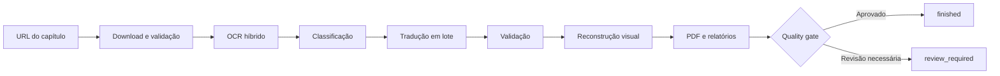

# Tradutor.IA

**Pipeline local para transformar capítulos ilustrados em versões traduzidas para PT-BR, com OCR híbrido, validação de qualidade e geração de PDF.**


Tradutor.IA organiza em um único fluxo a coleta de páginas, o reconhecimento de texto, a classificação semântica, a tradução, a reconstrução visual e a geração do PDF. O projeto foi desenhado para preservar evidências de cada etapa e encaminhar resultados duvidosos para revisão, em vez de tratá-los silenciosamente como corretos.

O fluxo principal atual é voltado a capítulos web com texto-fonte em inglês e tradução para português brasileiro. Ele pode ser operado por uma interface local ou pela linha de comando.

## Demonstração visual

> Uma demonstração pública ainda não está versionada no repositório. Isso evita publicar páginas de terceiros ou artefatos de usuários. Uma futura demonstração deverá usar somente material próprio ou autorizado.

## Principais recursos

- **Aquisição auditável:** coleta páginas com Selenium, valida quantidade, integridade e ordem e registra o teardown do navegador.
- **Análise de fonte controlada:** adapters específicos têm prioridade; uma URL pública sem adapter pode ser analisada por evidências e, conforme o score, seguir, pedir confirmação das páginas ou falhar fechada.
- **OCR híbrido:** o modo rápido combina RapidOCR com análise de qualidade e fallbacks seletivos para PaddleOCR Mobile e PaddleOCR completo.
- **Classificação contextual:** diferencia fala, narração, SFX e elementos decorativos antes de decidir o que deve ser traduzido.
- **Tradução em lote:** o provedor padrão é o **DeepL**; Riva e Nemotron (NVIDIA) continuam selecionáveis por capítulo. Cache, controle de requisições e retries em todos, e nenhum fallback silencioso entre providers.
- **Validação multilíngue:** procura texto-fonte residual, traduções parciais e outros sinais de mistura de idiomas sem reescrever a resposta do modelo.
- **Reconstrução protegida:** aplica máscaras, inpainting, ajuste de fonte e verificações visuais para limitar alterações fora da área de texto.
- **Artefatos de revisão:** produz PDF, relatórios JSON/HTML, progresso persistido, métricas e um quality gate com estados explícitos.
- **Fila persistente:** o pipeline roda num worker independente da UI; fechar o navegador não interrompe um capítulo.
- **Execução supervisionada:** o launcher canônico reinicia o worker que ele criou sob política limitada (2s/5s/15s, 3 tentativas, depois degradado) e persiste o exit code real controlando a árvore de processos no Windows.

## Como funciona



O pipeline mantém o texto reconhecido, os candidatos de OCR, as decisões de fallback, os motivos de validação e as métricas visuais nos artefatos de execução. Assim, uma conclusão técnica pode gerar um PDF e ainda terminar como `review_required` quando houver itens que mereçam inspeção humana.

## Início rápido

O ambiente auditado usa **Windows 64 bits e Python 3.11**. É necessário ter Git, Google Chrome e uma chave do DeepL para o provedor de tradução padrão.

```powershell
git clone https://github.com/HenriquePvAr/Tradutor.Ia.git
cd Tradutor.Ia

py -3.11 -m venv .venv
.\.venv\Scripts\Activate.ps1
python -m pip install --upgrade pip
pip install -r requirements.txt
pip install -r requirements-rapidocr.txt
pip install -r requirements-ui.txt

Copy-Item .env.example .env
```

Edite `.env` e preencha `DEEPL_API_KEY` (provedor padrão) e as variáveis do Supabase, que o login exige. As demais opções possuem defaults conservadores e podem ser ajustadas depois. Nunca versione valores reais de chave.

Para iniciar o sistema local (worker supervisionado + interface):

```powershell
python start_tradutor.py            # canônico: worker + UI
python start_tradutor.py status     # saúde do worker e da fila
python start_tradutor.py stop       # parada graciosa do worker
```

No Windows há também `start_tradutor.bat`. A aplicação escuta por padrão em `http://127.0.0.1:8080`.

> `python app_ui.py` sobe apenas a interface, sem worker; nesse caso os capítulos ficam `queued` até que um worker seja iniciado.

Para executar pela CLI:

```powershell
python run_webtoon.py "<URL_DO_CAPITULO>" --mode fast --no-context
```

O cache é reutilizado por padrão. Use `--force` somente quando quiser reprocessar download, OCR, tradução e renderização. Consulte o [guia de instalação](docs/INSTALLATION.md) antes da primeira execução completa e a [referência de configuração](docs/CONFIGURATION.md) para ajustar recursos e qualidade.

Uma URL HTTP(S) pública sem adapter específico pode passar pela análise universal, mas isso
não significa que o site seja suportado. O sistema só continua quando encontra evidência
suficiente **e completa dentro dos limites** para o conjunto de páginas; em confiança média,
a UI pede confirmação antes do OCR. Cobertura incompleta, autenticação, challenges, conteúdo
protegido e leitores não observáveis falham fechados. Consulte as limitações de segurança e
de formatos em [Adaptador universal de capítulos](docs/UNIVERSAL_CHAPTER_ADAPTER.md) antes de
usar esse fallback.

## Modos de execução

| Modo | Estratégia de OCR | Indicação |
| --- | --- | --- |
| `fast` | RapidOCR, salvaguardas de qualidade e fallback Paddle seletivo | Uso geral e iteração mais rápida |
| `quality` | PaddleOCR como engine inicial | Comparações conservadoras e diagnóstico |

Exemplos:

```powershell
# Execução rápida com cache
python run_webtoon.py "<URL_DO_CAPITULO>" --mode fast

# OCR inicial com PaddleOCR e saída nomeada
python run_webtoon.py "<URL_DO_CAPITULO>" --mode quality --output "meu_capitulo"

# Apenas coleta e auditoria do download
python run_webtoon.py "<URL_DO_CAPITULO>" --download-only
```

A referência completa das flags está disponível em `python run_webtoon.py --help`.

## Arquitetura em poucas linhas

| Área | Responsabilidade principal |
| --- | --- |
| `start_tradutor.py`, `worker_supervisor.py` | Launcher canônico e supervisão limitada do worker |
| `app_ui.py` e `ui_bridge.py` | Interface local, progresso, revisão e histórico (não executa o pipeline) |
| `worker_service.py`, `job_runner.py`, `job_store.py` | Fila persistente, worker independente e execução isolada por capítulo |
| `run_webtoon.py` | Entrada simplificada da CLI e seleção de modo |
| `benchmark_pipeline.py` | Orquestração do fluxo ponta a ponta e relatórios |
| `down.py` | Coleta, validação e teardown do navegador |
| `ocr_engine.py` e `ocr_balloon.py` | OCR, fallback, agrupamento, classificação, validação e reconstrução |
| `translator_deepl.py`, `translator_nvidia.py` | Tradução em lote, rate limit, retries e cache |
| `pipeline_cache.py`, `resource_monitor.py` | Cache versionado, persistência atômica e métricas de recursos |
| `pdf.py` | Divisão em páginas lógicas e geração do PDF |
| `process_launcher.py` | Execução supervisionada de um processo e persistência do exit code |

O desenho completo está em [Documentação Técnica](docs/technical/DOCUMENTACAO_TECNICA.md); a visão por módulos do pipeline continua em [Arquitetura](docs/ARCHITECTURE.md).

## Qualidade e execução segura

O sistema combina verificações em vários níveis:

- score de qualidade do OCR e comparação entre engines para regiões suspeitas;
- preservação de SFX por padrão e decisão de tradução baseada em classificação;
- validação de resíduos em inglês ou espanhol e de fragmentos parcialmente traduzidos;
- retries controlados, rejeição do candidato inválido e marcação para revisão manual;
- validação de overflow, bordas, mudanças fora da máscara e páginas inválidas;
- escrita atômica dos principais JSONs e do exit code do launcher;
- teardown limitado do Selenium e controle da árvore de processos no Windows.

Os estados terminais têm significados distintos:

| Estado | Significado |
| --- | --- |
| `finished` | Execução técnica concluída e quality gate aprovado |
| `review_required` | Execução concluída, com PDF disponível, mas há revisão de qualidade pendente |
| `failed` | Falha técnica ou artefato essencial ausente (exibido como "erro" na interface) |
| `cancelled` | Cancelamento explícito |

A taxonomia completa (14 estados, incluindo `staging`, `awaiting_source_review`, `interrupted` e `resumable`) está em [Documentação Técnica §8](docs/technical/DOCUMENTACAO_TECNICA.md#8-máquina-de-estados-do-job).

Esses mecanismos reduzem falsos positivos, mas não garantem tradução perfeita. Veja [Qualidade e validação](docs/QUALITY_AND_VALIDATION.md) para o contrato completo.

## Estado atual

O Tradutor.IA está em **beta técnica e desenvolvimento ativo**. O pipeline ponta a ponta, a UI local, a CLI, o PDF, os caches, os relatórios e o quality gate são funcionais e cobertos por suítes de regressão locais. O TDD #76 executou um E2E real pós-#75 pela UI visível com `CURRENT_HEAD == job.commit_hash == run_manifest.commit_hash`, DeepL `quality_optimized`, RapidOCR, 35 source items e 72 páginas finais. A qualidade Beta de story text está **fechada**: `ordinary_story_physical_residual_count=0`, P068 recebeu candidato real do provider e foi renderizado limpo. O job ainda pode terminar `review_required` para preservar revisão humana de SFX, crédito, URL e OCR ambíguo não-story. O TDD #78 conectou a fundação de licenciamento ao Supabase remoto configurado: schema/RLS/RPC atômica estão aplicados, `auth.uid()` é a autoridade de usuário, a expiração usa tempo do servidor e o smoke sem entitlement nega sem criar device/entitlement. O smoke autenticado foi feito por contexto JWT simulado no banco, sem extrair sessão real do navegador; nenhum tester real foi concedido ainda.

Ainda assim, a revisão humana continua importante. SFX com tipografia complexa, texto decorativo, naturalidade do PT-BR, fontes incomuns e páginas visualmente densas podem exigir ajuste ou inspeção. O suporte end-to-end foi auditado no Windows; outros sistemas não fazem parte do contrato validado atual. Use apenas conteúdo que você tenha autorização para processar.

## Documentação

Página inicial da documentação: **[docs/README.md](docs/README.md)**.

- [Guia do Usuário](docs/user/GUIA_DO_USUARIO.md) — para Scans, tradutores e testadores da Beta.
- [Documentação Técnica](docs/technical/DOCUMENTACAO_TECNICA.md) — arquitetura, processos, estados, segurança, testes e dívida técnica.
- [Política de Documentação](docs/DOCUMENTATION_POLICY.md) — regras de sincronização entre código e documentação.
- [Instalação](docs/INSTALLATION.md) · [Configuração](docs/CONFIGURATION.md) · [Arquitetura](docs/ARCHITECTURE.md) · [Qualidade e validação](docs/QUALITY_AND_VALIDATION.md) · [Adaptador universal](docs/UNIVERSAL_CHAPTER_ADAPTER.md) · [Troubleshooting](docs/TROUBLESHOOTING.md).

## Testes

Os testes padrão são offline. Smokes que acessam rede ficam em `scripts/`,
exigem opt-in explícito e estão documentados em [Testes](docs/TESTING.md).

## Roadmap

> Esta seção descreve **intenções**, não comportamento disponível. Nada aqui deve ser lido como recurso existente. Empacotamento (`Setup.exe`) e distribuição externa ainda **não existem** nesta versão. O licenciamento remoto já tem schema/RPC/RLS, mas o primeiro entitlement real de tester ainda não foi criado.

- criar exatamente um entitlement real controlado de tester antes de Setup/Beta externa;
- entregar instalador para usuário final e canal de atualização assinado;
- expor a retomada de capítulo interrompido na interface;
- aprimorar a classificação de SFX e elementos decorativos;
- melhorar naturalidade e consistência da tradução PT-BR;
- ampliar a validação visual e os relatórios de revisão;
- simplificar a instalação e o gerenciamento de modelos;
- evoluir os testes end-to-end automatizados com material autorizado;
- adicionar uma demonstração pública reproduzível.

## Autor

Desenvolvido por [Henrique Araujo](https://github.com/HenriquePvAr).
