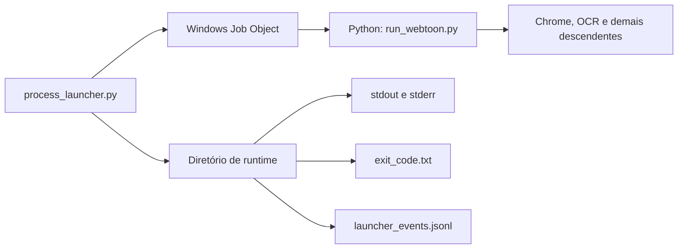
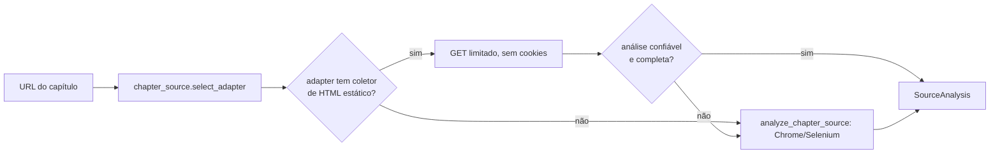

# Arquitetura

> **Base verificada:** `a6a46e4` (branch `fix/main-e2e-findings`) · **Revisado em:** 2026-09-03

Este documento descreve a arquitetura implementada no repositório. Ideias futuras aparecem somente quando identificadas como roadmap.

> [Voltar ao README](../README.md) · [Desenvolvimento](DEVELOPMENT.md) · [Qualidade e validação](QUALITY_AND_VALIDATION.md)

## Neste guia

- [Visão geral](#visão-geral)
- [Entradas públicas](#entradas-públicas)
- [Descoberta de fonte](#descoberta-de-fonte)
- [Download e validação de entrada](#download-e-validação-de-entrada)
- [OCR híbrido](#ocr-híbrido)
- [Tradução e contexto](#tradução-e-contexto)
- [Memória de capítulo: terminologia e entidades](#memória-de-capítulo-terminologia-e-entidades)
- [Recuperação de segmentação da fonte](#recuperação-de-segmentação-da-fonte)
- [Reconstrução de arte](#reconstrução-de-arte)
- [Tipografia e render](#tipografia-e-render)
- [Cache e resume](#cache-e-resume)
- [Relatórios e artefatos](#relatórios-e-artefatos)
- [Recursos e paralelismo](#recursos-e-paralelismo)
- [Ciclo de vida do job](#ciclo-de-vida-do-job)

## Visão geral

O Tradutor.IA é um pipeline orientado a artefatos. Cada etapa recebe dados verificáveis, registra decisões relevantes e entrega sua saída à etapa seguinte. A execução não se resume à tradução textual: ela também controla download, OCR, classificação, reconstrução, PDF e quality gate.

```mermaid
flowchart LR
    UI[app_ui.py] --> Bridge[ui_bridge.py]
    Bridge --> Queue[(job_store.py)]
    Queue --> Worker[worker_service.py]
    Worker --> Runner[job_runner.py]
    Runner --> CLI[run_webtoon.py]
    CLI --> Orchestrator[benchmark_pipeline.py]
    Launcher[process_launcher.py] -. supervisão opcional .-> CLI
    Orchestrator --> Discovery[chapter_source.py + http_source_discovery.py]
    Discovery --> Download[down.py]
    Download --> Split[pdf.py: smart split]
    Split --> OCR[ocr_engine.py]
    OCR --> Groups[ocr_balloon.py]
    Groups --> Translation[translator_deepl.py / translator_nvidia.py]
    Translation --> Context[session_context.py: ledger e entidades]
    Context --> Validation[semantic_fidelity.py + validação e retries]
    Validation --> Art[art_text_inpainting.py / advanced_art_inpainting.py]
    Art --> Render[Tipografia e redraw]
    Render --> PostRender[Validação pós-render]
    PostRender --> PDF[pdf.py: PDF e relatórios]
    PDF --> Gate[Quality gate]
    Gate --> Reader[pdf_reader.py: Leitor e Histórico]
```



## Entradas públicas

### Interface local

`app_ui.py` inicia uma aplicação NiceGUI na porta `8080` por padrão. O frontend conversa com `ui_bridge.py`, que:

- valida URLs, modos e nomes de saída;
- cria o job persistido no `job_store` e monta o comando de `run_webtoon.py` como lista de argumentos;
- acompanha progresso, histórico, revisão e cancelamento lendo o banco;
- mascara segredos antes de expor logs à interface.

> **A UI não executa o pipeline.** Ela cria linhas em `.cache/runtime/jobs.sqlite3`; quem
> reivindica e executa é o `worker_service.py`, num processo independente, que por sua vez
> cria um `job_runner.py` isolado por capítulo. Fechar o navegador ou reiniciar `app_ui.py`
> não interrompe um capítulo em andamento. Veja
> [Fila de worker persistente](WORKER_QUEUE.md) e
> [Documentação Técnica §4–§9](technical/DOCUMENTACAO_TECNICA.md#4-arquitetura-de-execução).

A UI tem seu próprio bridge assíncrono. Ela não usa automaticamente `process_launcher.py`.

### CLI

`run_webtoon.py` é a entrada simplificada para o pipeline atual. Ele valida os argumentos, configura o modo de OCR, resolve a pasta de saída e chama `benchmark_pipeline.run_benchmark()`.

Os modos públicos são:

- `fast`: RapidOCR como primeira engine, com fallbacks pesados desativados por padrão;
- `quality`: RapidOCR como engine primária, validação OCR pós-render e escalonamentos
  opcionais para Paddle quando ele estiver disponível.

PaddleOCR não é dependência obrigatória do modo `quality`: ele é fallback opcional. A
ausência de Paddle não deve bloquear uma execução em qualidade quando RapidOCR está instalado
e disponível; já a ausência do OCR primário configurado falha fechado antes do capítulo.

Sem `--force`, caches e progresso compatíveis podem ser reutilizados. `--download-only` executa apenas a coleta e a auditoria do download.

### Launcher supervisionado

`process_launcher.py` é o launcher rastreado para execuções CLI que precisam de supervisão fora da UI e de metadados claros de processo.



No Windows, o filho nasce suspenso, é associado a um Job Object com `KILL_ON_JOB_CLOSE` e só então é retomado. No POSIX, o launcher usa uma nova sessão e um grupo de processos. A conclusão normal preserva o return code do filho; cancelamento e falhas do launcher têm códigos próprios.

Exemplo PowerShell:

```powershell
$repo = (Get-Location).Path
$runtime = ".cache\e2e_runtime\minha_execucao"
$python = "$repo\.venv\Scripts\python.exe"

& $python process_launcher.py `
  --runtime-directory $runtime `
  --cwd $repo `
  --stdout-path "$runtime\stdout.log" `
  --stderr-path "$runtime\stderr.log" `
  -- $python -u run_webtoon.py "<URL_DO_CAPITULO>" `
  --mode fast --output "minha_execucao" --no-context
```

O separador `--` encerra os argumentos do launcher. Tudo o que vem depois pertence ao processo filho.

## Descoberta de fonte

Antes de qualquer download, o pipeline precisa provar que enxergou o leitor inteiro. Essa
prova tem **dois caminhos**, e o mais barato é tentado primeiro.



`down.discover_chapter_source` é o ponto de entrada usado tanto pelo preflight da UI
(`ui_bridge.py`) quanto pela fase de fonte do worker (`worker_service.py`). Ele:

1. seleciona o adapter por host e valida/normaliza a URL;
2. chama `http_source_discovery.discover_via_http`, que faz **um GET limitado e sem cookies**
   e pede ao adapter para ler o HTML estático;
3. só inicia Chrome/Selenium (`analyze_chapter_source`) quando o passo 2 retorna `None`.

O passo 2 retorna `None` — nunca levanta erro para um caso comum de "isto não se aplica" —
quando o adapter não implementa coletor de HTML estático, quando o fetch limitado falha
(erro de rede, timeout, recusa de redirect/SSRF, content-type errado, limite de tamanho) ou
quando a análise resultante não é imediatamente utilizável (confiança baixa, revisão
necessária). Por construção, um `None` aqui nunca deixa um capítulo travado: o mesmo URL
segue para o caminho de navegador.

**Quem suporta HTTP-first.** `BaseAdapter.collect_dom_candidates_from_html` retorna `None` por
padrão, então o caminho HTTP fica restrito aos adapters que explicitamente sobrescreveram o
coletor. Hoje isso vale para o **VortexScans**, cujo leitor renderiza cada página como um
`` já presente na resposta HTTP inicial. Um leitor que só existe depois de JS do cliente
rodar não pode honestamente reivindicar descoberta por HTTP e por isso não a reivindica.

**Selenium não é o caminho principal do Vortex.** Ele permanece como fallback correto para
todas as fontes, e é o caminho normal para as que não suportam HTTP-first.

O mesmo seam vale para o download: `download_images` também tenta `discover_via_http`
primeiro e registra `collection_strategy = "http_static_html"` quando o usa, porque os
transportes de download já funcionam sem driver. Chrome só é iniciado quando o caminho HTTP
não se aplica.

A seleção de fonte confirmada pelo usuário é persistida com o job e o worker reanalisa o
leitor antes do download, de modo que exclusões e ordem manual sobrevivam à criação do job.

### Chrome, Selenium e TPM

O fallback baseado em navegador depende de Chrome/chromedriver funcionais.

Problema conhecido em máquina de desenvolvimento: em sistemas afetados por problemas de
**Microsoft Platform Crypto Provider / TPM**, o Chrome pode falhar ao iniciar ou travar,
tornando o fallback inutilizável. A descoberta HTTP evita essa dependência para as fontes
que a suportam, e foi essa a motivação original do seam.

Este documento registra o sintoma; ele não prescreve intervenção em TPM, BIOS ou Windows
Hello.

## Download e validação de entrada

Quando o caminho de navegador é usado, `down.py` opera Selenium e Chrome headless para
coletar os recursos do viewer. O downloader:

- deduplica URLs e preserva a ordem observada;
- valida imagens baixadas;
- compara o conjunto esperado com o conjunto disponível;
- produz um download gate com motivos de falha;
- executa teardown limitado e registra o mecanismo usado;
- encerra somente processos cuja propriedade foi comprovada.

Quando habilitado, o cache de download evita nova coleta para a mesma origem. O manifest é copiado para o output ativo, mantendo evidência da origem dos arquivos.

### Fonte específica e fallback controlado

`chapter_source.py` sempre tenta primeiro um adapter específico. Quando não há adapter
registrado, uma URL HTTP(S) pública pode passar por `UniversalChapterAdapter`; isso é uma
análise controlada, não uma declaração de suporte ao site. A URL, DNS e redirects são
validados antes do navegador. Os recursos de imagem só são autorizados em memória depois
de um cluster vencedor observado no leitor, e cada redirect de imagem volta a ser
validado.

O analisador em `universal_chapter_adapter.py` observa DOM, lazy loading, recursos já
vistos pelo navegador, JSON inline, metadados CDP/performance sanitizados e canvas capturável.
JSON pequeno e reconhecido de respostas que o navegador já recebeu pode ser analisado em memória;
texto não é executado nem persistido. A decisão é explícita: score
`>= 0,85` permite seleção automática, `0,60–0,84` segura o job em revisão de páginas e
score menor falha fechado. Limite de coleta/iframe, scroll não comprovadamente completo ou mais de
400 páginas produz `incomplete_download`, antes de OCR e sem seleção parcial. A revisão
ocorre antes de OCR; a confirmação usa IDs opacos e o worker reanalisa o leitor antes do
download. Para imagem DOM já visível e carregada, o payload de revisão pode conter uma miniatura
local `data:image` limitada; ele não leva URL de origem e a UI não faz fetch remoto para mostrá-la.
Ausência de imagem DOM ou canvas CORS/tainted apenas omite a prévia, sem omitir os metadados do
candidato. Enquanto o mesmo job aguarda revisão, o polling não substitui o DOM dessa revisão, para
preservar exclusões e ordem manual na aba atual. O relatório guarda diagnósticos sanitizados, não
URLs completas, cookies, queries ou pixels originais de canvas.

Os transportes compartilham limites de redirects, tamanho, quantidade, bytes e duração
por capítulo. A sessão com cookies do navegador é temporária e opcional; challenges,
autenticação e canvas inacessível não são contornados. No fallback universal, um `href`
explícito pode ser seguido sem clique somente quando prova mesma origem/path e avanço de query
numérica N+1; a sequência é limitada e qualquer ambiguidade, ciclo, timeout ou cobertura parcial
vira `pagination_incomplete`, que bloqueia a seleção inclusive pelo caminho de revisão manual.
O sistema não aciona load more, handlers de botão, carrosséis,
APIs privadas nem usa miniaturas remotas; a única prévia possível é uma data URI local e limitada
derivada de imagem DOM já carregada. Leitores que dependam desses mecanismos pedem adapter
específico. A validação protege a navegação e as imagens selecionadas, mas não é
um sandbox de todos os subrecursos que o navegador pode carregar ao renderizar uma página,
nem fixa o IP final de `requests`; para URLs não confiáveis, o deploy precisaria de uma
política de egress/interceptação adicional. Consulte [Adaptador universal de capítulos](UNIVERSAL_CHAPTER_ADAPTER.md)
para limites, perfis de evidência e limitações.

O roteamento de fonte é decidido pelo adapter selecionado por host antes de qualquer
canonicalização específica. VortexScans usa o adapter/canonicalizer Vortex; Webtoons usa o
adapter/canonicalizer Webtoons. Uma falha ou timeout de Webtoons não deve participar nem
bloquear a análise de uma URL Vortex suportada.

Quando a análise da fonte falha antes de criar job, o comportamento esperado é: zero job, zero
run, zero entrada fantasma de histórico, mensagem recuperável na UI, log sanitizado com estágio,
adapter/host seguro e classe de falha. O shell normal da aba "Nova tradução" permanece visível:
a superfície azul de processamento não deve aparecer em erro pré-job.

Para Webtoons, a análise específica resolve slots lazy antes de formar `source_selection`.
`webtoons_reader_bridge.py` adapta o driver Selenium já aberto para
`lazy_slot_resolver.resolve_lazy_reader_slots`, relendo apenas imagens descendentes do reader e
rolando somente dentro dos bounds do container. Placeholders 1x1 permanecem pendentes, nunca
autorizam o host `webtoons-static.pstatic.net` e nunca entram no manifesto. Se a resolução fica
incompleta, a fase de fonte termina como `incomplete_source_coverage`, sem iniciar runner e sem
usar `incomplete_download`.

### Pasta local

Uma pasta local percorre uma fronteira separada: `LocalFolderChapterAdapter` valida uma raiz
permitida, arquivos diretos e bytes de imagem, cria snapshot interno de nomes gerados e entrega
ao job somente uma referência opaca. Ela não usa navegador, URL `file://` nem downloader HTTP
para adquirir a origem. Como os arquivos são páginas lógicas completas, o Smart Split faz
passthrough. A aquisição local é offline, mas OCR/tradução posteriores continuam sendo etapas
normais do pipeline. Consulte [Entrada por pasta local](LOCAL_FOLDER_INPUT.md).

## Páginas lógicas

Webtoons podem fornecer fatias muito altas ou com divisões inadequadas para OCR e PDF. `pdf.py` implementa o smart split, que reconstrói páginas lógicas com limites configuráveis de altura e preserva um relatório das fronteiras escolhidas.

Essa transformação ocorre antes do OCR quando `SMART_WEBTOON_PDF_SPLIT=True`.

## OCR híbrido

`ocr_engine.py` fornece uma interface comum para RapidOCR, PaddleOCR completo, PaddleOCR Mobile e o caminho opcional de Tesseract.

Nos modos `fast` e `quality`, RapidOCR é o OCR primário da configuração Beta. O modo `quality`
mantém os recursos de recuperação e validação mais caros, mas Paddle só participa como fallback
opcional se o pacote estiver disponível e se a política de fallback o selecionar. Um fallback
vazio ou destrutivo não pode apagar uma leitura útil do RapidOCR.

O engine primário não depende do modo: `config.effective_ocr_engine()` retorna
`config.BETA_OCR_ENGINE` (`"rapidocr"`) a menos que `TRADUTOR_OCR_ENGINE_OVERRIDE` nomeie
explicitamente outro engine suportado. `run_webtoon.py` aplica essa resolução antes do
download e falha fechado se o engine primário não estiver disponível — em vez de coletar o
capítulo inteiro e só então produzir um erro de OCR por página.

No caminho RapidOCR:

1. RapidOCR processa a página;
2. reparos conservadores podem normalizar problemas estruturais sem traduzir o texto;
3. grupos individuais recebem score em `ocr_balloon.py`;
4. uma região com leitura duvidosa pode executar **recuperação regional limitada com
   RapidOCR** sobre o recorte da própria região;
5. se a leitura continuar ambígua, a região vai para revisão em vez de render;
6. o candidato com melhor combinação de qualidade, confiança e coerência é selecionado.

O escalonamento legacy para Paddle (página ou região) é opt-in por
`OCR_LEGACY_PADDLE_FALLBACK`, **desligado por padrão**. Ele não roda automaticamente em
regiões suspeitas e não é requisito para fechar qualidade Beta.

Os metadados registram engine original, engine final, confidences, motivos de fallback,
reparos e scores (`ocr_line_provenance.py`). O fallback solicita comparação; ele não fabrica
a leitura correta.

## Agrupamento e classificação

`ocr_balloon.py` agrupa linhas visualmente relacionadas e classifica o grupo usando evidências textuais e de container. As classes principais são:

- `speech`;
- `narration`;
- `sfx`;
- `decorative`;
- `unknown`, quando a evidência não permite decisão segura.

SFX são preservados por padrão (`TRANSLATE_SFX=False`). Elementos decorativos e grupos ignorados não entram automaticamente na tradução. A classificação também informa a estratégia de máscara e redraw.

## Tradução e contexto

O pipeline atual chama `get_translator("3")`, correspondente a texto-fonte em inglês.

O provider padrão do produto é o **DeepL** (`ui_helpers.DEFAULT_TRANSLATION_PROVIDER = "deepl"`), resolvido por `translator_deepl.py`. `TRANSLATION_MODE` (default `nvidia`) é um eixo mais antigo e ortogonal: ele seleciona a *família* local/Google/NVIDIA, e um job sem provider explícito só recebe o default DeepL quando `TRANSLATION_MODE == "nvidia"` — assim uma instalação que roda deliberadamente `google` não é sequestrada por um default no qual nunca optou. Um provider pedido explicitamente sempre vence, e não há fallback silencioso entre providers: um job DeepL que não alcança a DeepL falha, não vira job Riva.

`translator_nvidia.py` atende `nemotron` (API compatível com OpenAI) e `riva` (contrato de prompt nativo). Os tradutores operam em lotes, respeitam limite de requisições, usam retry/backoff para falhas temporárias e gravam cache por entrada e configuração. Modos Google e NLLB permanecem como caminhos de compatibilidade no código, mas não são o fluxo recomendado da UI e da CLI atuais.

Quando o contexto está habilitado, `session_context.py` mantém informações do capítulo em `session_context.json`. `--no-context` desativa esse comportamento; `--delete-context-after` remove o arquivo somente após a geração bem-sucedida do PDF.

O refinamento natural PT-BR (`natural_ptbr_refinement.py`, provider NVIDIA/Nemotron) **não
faz parte do fluxo automático**. Ele é exposto como uma sugestão linguística explícita na
superfície de revisão (`POST /api/ui/human-translation/refinement`), exige autorização
explícita do dono do job e nunca aplica uma tradução por conta própria.

## Memória de capítulo: terminologia e entidades

Um capítulo não é uma sequência de regiões independentes: o mesmo nome precisa sair com a
mesma forma da primeira à última página. `session_context.py` mantém duas memórias
deliberadamente separadas, com autoridades distintas.

**Ledger de terminologia.** Um mapa compacto `origem → alvo`, uma entrada por termo único,
nunca um transcript. Ele existe porque a janela rolante de diálogo é curta por decisão de
custo: uma ligação escolhida cedo era despejada por conversa não relacionada muito antes do
termo voltar, e o mesmo termo de origem saía do capítulo sob duas formas diferentes. O ledger
carrega a **autoridade** de cada ligação — glossário explícito, nome próprio, termo de
entidade, termo de domínio estabelecido, termo aprendido, pista lexical ou não-autoritativo —
e um conflito com uma ligação autoritativa é reportado como `terminology_conflict`.

**Registro de personagens.** O ledger preserva *texto*; ele não diz nada sobre a entidade
por trás do nome. O registro é a memória de nível de entidade: quem existe neste capítulo e
quais propriedades linguísticas têm evidência real (gênero, pronomes), com a proveniência
dessa evidência. Um personagem estabelecido cedo com uma forma de tratamento e endereçado
depois com outra produz `character_gender_conflict` ou `character_pronoun_conflict`.

Em termos arquiteturais:

- nomes próprios detectados na fonte podem ser propagados no contexto do capítulo;
- formas canônicas e conhecidas são preservadas;
- aliases podem existir e são resolvidos para a forma canônica;
- um candidato que altera uma entidade já estabelecida é rejeitado ou marcado para revisão.

A autoridade é dividida de propósito: o ledger é dono da grafia `origem → alvo`, o registro é
dono dos atributos da entidade. Nenhuma regra do pipeline é escrita em função de um
personagem ou obra específicos.

## Recuperação de segmentação da fonte

O OCR pode fundir tokens vizinhos numa corrida ilegível. Quando isso acontece, a região é
marcada `source_segmentation_incomplete` e pode executar **recuperação local limitada** com
RapidOCR antes do retry final de tradução.

- havendo concordância independente suficiente, a fonte canônica recuperada alimenta o retry
  e os validadores seguintes; a fonte bruta permanece no relatório para auditoria;
- o candidato recuperado **continua passando por todos os gates**; recuperação não é
  aprovação;
- se a leitura continuar ambígua, a região segue `REVIEW_UNUSABLE` e não renderiza.

O discriminador é o resíduo de fusão que chega ao candidato, não a fluência do alvo: um alvo
gramatical e sem resíduo literal não é evidência de recuperação. Não existe regra codificada
por página, frase ou obra. Os limiares exatos são detalhados em
[Qualidade e validação](QUALITY_AND_VALIDATION.md) e não devem ser tratados como API pública.

## Validação do candidato de tradução

O texto traduzido **não vai direto para o render**. Antes do redraw ele passa por uma
sequência de gates independentes:

| Gate | O que verifica |
| --- | --- |
| Qualidade lexical | candidato vazio, truncado, malformado ou fora do formato pedido |
| Resíduo de origem | texto-fonte remanescente (inglês/espanhol) ou fragmento parcialmente traduzido |
| Fidelidade semântica | `semantic_fidelity.py`: se o alvo preserva o sentido da fonte; um veredito inutilizável (`REVIEW_UNUSABLE`) impede o render |
| Terminologia | conflito com uma ligação autoritativa do ledger do capítulo |
| Nome próprio e entidade | alteração de uma entidade já estabelecida no registro de personagens |
| Proveniência de OCR | de qual engine e de qual recuperação veio a fonte que originou o candidato |

Candidatos inválidos podem receber retries seletivos (`selective_review_retry.py`). Se
continuarem inválidos, o texto-fonte é preservado e o grupo é marcado para revisão. Não há
reescrita silenciosa da resposta do provider.

## Reconstrução de arte

A reconstrução ocorre em duas camadas, com uma política de preservação acima de ambas.

1. **Remoção do lettering de origem** (`art_text_inpainting.py`): máscara restrita ao texto,
   análise de background, e preenchimento compatível ou inpainting local. `STRICT_MASK_BOUNDS`
   e os limites de expansão impedem que a máscara cresça sobre a arte.
2. **Reconstrução avançada opcional** (`advanced_art_inpainting.py`): para regiões
   texturizadas difíceis, um modelo local do tipo LaMa
   (`ADVANCED_ART_INPAINT_MODEL_ID`, hoje `anime_manga_lama_large_jit`). Contrato de runtime:
   os arquivos de modelo são **assets externos**, nunca código versionado; o modelo só é
   carregado após correspondência exata de SHA256; a inferência é estritamente local; e
   **falha significa indisponível/revisão, nunca render forçado**.

**Política de preservação.** Uma reconstrução pode ser comprovadamente não destrutiva e ainda
assim ser visivelmente mais suave que a arte que substituiu. Esses são dois eixos distintos:
a segurança da arte tem seu próprio limite (`MAX_FLAT_PATCH_TEXTURE_RATIO`) e a fidelidade
tem outro (`MIN_ART_FIDELITY_TEXTURE_RATIO`), que marca `art_fidelity_uncertain` sem segurar
o render — segurar um PT-BR bom por dúvida de fidelidade recolocaria o inglês na página.

**`REVIEW_UNUSABLE`.** Quando a evidência é inutilizável e não apenas incerta, a região não
renderiza: os pixels de origem são mantidos. O sistema prefere uma página com o texto
original visível a uma página com um alvo inseguro apresentado como correto.

## Tipografia e render

A tipografia é derivada da fonte, não escolhida arbitrariamente:

- o estilo é inferido da lettering de origem da região
  (`source_glyph_envelope.py`: envelope determinístico e fail-closed a partir dos pixels);
- a seleção de fonte é consciente do papel da região (`font_fidelity.ROLE_FONT_FILES`): cada
  papel semântico tem sua própria cadeia de candidatos de fonte **local**, em vez de
  colapsar num único bucket compartilhado, preservando hierarquia visual;
- `font_fidelity.py` nunca baixa fonte e nunca chama provider: ele resolve apenas os
  candidatos disponíveis localmente, registra o arquivo que o Pillow realmente abriu e
  pontua o raster por pixels, não pelo nome da fonte;
- o encaixe usa quebra de linha automática (`AUTO_LINE_WRAP`), redução de fonte
  (`AUTO_FONT_SHRINK`) entre `MIN_FONT_SIZE` e `MAX_FONT_SIZE`, e espaçamento de linha
  proporcional;
- a colocação respeita `TEXT_SAFE_PADDING` e o envelope da região original.

Depois do redraw, a validação visual mede alterações fora da máscara
(`MAX_OUTSIDE_CHANGE_RATIO`), dano de borda de balão, overflow
(`MAX_TEXT_OVERFLOW_RATIO`) e componentes novos sobre arte texturizada. Com
`POST_RENDER_OCR_VALIDATION`, a página renderizada volta a passar por OCR para confirmar que
o texto alvo está fisicamente presente e o texto de origem, ausente.

Isto **não** é reprodução pixel-perfect da tipografia original, e o pipeline não promete isso.

## PDF

`pdf.py` reúne as páginas finais válidas. A contagem do PDF é comparada com a contagem
esperada pelo quality gate. `pdf_naming.py` é a única fonte do nome do arquivo, e
`pdf_reader.py` lê as páginas de volta para o leitor interno sem nenhuma dependência de
renderização de PDF — o PDF é gerado com uma forma estreita e conhecida (uma imagem
`/DCTDecode` por página), e servir uma página é entregar ao navegador o JPEG que já está
dentro do artefato. Qualquer coisa fora dessa forma levanta `UnsupportedPdf` e o chamador cai
para o visualizador de PDF do próprio navegador.

## Cache e resume

`pipeline_cache.py` separa os caches de download, precheck sem texto, OCR, tradução e página renderizada. As chaves incorporam hashes de imagem, engine, configuração relevante e versões internas do formato.

Os JSONs críticos usam escrita atômica. O `run_signature` em `progress.json` permite reutilizar páginas concluídas apenas quando a execução é compatível. `--force` ignora os caches de download, OCR, tradução e renderização; ele não apaga o cache global.

## Relatórios e artefatos

Uma execução completa cria, conforme a configuração:

```text
output/<slug>/<run_id>/
├── input/                       # imagens de origem ativas
├── pages/                       # páginas finais
├── progress.json                # progresso, status e run signature
├── downloaded_images.json       # manifest ativo do download
├── download_report.json|html    # auditoria da coleta
├── timing_report.json|txt       # tempos, contagens e caminhos
├── quality_report.json|html     # itens de qualidade e revisão
├── resource_report.json|html    # somente com monitoramento habilitado
├── classification_profile.*     # somente com profiling habilitado
└── *.pdf                        # documento final
```

Novos jobs da UI usam o nível `<run_id>` para manter reprocessamentos do mesmo capítulo
separados. Saídas legadas em `output/<slug>/` permanecem aceitas pelo histórico.

Contact sheets e diretórios de debug podem ser produzidos conforme as flags. Eles são artefatos locais e não devem ser tratados como assets públicos do projeto.

### Nome do PDF

O PDF de um capítulo completo é nomeado pela obra e pelo capítulo, de modo que a saída possa ser identificada sem abri-la:

```text
<obra>_capitulo_<numero>.pdf
```

`pdf_naming.py` é a única fonte do nome. A obra vem do título da série quando o pipeline o conhece e, caso contrário, do slug da série na URL do capítulo — o segmento do episódio nunca é usado como nome da obra. O número vem da metadata do capítulo, depois da URL, e só recorre ao identificador da execução quando o capítulo não tem número. O nome é sanitizado para o Windows: minúsculas, sem acentos, sem caracteres inválidos, sem travessia de caminho, sem nomes reservados e com tamanho limitado.

A execução registra o caminho do PDF no `run_manifest.json` (`pdf_path`, `pdf_filename`), e a UI abre o arquivo por esse caminho em vez de remontar o nome. Saídas antigas continuam funcionando: elas usavam um nome genérico e são descobertas pelo caminho persistido ou pelo PDF presente na pasta. A convenção nova vale apenas para novas execuções — nenhum PDF existente é renomeado.

## Recursos e paralelismo

`ocr_parallel.py` coordena workers de OCR. `adaptive_scheduler.py` pode ajustar concorrência a partir da memória e CPU observadas, enquanto `resource_monitor.py` registra amostras e relatórios. Os defaults mantêm paralelismo adaptativo e monitoramento detalhado desativados; ambos são opt-in pelo `.env`.

## Ciclo de vida do job

A UI **não executa o pipeline**. Ela grava um job em `.cache/runtime/jobs.sqlite3`
(`job_store.py`); `worker_service.py`, num processo independente, reivindica esse job
atomicamente e cria um `job_runner.py` isolado por capítulo, que por sua vez executa
`run_webtoon.py` como subprocesso com log próprio, progresso e heartbeat.

`job_store.JobStatus` define **14 estados**, dos quais 4 são terminais:

```text
staging → queued → claiming → starting → running → { finished | review_required | failed | cancelled }
                                              ↑
        awaiting_source_review / source_analysis_ready   (revisão de páginas antes do OCR)
        cancelling                                        (cancelamento em andamento)
        interrupted / resumable                           (crash duro, reconciliado na volta)
```

Consequências arquiteturais:

- fechar o navegador ou reiniciar `app_ui.py` não interrompe um capítulo em andamento;
- um worker que morre deixa o job em estado reconciliável, não em `running` fantasma;
- a supervisão do worker pelo launcher é limitada por política (2s/5s/15s, 3 tentativas,
  depois `degraded`), e o `process_launcher.py` persiste o exit code real controlando a
  árvore de processos no Windows;
- `resumable` tem API (`POST /api/ui/resume`) mas **ainda não tem controle na interface**.

Detalhe completo em [Fila de worker persistente](WORKER_QUEUE.md) e
[Documentação Técnica §8](technical/DOCUMENTACAO_TECNICA.md#8-máquina-de-estados-do-job).

## Qualidade como estado do sistema

O pipeline separa sucesso técnico de aprovação de qualidade. Um PDF pode existir e a execução terminar como `review_required`. Consulte [Qualidade e validação](QUALITY_AND_VALIDATION.md) para as regras e [Troubleshooting](TROUBLESHOOTING.md) para diagnóstico.

O congelamento atual de comportamento de produção está registrado em
[Quality Freeze](QUALITY_FREEZE.md).
