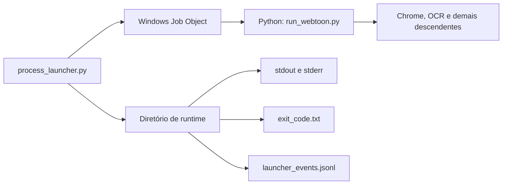

# Arquitetura

Este documento descreve a arquitetura implementada no repositório. Ideias futuras aparecem somente quando identificadas como roadmap.

> [Voltar ao README](../README.md)

## Neste guia

- [Visão geral](#visão-geral)
- [Entradas públicas](#entradas-públicas)
- [Download e validação de entrada](#download-e-validação-de-entrada)
- [OCR híbrido](#ocr-híbrido)
- [Tradução e contexto](#tradução-e-contexto)
- [Cache e resume](#cache-e-resume)
- [Relatórios e artefatos](#relatórios-e-artefatos)
- [Recursos e paralelismo](#recursos-e-paralelismo)

## Visão geral

O Tradutor.IA é um pipeline orientado a artefatos. Cada etapa recebe dados verificáveis, registra decisões relevantes e entrega sua saída à etapa seguinte. A execução não se resume à tradução textual: ela também controla download, OCR, classificação, reconstrução, PDF e quality gate.

```mermaid
flowchart LR
    UI[app_ui.py] --> Bridge[ui_bridge.py]
    CLI[run_webtoon.py] --> Orchestrator[benchmark_pipeline.py]
    Bridge --> CLI
    Launcher[process_launcher.py] -. supervisão opcional .-> CLI
    Orchestrator --> Download[down.py]
    Download --> Split[pdf.py: smart split]
    Split --> OCR[ocr_engine.py]
    OCR --> Groups[ocr_balloon.py]
    Groups --> Translation[translator_nvidia.py]
    Translation --> Validation[Validação e retries]
    Validation --> Render[Máscara, inpainting e redraw]
    Render --> PDF[PDF e relatórios]
    PDF --> Gate[Quality gate]
```



## Entradas públicas

### Interface local

`app_ui.py` inicia uma aplicação NiceGUI na porta `8080` por padrão. O frontend conversa com `ui_bridge.py`, que:

- valida URLs, modos e nomes de saída;
- mantém uma fila local e executa um item por vez;
- cria o comando de `run_webtoon.py` como lista de argumentos;
- inicia o subprocesso sem shell;
- acompanha stdout, progresso, histórico e cancelamento;
- mascara segredos antes de expor logs à interface.

A UI tem seu próprio bridge assíncrono. Ela não usa automaticamente `process_launcher.py`.

### CLI

`run_webtoon.py` é a entrada simplificada para o pipeline atual. Ele valida os argumentos, configura o modo de OCR, resolve a pasta de saída e chama `benchmark_pipeline.run_benchmark()`.

Os modos públicos são:

- `fast`: RapidOCR como primeira engine, fallback Paddle e validação OCR pós-render;
- `quality`: PaddleOCR como primeira engine.

Sem `--force`, caches e progresso compatíveis podem ser reutilizados. `--download-only` executa apenas a coleta e a auditoria do download.

### Launcher supervisionado

`process_launcher.py` é o launcher rastreado para execuções CLI que precisam de supervisão fora da UI e de metadados claros de processo.



No Windows, o filho nasce suspenso, é associado a um Job Object com `KILL_ON_JOB_CLOSE` e só então é retomado. No POSIX, o launcher usa uma nova sessão e um grupo de processos. A conclusão normal preserva o return code do filho; cancelamento e falhas do launcher têm códigos próprios.

Exemplo PowerShell:

```powershell
$repo = (Get-Location).Path
$runtime = ".cache\e2e_runtime\minha_execucao"
$python = "$repo\.venv\Scripts\python.exe"

& $python process_launcher.py `
  --runtime-directory $runtime `
  --cwd $repo `
  --stdout-path "$runtime\stdout.log" `
  --stderr-path "$runtime\stderr.log" `
  -- $python -u run_webtoon.py "<URL_DO_CAPITULO>" `
  --mode fast --output "minha_execucao" --no-context
```

O separador `--` encerra os argumentos do launcher. Tudo o que vem depois pertence ao processo filho.

## Download e validação de entrada

`down.py` usa Selenium e Chrome headless para coletar os recursos do viewer. O downloader:

- deduplica URLs e preserva a ordem observada;
- valida imagens baixadas;
- compara o conjunto esperado com o conjunto disponível;
- produz um download gate com motivos de falha;
- executa teardown limitado e registra o mecanismo usado;
- encerra somente processos cuja propriedade foi comprovada.

Quando habilitado, o cache de download evita nova coleta para a mesma origem. O manifest é copiado para o output ativo, mantendo evidência da origem dos arquivos.

## Páginas lógicas

Webtoons podem fornecer fatias muito altas ou com divisões inadequadas para OCR e PDF. `pdf.py` implementa o smart split, que reconstrói páginas lógicas com limites configuráveis de altura e preserva um relatório das fronteiras escolhidas.

Essa transformação ocorre antes do OCR quando `SMART_WEBTOON_PDF_SPLIT=True`.

## OCR híbrido

`ocr_engine.py` fornece uma interface comum para RapidOCR, PaddleOCR completo, PaddleOCR Mobile e o caminho opcional de Tesseract.

No modo `fast`:

1. RapidOCR processa a página;
2. reparos conservadores podem normalizar problemas estruturais sem traduzir o texto;
3. sinais de suspeita podem acionar fallback de página para Paddle Mobile;
4. grupos individuais recebem score em `ocr_balloon.py`;
5. regiões suspeitas são comparadas com Paddle Mobile;
6. Paddle completo só é usado quando a comparação ainda não resolve o contrato;
7. o candidato com melhor combinação de qualidade, confiança e coerência é selecionado.

Os metadados registram engine original, engine final, confidences, motivos de fallback, reparos e scores. O fallback solicita comparação; ele não fabrica a leitura correta.

## Agrupamento e classificação

`ocr_balloon.py` agrupa linhas visualmente relacionadas e classifica o grupo usando evidências textuais e de container. As classes principais são:

- `speech`;
- `narration`;
- `sfx`;
- `decorative`;
- `unknown`, quando a evidência não permite decisão segura.

SFX são preservados por padrão (`TRANSLATE_SFX=False`). Elementos decorativos e grupos ignorados não entram automaticamente na tradução. A classificação também informa a estratégia de máscara e redraw.

## Tradução e contexto

O pipeline atual chama `get_translator("3")`, correspondente a texto-fonte em inglês. Com o default `TRANSLATION_MODE=nvidia`, `translator_nvidia.py` usa uma API compatível com OpenAI no endpoint configurado da NVIDIA.

O tradutor opera em lotes, respeita limite de requisições, usa retry/backoff para falhas temporárias e grava cache por entrada e configuração. Modos Google e NLLB permanecem como caminhos de compatibilidade no código, mas não são o fluxo recomendado da UI e da CLI atuais.

Quando o contexto está habilitado, `session_context.py` mantém informações do capítulo em `session_context.json`. `--no-context` desativa esse comportamento; `--delete-context-after` remove o arquivo somente após a geração bem-sucedida do PDF.

## Validação, reconstrução e PDF

Antes do redraw, o texto traduzido passa por validação lexical e multilíngue. Candidatos inválidos podem receber retries; se continuarem inválidos, o texto-fonte é preservado e o grupo é marcado para revisão.

A reconstrução usa máscara restrita, análise de background, inpainting ou preenchimento compatível, quebra de linha e redução de fonte. A validação visual mede alterações fora da máscara, danos de borda, overflow e outros riscos.

`pdf.py` reúne as páginas finais válidas. A contagem do PDF é comparada com a contagem esperada pelo quality gate.

## Cache e resume

`pipeline_cache.py` separa os caches de download, precheck sem texto, OCR, tradução e página renderizada. As chaves incorporam hashes de imagem, engine, configuração relevante e versões internas do formato.

Os JSONs críticos usam escrita atômica. O `run_signature` em `progress.json` permite reutilizar páginas concluídas apenas quando a execução é compatível. `--force` ignora os caches de download, OCR, tradução e renderização; ele não apaga o cache global.

## Relatórios e artefatos

Uma execução completa cria, conforme a configuração:

```text
output/<slug>/
├── input/                       # imagens de origem ativas
├── pages/                       # páginas finais
├── progress.json                # progresso, status e run signature
├── downloaded_images.json       # manifest ativo do download
├── download_report.json|html    # auditoria da coleta
├── timing_report.json|txt       # tempos, contagens e caminhos
├── quality_report.json|html     # itens de qualidade e revisão
├── resource_report.json|html    # somente com monitoramento habilitado
├── classification_profile.*     # somente com profiling habilitado
└── *.pdf                        # documento final
```

Contact sheets e diretórios de debug podem ser produzidos conforme as flags. Eles são artefatos locais e não devem ser tratados como assets públicos do projeto.

### Nome do PDF

O PDF de um capítulo completo é nomeado pela obra e pelo capítulo, de modo que a saída possa ser identificada sem abri-la:

```text
<obra>_capitulo_<numero>.pdf
```

`pdf_naming.py` é a única fonte do nome. A obra vem do título da série quando o pipeline o conhece e, caso contrário, do slug da série na URL do capítulo — o segmento do episódio nunca é usado como nome da obra. O número vem da metadata do capítulo, depois da URL, e só recorre ao identificador da execução quando o capítulo não tem número. O nome é sanitizado para o Windows: minúsculas, sem acentos, sem caracteres inválidos, sem travessia de caminho, sem nomes reservados e com tamanho limitado.

A execução registra o caminho do PDF no `run_manifest.json` (`pdf_path`, `pdf_filename`), e a UI abre o arquivo por esse caminho em vez de remontar o nome. Saídas antigas continuam funcionando: elas usavam um nome genérico e são descobertas pelo caminho persistido ou pelo PDF presente na pasta. A convenção nova vale apenas para novas execuções — nenhum PDF existente é renomeado.

## Recursos e paralelismo

`ocr_parallel.py` coordena workers de OCR. `adaptive_scheduler.py` pode ajustar concorrência a partir da memória e CPU observadas, enquanto `resource_monitor.py` registra amostras e relatórios. Os defaults mantêm paralelismo adaptativo e monitoramento detalhado desativados; ambos são opt-in pelo `.env`.

## Qualidade como estado do sistema

O pipeline separa sucesso técnico de aprovação de qualidade. Um PDF pode existir e a execução terminar como `review_required`. Consulte [Qualidade e validação](QUALITY_AND_VALIDATION.md) para as regras e [Troubleshooting](TROUBLESHOOTING.md) para diagnóstico.
