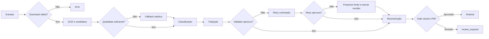

# Qualidade e validação

Este documento descreve como o Tradutor.IA decide entre aceitar um resultado, tentar outra estratégia ou solicitar revisão humana.

> [Voltar ao README](../README.md)

## Princípio do sistema

O pipeline não possui um único “score mágico”. Ele combina gates independentes para download, OCR, tradução, reconstrução e PDF. Um gate pode concluir que o processamento técnico terminou e, ao mesmo tempo, que a qualidade precisa de revisão.

O objetivo é tornar incertezas observáveis. Nenhuma dessas verificações garante correção linguística ou visual absoluta.

## Neste guia

- [Download gate](#download-gate)
- [Qualidade do OCR](#qualidade-do-ocr)
- [Classificação antes da tradução](#classificação-antes-da-tradução)
- [Validator de tradução](#validator-de-tradução)
- [Retries e rejeição](#retries-e-rejeição)
- [Validação da reconstrução](#validação-da-reconstrução)
- [Quality gate final](#quality-gate-final)
- [Estados terminais](#estados-terminais)
- [Relatórios úteis](#relatórios-úteis)

## Download gate

O downloader registra URLs observadas, itens ignorados, arquivos salvos e validações. O gate compara o conjunto esperado com as imagens válidas e verifica, entre outros sinais:

- imagens ausentes;
- arquivos inválidos;
- duplicação ou divergência de ordem;
- contagem incompatível com o escopo solicitado;
- término e teardown do Selenium.

Uma reprovação do download impede que um capítulo incompleto seja tratado como entrada válida do pipeline. Os detalhes ficam em `downloaded_images.json` e `download_report.json`/`.html`.

## Qualidade do OCR

Cada linha de OCR carrega texto, confidence, caixa, engine e metadados. Depois do agrupamento, `score_group_ocr_quality()` avalia o texto e produz razões específicas para sinais suspeitos.

No modo `fast`, há dois níveis de fallback:

1. **Fallback de página:** RapidOCR pode ser substituído por Paddle Mobile quando a página inteira não atende às salvaguardas.
2. **Fallback regional:** grupos suspeitos são recortados e comparados com Paddle Mobile; Paddle completo é usado apenas quando ainda pode melhorar a decisão.

A seleção considera score de qualidade, confidence, coerência lexical e penalidades do candidato. Confidence alta isolada não garante vitória. O sinal de discordância lexical entre linhas, por exemplo, combina contexto confiável e queda relativa de confidence para pedir comparação entre engines.

Quando uma frase longa de fala/narração tem OCR suspeito, mas ainda preserva forma de
story text com pontuação, o pipeline pode roteá-la ao tradutor em vez de preservá-la crua.
Isso não declara a região limpa: a evidência `ocr_source_suspicious` segue com o grupo, e
o candidate ainda precisa passar por validator, fidelidade e render gate. Tokens curtos
uninteligíveis ou sem autoridade semântica continuam fail-closed/manual review.

### Reparo de OCR

O reparo em modo `conservative` trata padrões estruturais limitados, como junções evidentes. Ele:

- não traduz;
- não usa frases de capítulos como regras;
- não substitui diretamente um candidato por uma resposta conhecida;
- preserva texto original, texto reparado e motivo;
- pode ser rejeitado quando piora a qualidade.

## Classificação antes da tradução

Os grupos recebem classe, confidence, motivo e evidências. As classes principais são fala, narração, SFX, decorative e unknown.

A decisão usa texto, geometria, proximidade, orientação e características do container. Isso evita regras simplistas como “todo texto curto é SFX”. Com o default `TRANSLATE_SFX=False`, SFX confirmados são preservados e não enviados ao provedor de tradução.

Elementos decorativos também podem ser ignorados. Fala, narração, texto de sistema e
`unknown` com evidência semântica de história seguem para tradução; SFX, logos, créditos,
promos, URLs e entidades preservadas continuam excluídos por política.

## Validator de tradução

`validate_translation_text()` recebe source e candidate sem modificar o candidate. A análise normaliza tokens apenas internamente e procura sinais como:

- candidate vazio ou sem conteúdo útil;
- texto essencialmente igual ao source;
- inglês residual inequívoco;
- espanhol residual;
- mistura de idiomas;
- fragmentos hifenizados parcialmente traduzidos;
- pontuação ou estrutura incompatíveis com a resposta esperada.

Palavras válidas em português, nomes próprios e tokens ambíguos não são rejeitados apenas por capitalização ou sufixo. Da mesma forma, permitir um token ambíguo não esconde outras palavras inglesas reais na mesma frase.

O validator não reescreve espaços, hífens ou a tradução final. Ele retorna um booleano e um motivo observável.
Antes dessa validação, o pipeline pode aplicar reparos locais estreitos a erros mecânicos
conhecidos: preservação de nomes próprios declarados, remoção de fragmentos OCR isolados que
não existem no source e correção PT-BR limitada de `você fazer` em contexto “what you do”.
Esses reparos não substituem tradução, não chamam provider e não escondem falhas restantes.
Desde o TDD #64, a preservação de nome declarado também corrige casing OCR misto quando a
declaração já provou o nome; isso evita literalização ou casing corrompido sem criar um
detector novo de nomes.

## Retries e rejeição

Quando `TRANSLATION_VALIDATION=True` e a razão permite retry, o pipeline pode solicitar nova tradução até `TRANSLATION_MAX_RETRIES` vezes.

O fluxo é:

1. validar o candidate inicial;
2. registrar a razão da falha;
3. solicitar retry, quando permitido;
4. validar novamente;
5. aceitar a primeira resposta que cumpra o contrato;
6. se nenhuma cumprir, preservar o source, guardar a tradução rejeitada e marcar revisão manual.

Os registros incluem candidate, razão, tentativa e resultado. Eles alimentam o relatório de qualidade e a agregação de itens multilíngues.

## Validação da reconstrução

Depois da tradução, o redraw precisa caber na região segura e não degradar a arte. As verificações incluem:

- overflow da caixa de texto;
- alterações fora da máscara;
- componentes novos grandes;
- dano de borda do balão;
- manchas claras fora de containers;
- manchas escuras sobre arte texturizada;
- relação desproporcional entre máscara e texto;
- OCR pós-render no modo rápido.

Quando uma tentativa visual é insegura, o grupo pode ser revertido e marcado para revisão. O sistema não deve preservar uma tradução à custa de corromper a página.

### Cobertura de story text ≠ qualidade de reconstrução (TDD #81)

São **duas dimensões independentes**, e o #81 passou a contabilizá-las separadamente:

| Dimensão | Pergunta | Status |
| --- | --- | --- |
| **Story-text coverage** | o glifo de origem sumiu e o texto PT-BR está lá? | **CLOSED** desde o #76 |
| **Art reconstruction** | a arte embaixo foi reconstruída ou destruída? | `clean` / `review` por região |

Uma região podia — e no artefato real de 72 páginas *podia mesmo* — reportar
`source_text_coverage: 1.0` e `visual_validation_passed: true` enquanto a arte texturizada
por baixo havia sido substituída por um retângulo chapado. Cobertura de texto nunca prova
reconstrução.

O relatório de qualidade agora agrega `reconstruction_regions_expected`,
`reconstruction_clean`, `reconstruction_review`, `flat_patch_suspected`,
`seam_suspected` e `rectangular_line_mask_rejections`, e cada item carrega
`art_reconstruction_status` / `art_reconstruction_reason`.

Uma região em revisão de reconstrução **não** reabre a cobertura de story text: são
veredictos separados e devem ser lidos separadamente. Para Beta externa, porém, um defeito
óbvio de reconstrução — patch chapado sobre arte texturizada, ghost do lettering de
origem — é bloqueador por si só, mesmo com a tradução correta.

**Segurança ≠ fidelidade (TDD #84).** As duas leituras acima ainda não separam “a
reconstrução não destruiu a arte” de “a reconstrução não *inventou* uma borda”. Uma
limpeza pode remover todo glifo de origem, não deixar nenhum retângulo chapado e mesmo
assim deixar uma costura visível. `ART-SEAM-DETECTOR-001`, fechado offline em #84,
responde essa terceira pergunta e falha fechado como
`visible_reconstruction_seam_at_mask_boundary`, roteando a região para revisão em vez de
declará-la limpa só porque o glifo de origem sumiu. Um patch óbvio classificado como
limpo é pior que uma revisão conservadora.

Detalhes de implementação (anel de flatness, footprint de glifo, detector de patch plano,
detector de costura) estão em `docs/technical/DOCUMENTACAO_TECNICA.md`, seção 16.

O relatório de qualidade também registra `render_plan_accounting`. Essa seção existe para
separar três coisas que antes podiam parecer iguais:

- story text com candidato válido que foi renderizado limpo;
- story text com candidato válido que foi revertido ou pulado com razão estruturada;
- story text que ficou sem desfecho observável no plano de render.

Um item pulado sem razão estruturada entra em `unaccounted`/`skipped_without_reason`. Um
item revertido por risco visual entra em revisão estruturada, não em sucesso. Linhas OCR
filhas sem palavra lexical podem pertencer à limpeza física de um grupo story pai quando a
geometria prova o mesmo container; nesse caso, elas ficam fora do texto de tradução, mas as
caixas renderizadas em `cleanup_line_boxes` contam para fechar o resíduo físico.

Nos artefatos reais #60/#63/#65, essa camada é apenas forense/offline: os PDFs históricos
continuam intactos. O #65 terminou `review_required` com 15 resíduos físicos observados:
14 source-retained e um filho de linha órfã. O TDD #66 audita esses 15 caminhos e fecha
offline a contabilidade/ownership local.

O artifact real #67 continuou `review_required`, com `physical_gate_passed=false` e os
mesmos 15 IDs físicos residuais. A perícia #68, porém, mostrou que ele foi produzido por
`c7795dd`, não pelo commit pós-#66 que a UI pretendia validar. Esse é o blocker Beta
`OFFLINE-PRODUCTION-PARITY-001`: o job e o manifest físico precisam declarar o mesmo
commit, ou a execução falha com `pipeline_commit_mismatch`. Assim, #67 é útil para provar
runtime stale, mas não fecha nem reprova a qualidade pós-#66.

O TDD #69 executou o primeiro E2E real pós-guard com provenance válido
(`CURRENT_HEAD == job.commit_hash == run_manifest.commit_hash`). A execução usou DeepL em
configuração `quality_optimized`, `force=true`, `use_cache=false`, 35 source items e 72
páginas finais. O runtime/binding ficou fechado, mas `QUALITY` permanece aberto: o PDF
terminou `review_required`, `physical_gate_passed=false`, 104 regiões físicas esperadas,
91 traduzidas, 13 `review_source_retained` e 14 resíduos físicos reportados. A auditoria
visual também confirmou story text comum ainda em inglês, incluindo p002, p005, p006,
p025, p030, p044, p062 e o sentinela p068 com `IT'LL` ainda visível.

O recorte P68 do TDD #70 fortalece a prova física sem rerun: a linha filha corrompida
entra na máscara do grupo pai por ownership geométrico de narração aberta, e o gate registra
`source_owned_geometry_coverage`. Uma máscara parcial que transforma `IT'LL` em ruído OCR
como `77,!!` continua `review`, porque a geometria fonte não foi coberta; uma máscara
completa sobre as linhas owned pode passar mesmo sem OCR exato da palavra original. Isso
fecha o falso-clean por OCR como prova única, mas não fecha sozinho os demais resíduos
ordinary-story de #69.

Ainda em #70, dois falsos bloqueios locais de story text foram estreitados: o pós-render OCR
pode perdoar `SO` somente quando ele é a dobra sem acento da tradução esperada (`SÓ`) e não
vem da provenance fonte; e a seleção de tradução aceita frases longas/pontuadas de speech
com alto `main_text_score` mesmo quando RapidOCR sinaliza `improbable_apostrophe_pattern`.
Além disso, p025-like não é reprovado como white patch quando a própria região prova fundo
claro uniforme/enclosed, mesmo se o classificador coarse marcou `textured_art`. Essas
exceções não promovem promo/crédito/SFX, tokens curtos ininteligíveis nem patches brancos
sem prova positiva. O source-scoped area gate agora registra e decide por
`source_scoped_mask_to_page_ratio`, mantendo `source_evidence_to_page_ratio` como
telemetria; assim uma caixa fonte grande não bloqueia uma máscara owned pequena, e uma
máscara grande continua falhando. `QUALITY` permanece aberta até um E2E real pós-#70.
O p025-like também exige cobertura completa das linhas owned quando o fundo claro já foi
comprovado, fechando o caso em que a limpeza por componentes deixava bordas da fonte. Para
p030-like, uma linha curta/SFX destacada que virou seed de grupo é separada antes da
classificação: o story-core fica translatável e o outlier permanece preservado com motivo
explícito, sem ser apagado por uma tradução que não o representa.
Para o mesmo perfil p002-like, o dark-blotch guard também diferencia fundo narrativo
extremamente escuro e uniforme de arte escura irregular: alta saturação sozinha não bloqueia
a limpeza quando brilho, razão de pixels escuros e textura interna provam backdrop uniforme,
mas regiões escuras não-uniformes seguem fail-closed.
O gate de fidelidade também trata passiva preservada (`being chosen` → `ser escolhido`)
como faithful em vez de `state_action_changed`, preservando o roteamento para mudanças reais
de ação/intenção.

O subgate local também diferencia dois resíduos de seleção do #69 sem fabricar candidato
histórico: P005-like, apesar de OCR danificado (`NOT TH ECHEAP...`) e avisos
`long_consonant_run`/`short_improbable_caps_token`, é story text translatável quando há
autoridade story, pontuação e `main_text_score >= 0.58`; P062-like permanece translatável
como speech longo compactado por OCR. Em sentido contrário, `STAGGER`-like passa a ser SFX
quando a aparente região clara é apenas o contorno/efeito do lettering, preservando o mesmo
comportamento de `TAK`, `TUR` e `TRNDGE`. Esses ajustes são prova local de routing: como o
#69 não gerou candidatos reais para P005/P062, o quality gate real continua aberto até novo
E2E autorizado.
P006-like também fica explícito: texto `decorative` em `textured_art` só entra no fluxo de
tradução quando tem formato de cláusula ordinária forte (`IT BETTER BE WORTH IT.`), com
pontuação, confiança alta, `main_text_score` suficiente e OCR limpo. Rótulos curtos como
placa/efeito continuam retidos como `decorative_text`, então o ajuste fecha a perda de
story sem transformar arte ambiental em tradução automática. A mesma autoridade alimenta o
gate `source_scoped`, evitando que a seleção aceite a região e o renderer a rejeite por
uma leitura duplicada do rótulo legacy.
Para o lado físico de P006-like, captions claros abertos recebem prova positiva de fundo
claro (`open_light_art_caption`) e o cleanup source-scoped cobre também o contorno claro
owned da fonte. Assim a região não falha como white-patch quando a alteração está limitada
à geometria OCR e ao orçamento de área por página; fundos escuros uniformes continuam usando
a máscara pequena, sem transformar uma evidência grande em retângulo de limpeza.

O TDD #71 congelou o ledger real #69 sem novo job/provider: 14 resíduos físicos, 13
structured-review retidos e 26 revisões manuais foram reconciliados contra os motivos
persistidos. O replay offline com a lógica atual fecha os roots locais ordinários
P002/P015/P025/P030/P044/P063/P068 e mantém P006 como sentinela verde. P030 é fechado pela
separação do outlier `ATa` antes do render; P44 é fechado pela correção estreita da passiva
preservada no gate de fidelidade; P68 é fechado por geometria/máscara owned, não por
desaparecimento textual em OCR. P005 e P062 permanecem como dependência de provider real,
porque o artifact #69 não possui candidato DeepL persistido para essas regiões; o caminho
downstream foi provado apenas com candidato sintético rotulado, sem fabricar qualidade real.
Por isso o próximo E2E real continua autorizado somente após budget explícito e deve medir
qualidade de produto, não reabrir os gates locais já reconciliados.

O E2E real #72 tornou-se a evidência atual de produto: commit, job e manifest bateram em
`0b40ca23f0d734a345b8a559bf5934f80c01123e`, com DeepL `quality_optimized`, RapidOCR,
35 source items e 72 páginas. A qualidade ainda ficou aberta (`review_required`), mas o
ledger caiu para 104 regiões físicas esperadas, 99 traduzidas/renderizadas, 5 retidas para
revisão e 6 resíduos físicos. P005, P006 e P062 passaram no runtime real; os resíduos
ordinários de história restantes foram `p063:BALAO_1` e `p068:LINE_004`.

O TDD #73 fecha esses dois roots offline. Para P063, o candidato DeepL persistido preservava
a oposição semântica `TRIALS`/`EXECUTIONS`; a rejeição vinha de um falso positivo estreito do
detector `repeated_translation_fragment` sobre o par português `PROVOCA`/`PROVAS`. Para P68,
o problema era a primeira associação de ownership: a linha filha `LINE_004` compartilhava a
região visual aberta do parent, mas era avaliada antes de `narration_box` existir no grupo.
O cleanup agora anexa essa geometria por região visual compartilhada, sem mandar o texto
corrompido ao provider e sem apagar SFX/open art próximo.

A partir do #73, `physical_quality` mantém dois níveis: o global
`physical_source_residual_count`, ainda fail-closed e útil para revisão, e o subgate
`ordinary_story_physical_residual_count`/`ordinary_story_physical_residual_ids`, que deve ser
0 para fechamento Beta de história comum. Um E2E real futuro ainda é obrigatório para provar
o artifact novo; o #73 não altera PDFs históricos nem consome provider.

O E2E real #74 validou o #73 no caminho de produto apenas parcialmente: P063 fechou no runtime
real (`AFINAL, O FEITIÇO PROVOCA PROVAS, NÃO EXECUÇÕES.`, source removido e residual físico
0), mas P068 continuou como único residual ordinário. A evidência nova mostrou que o problema
não era somente a máscara de `LINE_004`: o parent `p068:BALAO_2` nem chegou ao provider/render,
terminando em `translation_not_selected`, sem candidato DeepL persistido. O TDD #75 separa
texto e geometria: a linha corrompida `77,!!` permanece cleanup-only, mas o motivo
`ignored_line_inside_text_region` não pode envenenar um parent de narração com contêiner e
semântica fortes. Como #74 não possui candidato real para esse grupo, a prova #75 é
produção-paritária local com candidato sintético apenas para routing/render/cleanup; qualidade
continua **OPEN — REAL POST-#75 E2E REQUIRED**.

O E2E real #76 fechou essa pendência no caminho de produto. O run
`05a77bb8-487c-46a6-98cd-c1f23ff7e233` foi criado pela UI visível com um único job, sem
rerun, em `594f7f0139f27d7d4e274c46d9a006af352bd31a`; `CURRENT_HEAD`, `jobs.commit_hash` e
`run_manifest.commit_hash` coincidiram. P068 `BALAO_2` chegou ao DeepL `quality_optimized`,
obteve candidato real (`LEVE ALGUMAS HORAS PARA CHEGAR AQUI, DEPOIS QUE ACORDAR.`), foi
validado e renderizado. A linha corrompida `LINE_004` permaneceu cleanup-only, não virou
request independente ao provider, e sua geometria foi limpa pelo parent. O gate final ficou
`story_expected=104`, `valid_candidate=100`, `render_selected=100`, `rendered_clean=100`,
`render_skipped=4`, `structured_review=4`, `unaccounted=0`,
`skipped_without_reason=0` e `ordinary_story_physical_residual_count=0`. Status:
**QUALITY CLOSED — REAL POST-#75 E2E VALIDATED** para story-text Beta; os quatro resíduos
globais restantes são SFX/OCR ambíguo não-story preservados para revisão humana.

## Quality gate final

`_validate_quality()` aprova a execução apenas quando todas estas condições são verdadeiras:

- as páginas finais são imagens válidas;
- a contagem de páginas do PDF corresponde à esperada;
- páginas com maior volume de tradução continuam válidas;
- a política de preservação de SFX está consistente;
- não há falhas de validação visual;
- não há grupos marcados para revisão manual;
- não há overflow acima do limite.

O resultado é persistido em `quality_report.json` e resumido em `timing_report.json`.

## Fidelidade semântica e PT-BR natural

Cobertura de texto de história (**fechada**) e fidelidade semântica são dimensões
diferentes. A primeira pergunta "o texto foi traduzido e o inglês sumiu da página"; a
segunda pergunta "a tradução ainda diz o que o original dizia". Uma tradução pode passar
na primeira e falhar na segunda.

`semantic_fidelity.py` responde em três severidades, nesta ordem:

| Severidade | Significado | Efeito no pipeline |
| --- | --- | --- |
| `blocked` | Divergência **provada** sem julgamento: número trocado, nome próprio do capítulo dissolvido, ordem temporal invertida | Candidato rejeitado; o retry recebe a restrição correspondente |
| `verify` | Algo se moveu, mas nenhuma regra decide o quê: negação, ação virada estado, papéis trocados, relação temporal inventada | Uma adjudicação semântica por região; incerteza nunca vale como aprovação |
| `review` | Nem errado provado, nem confiável: fonte OCR suspeita, português malformado | **Renderiza normalmente** e é contado à parte; segurar a região devolveria inglês à página |

### Confiança na fonte (OCR) antes de culpar o provedor

Um token que a língua de origem não escreve (sem vogal, ou com três consoantes seguidas —
o mesmo teste de forma que o score de qualidade de OCR já usa) e que **sobrevive literalmente
para o português** é defeito de OCR, não de tradução: `SLLM RAT` → `RATO DO SLLM`. Nomes
próprios e interjeições estilizadas (`HMMM`) ficam de fora.

Tokens colados (`TAKEAFEWHOURS`) **não** são sinal: 126 de 542 regiões reais persistidas
carregam um, e o provedor recupera quase todos corretamente. Sinalizá-los soterraria os
defeitos reais numa fila de revisão quatro vezes maior.

### Âncoras de significado

Negação, quantidade (algarismos **e** quantidades por extenso), entidades protegidas pelo
ledger do capítulo, papéis agente/paciente e relação temporal. Só a forma *subordinante*
conta no alvo: `depois` sozinho é o advérbio "later" e não afirma ordem nenhuma; `depois
que` afirma. Modalidade (`might`/`could`) permanece fora do validador local — as regras
testadas produziram apenas falsos positivos e o caso pertence ao adjudicador.

### PT-BR natural

Duas formas apenas, ambas inequívocas: infinitivo cru depois de pronome ("você fazer") e
palavra funcional duplicada ("da da"). Naturalidade não é literalidade e repetição legítima
("NÃO, NÃO, NÃO!") continua válida.

### Contexto de tradução

O contexto é ligado por `set_session_context`, contrato comum a todos os adaptadores. Ele
entra no *prompt*, nunca no texto-alvo, e é limitado (`FIDELITY_CONTEXT_MAX_LINES`,
`FIDELITY_CONTEXT_MAX_TERMS`). O adaptador DeepL declara explicitamente
`context_enabled = False` em vez de presumir suporte.

### Contabilidade

`fidelity_stats` passou a separar `semantic_review` e `semantic_review_<motivo>` das
contagens de bloqueio. Cada grupo carrega `semantic_review_reason` no `quality_report.json`.

## Estados terminais

| Estado | Condição | PDF pode existir? |
| --- | --- | --- |
| `finished` | Sucesso técnico e quality gate aprovado | Sim |
| `review_required` | Sucesso técnico, mas gate reprovado ou revisão manual presente | Sim |
| `error` | Falha técnica ou artefato essencial ausente | Pode não existir |
| `cancelled` | Cancelamento explícito | Pode haver artefatos parciais |

`review_required` não é sinônimo de crash. Também não deve ser convertido em exit code não zero apenas por causa da qualidade. É válido que o processo termine com exit code `0` e o status seja `review_required`.

## Launcher e códigos técnicos

O launcher oficial grava `exit_code.txt` somente depois que o filho termina:

| Código | Significado no launcher |
| --- | --- |
| código do filho | Conclusão normal, inclusive `0` |
| `130` | Cancelamento por interrupção |
| `251` | Falha ao criar ou iniciar o filho |
| `252` | Falha crítica de cleanup/controle da árvore |

Arquivos legados ausentes, vazios ou inválidos são lidos como código desconhecido, não como sucesso.

## Relatórios úteis

- `progress.json`: estado, páginas e run signature;
- `timing_report.json`/`.txt`: tempos, contagens, status e caminhos;
- `quality_report.json`/`.html`: grupos, fallbacks, validações e revisões;
- `download_report.json`/`.html`: coleta e teardown;
- `resource_report.json`/`.html`: memória e CPU, quando habilitado;
- `classification_profile.json`/`.csv`/`.html`: perfil opcional da classificação;
- `launcher_events.jsonl`: ciclo de vida do processo quando o launcher é usado.

## Limites conhecidos

- O validator é heurístico e não substitui revisão linguística.
- SFX estilizados e texto integrado à arte continuam difíceis de classificar e reconstruir.
- Uma tradução gramaticalmente válida pode ainda soar pouco natural.
- Fontes incomuns, texto curvo e backgrounds detalhados elevam o risco visual.
- `ART-RECON-001` (**fechado offline em #84F2 no contrato local**): o footprint físico do
  lettering original agora é tratado separadamente da tradução e da costura de arte. A
  limpeza `source_scoped` pode incluir corpo, outline, halo/antialias e sombra visualmente
  pertencente ao lettering, sempre limitada à evidência OCR da própria região; se esse
  lettering sobreviver, `art_clean` fica impossível. O modelo de decisão distingue
  `translation`, `source_removed`, `art` e `render_disposition`
  (`render_clean`, `render_with_review`, `do_not_render`). A confirmação visual real de
  P5/P6 ainda depende de um novo E2E; não declarar fechamento real antes disso.
- `ART-RECON-002`: patches brancos/cinzas planos sobre textura são visualmente
  inaceitáveis. Sentinela planejada para #80: página 25.
- `TRANSLATION-SEMANTIC-001`: fechado localmente em #82 — ver
  [Fidelidade semântica e PT-BR natural](#fidelidade-semântica-e-pt-br-natural). Continua
  aberto para os casos em que nenhum candidato persistido alternativo existe: eles exigem
  um E2E real com provedor.
- `ART-SEAM-DETECTOR-001` (**fechado offline em #84**): `_reconstruction_seam_metrics()`
  avalia o limite entre patch reconstruído e arte original com três sinais de borda
  relativos à reconstrução (salto de luminância calibrado contra o movimento natural da
  arte ao lado, razão de textura e anel de halo), exigindo corroboração antes de reter a
  reconstrução — ver
  [Detector de costura](technical/DOCUMENTACAO_TECNICA.md#detector-de-costura-art-seam-detector-001).
  Controles negativos (balão plano, gradiente contínuo, contorno de origem cruzando a
  borda) e positivos (patch texturizado, bloco em gradiente, halo) são contratos
  permanentes, e o retângulo destrutivo real da página 25 é detectado. **Validado em
  execução real** no E2E de #84 (72 páginas, RapidOCR + DeepL): `seam_suspected: 0` em 97
  reconstruções aceitas — nenhum falso positivo em produção — e `flat_patch: 0`, com a
  página 25 traduzida e a arte íntegra. Nenhuma costura óbvia foi classificada como limpa.
  Ver o registro da Fase D em [DOCUMENTATION_AUDIT.md](DOCUMENTATION_AUDIT.md).
- `SEMANTIC-RUNTIME-001` (**fechado offline em #84F1** — descoberto no E2E real de #84): a
  severidade `review` do validador semântico de #82 **não chegava à aceitação do candidato
  no runtime**. O E2E real produziu `ISSO NÃO TEM NADA A VER COM UM RATO DO SLLM COMO EU.`
  com `translation_valid: true`, `translation_final_reason: 'ok'` e
  `translation_quality_impact: none`, contabilizado entre as regiões traduzidas — embora o
  `semantic_review_reason` (`source_ocr_suspicious:SLLM`) estivesse gravado e o validador
  offline classificasse a mesma dupla como `review`. Mesmo padrão nas páginas 42 (`COLLD`) e
  46 (`VALLT`); nenhuma outra região do run apresentava o padrão. A suíte offline de #82
  continuava verde: o defeito era de fiação, não de regra.
  **Correção (#84F1):** o impacto de qualidade passa a ser derivado do veredito semântico
  no único escritor de estado terminal, a política de render é explícita
  (`REVIEW` + `RENDER_WITH_REVIEW`; `REJECT` não renderiza), e a contabilidade ganha os
  baldes exclusivos `semantic_checked` / `semantic_clean` / `semantic_review` /
  `semantic_rejected`, com review e reject exigindo `review_required` no capítulo. Uma
  região com motivo semântico deixa de aparecer em `rendered_clean` e passa a
  `structured_review`, com `unaccounted = 0`. Contratos permanentes em
  `test_semantic_runtime_acceptance.py`, incluindo o replay dos três sentinelas reais.
  Pendente apenas a confirmação em novo E2E real, que só ocorrerá depois de `ART-RECON-001`.
- `ART-RECON-001` foi fechado **offline/localmente em #84F2** para o falso-clean: outline,
  halo e corpo residual são medidos antes do português ser desenhado e não podem produzir
  `art_reconstruction_status: clean`. A política `render_disposition` também separa render
  limpo, render com revisão e bloqueio. O run real #84 continua somente evidência histórica:
  P5 (`REGION_002`) tinha candidato PT-BR utilizável e foi retido por
  `large_white_patch_on_nonwhite_background`; P6 motivou o contrato de outline/halo
  residual. A confirmação de saída final P5/P6 permanece pendente de novo E2E real.
- **Replay offline com paridade de produção (#84F2)**: as regiões reais de P5, P6 e P25
  foram reprocessadas a partir das páginas e da geometria OCR persistidas do run
  `7d64890b-e303-497b-863f-74e2cd8d5645`, sem provider e sem rede, reproduzindo os números
  do relatório original. Resultado inspecionado visualmente: P5 e P6 passam a renderizar o
  PT-BR com o inglês ausente e sem ghost/retângulo/costura, sob
  `render_with_review` + `art_reconstruction_fidelity_uncertain`; o contorno branco de
  origem da página 6 desapareceu; a página 25 saiu **pixel a pixel idêntica** ao #84 real.
  Isso é replay offline, **não** um E2E: o fechamento real segue pendente.
- **Fidelidade de arte é um eixo separado da segurança de arte.** Uma reconstrução pode ser
  comprovadamente não destrutiva e ainda ser visivelmente mais suave que a arte que
  substituiu. `MIN_ART_FIDELITY_TEXTURE_RATIO` (0.55) marca `art_fidelity_uncertain` sem
  mexer no bound destrutivo (`MAX_FLAT_PATCH_TEXTURE_RATIO`, 0.25). Nunca retém o render:
  segurar um PT-BR bom por dúvida de fidelidade recolocaria o inglês na página. Toda região
  que renderiza sob revisão carrega `translation_quality_impact: review_required` e
  `manual_review_required` — `render_with_review` com qualidade `none` é impossível.
- Revisões estruturadas por risco visual continuam exigindo novo E2E real para provar que o
  PDF gerado ficou fisicamente limpo.
- O comportamento do provedor pode variar entre execuções.
- O contrato end-to-end atual foi auditado no Windows.

Para investigar uma execução sem apagar evidências, consulte [Troubleshooting](TROUBLESHOOTING.md).
