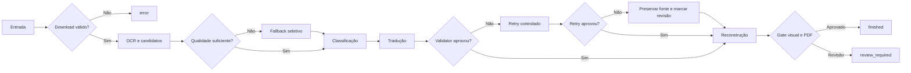

# Qualidade e validação

Este documento descreve como o Tradutor.IA decide entre aceitar um resultado, tentar outra estratégia ou solicitar revisão humana.

> [Voltar ao README](../README.md)

## Princípio do sistema

O pipeline não possui um único “score mágico”. Ele combina gates independentes para download, OCR, tradução, reconstrução e PDF. Um gate pode concluir que o processamento técnico terminou e, ao mesmo tempo, que a qualidade precisa de revisão.

O objetivo é tornar incertezas observáveis. Nenhuma dessas verificações garante correção linguística ou visual absoluta.

## Neste guia

- [Download gate](#download-gate)
- [Qualidade do OCR](#qualidade-do-ocr)
- [Classificação antes da tradução](#classificação-antes-da-tradução)
- [Validator de tradução](#validator-de-tradução)
- [Retries e rejeição](#retries-e-rejeição)
- [Validação da reconstrução](#validação-da-reconstrução)
- [Quality gate final](#quality-gate-final)
- [Estados terminais](#estados-terminais)
- [Relatórios úteis](#relatórios-úteis)

## Download gate

O downloader registra URLs observadas, itens ignorados, arquivos salvos e validações. O gate compara o conjunto esperado com as imagens válidas e verifica, entre outros sinais:

- imagens ausentes;
- arquivos inválidos;
- duplicação ou divergência de ordem;
- contagem incompatível com o escopo solicitado;
- término e teardown do Selenium.

Uma reprovação do download impede que um capítulo incompleto seja tratado como entrada válida do pipeline. Os detalhes ficam em `downloaded_images.json` e `download_report.json`/`.html`.

## Qualidade do OCR

Cada linha de OCR carrega texto, confidence, caixa, engine e metadados. Depois do agrupamento, `score_group_ocr_quality()` avalia o texto e produz razões específicas para sinais suspeitos.

No modo `fast`, há dois níveis de fallback:

1. **Fallback de página:** RapidOCR pode ser substituído por Paddle Mobile quando a página inteira não atende às salvaguardas.
2. **Fallback regional:** grupos suspeitos são recortados e comparados com Paddle Mobile; Paddle completo é usado apenas quando ainda pode melhorar a decisão.

A seleção considera score de qualidade, confidence, coerência lexical e penalidades do candidato. Confidence alta isolada não garante vitória. O sinal de discordância lexical entre linhas, por exemplo, combina contexto confiável e queda relativa de confidence para pedir comparação entre engines.

Quando uma frase longa de fala/narração tem OCR suspeito, mas ainda preserva forma de
story text com pontuação, o pipeline pode roteá-la ao tradutor em vez de preservá-la crua.
Isso não declara a região limpa: a evidência `ocr_source_suspicious` segue com o grupo, e
o candidate ainda precisa passar por validator, fidelidade e render gate. Tokens curtos
uninteligíveis ou sem autoridade semântica continuam fail-closed/manual review.

### Reparo de OCR

O reparo em modo `conservative` trata padrões estruturais limitados, como junções evidentes. Ele:

- não traduz;
- não usa frases de capítulos como regras;
- não substitui diretamente um candidato por uma resposta conhecida;
- preserva texto original, texto reparado e motivo;
- pode ser rejeitado quando piora a qualidade.

## Classificação antes da tradução

Os grupos recebem classe, confidence, motivo e evidências. As classes principais são fala, narração, SFX, decorative e unknown.

A decisão usa texto, geometria, proximidade, orientação e características do container. Isso evita regras simplistas como “todo texto curto é SFX”. Com o default `TRANSLATE_SFX=False`, SFX confirmados são preservados e não enviados ao provedor de tradução.

Elementos decorativos também podem ser ignorados. Fala, narração, texto de sistema e
`unknown` com evidência semântica de história seguem para tradução; SFX, logos, créditos,
promos, URLs e entidades preservadas continuam excluídos por política.

## Validator de tradução

`validate_translation_text()` recebe source e candidate sem modificar o candidate. A análise normaliza tokens apenas internamente e procura sinais como:

- candidate vazio ou sem conteúdo útil;
- texto essencialmente igual ao source;
- inglês residual inequívoco;
- espanhol residual;
- mistura de idiomas;
- fragmentos hifenizados parcialmente traduzidos;
- pontuação ou estrutura incompatíveis com a resposta esperada.

Palavras válidas em português, nomes próprios e tokens ambíguos não são rejeitados apenas por capitalização ou sufixo. Da mesma forma, permitir um token ambíguo não esconde outras palavras inglesas reais na mesma frase.

O validator não reescreve espaços, hífens ou a tradução final. Ele retorna um booleano e um motivo observável.
Antes dessa validação, o pipeline pode aplicar reparos locais estreitos a erros mecânicos
conhecidos: preservação de nomes próprios declarados, remoção de fragmentos OCR isolados que
não existem no source e correção PT-BR limitada de `você fazer` em contexto “what you do”.
Esses reparos não substituem tradução, não chamam provider e não escondem falhas restantes.
Desde o TDD #64, a preservação de nome declarado também corrige casing OCR misto quando a
declaração já provou o nome; isso evita literalização ou casing corrompido sem criar um
detector novo de nomes.

## Retries e rejeição

Quando `TRANSLATION_VALIDATION=True` e a razão permite retry, o pipeline pode solicitar nova tradução até `TRANSLATION_MAX_RETRIES` vezes.

O fluxo é:

1. validar o candidate inicial;
2. registrar a razão da falha;
3. solicitar retry, quando permitido;
4. validar novamente;
5. aceitar a primeira resposta que cumpra o contrato;
6. se nenhuma cumprir, preservar o source, guardar a tradução rejeitada e marcar revisão manual.

Os registros incluem candidate, razão, tentativa e resultado. Eles alimentam o relatório de qualidade e a agregação de itens multilíngues.

## Validação da reconstrução

Depois da tradução, o redraw precisa caber na região segura e não degradar a arte. As verificações incluem:

- overflow da caixa de texto;
- alterações fora da máscara;
- componentes novos grandes;
- dano de borda do balão;
- manchas claras fora de containers;
- manchas escuras sobre arte texturizada;
- relação desproporcional entre máscara e texto;
- OCR pós-render no modo rápido.

Quando uma tentativa visual é insegura, o grupo pode ser revertido e marcado para revisão. O sistema não deve preservar uma tradução à custa de corromper a página.

O relatório de qualidade também registra `render_plan_accounting`. Essa seção existe para
separar três coisas que antes podiam parecer iguais:

- story text com candidato válido que foi renderizado limpo;
- story text com candidato válido que foi revertido ou pulado com razão estruturada;
- story text que ficou sem desfecho observável no plano de render.

Um item pulado sem razão estruturada entra em `unaccounted`/`skipped_without_reason`. Um
item revertido por risco visual entra em revisão estruturada, não em sucesso. Linhas OCR
filhas sem palavra lexical podem pertencer à limpeza física de um grupo story pai quando a
geometria prova o mesmo container; nesse caso, elas ficam fora do texto de tradução, mas as
caixas renderizadas em `cleanup_line_boxes` contam para fechar o resíduo físico.

Nos artefatos reais #60/#63/#65, essa camada é apenas forense/offline: os PDFs históricos
continuam intactos. O #65 terminou `review_required` com 15 resíduos físicos observados:
14 source-retained e um filho de linha órfã. O TDD #66 audita esses 15 caminhos e fecha
offline a contabilidade/ownership local.

O artifact real #67 continuou `review_required`, com `physical_gate_passed=false` e os
mesmos 15 IDs físicos residuais. A perícia #68, porém, mostrou que ele foi produzido por
`c7795dd`, não pelo commit pós-#66 que a UI pretendia validar. Esse é o blocker Beta
`OFFLINE-PRODUCTION-PARITY-001`: o job e o manifest físico precisam declarar o mesmo
commit, ou a execução falha com `pipeline_commit_mismatch`. Assim, #67 é útil para provar
runtime stale, mas não fecha nem reprova a qualidade pós-#66.

O TDD #69 executou o primeiro E2E real pós-guard com provenance válido
(`CURRENT_HEAD == job.commit_hash == run_manifest.commit_hash`). A execução usou DeepL em
configuração `quality_optimized`, `force=true`, `use_cache=false`, 35 source items e 72
páginas finais. O runtime/binding ficou fechado, mas `QUALITY` permanece aberto: o PDF
terminou `review_required`, `physical_gate_passed=false`, 104 regiões físicas esperadas,
91 traduzidas, 13 `review_source_retained` e 14 resíduos físicos reportados. A auditoria
visual também confirmou story text comum ainda em inglês, incluindo p002, p005, p006,
p025, p030, p044, p062 e o sentinela p068 com `IT'LL` ainda visível.

O recorte P68 do TDD #70 fortalece a prova física sem rerun: a linha filha corrompida
entra na máscara do grupo pai por ownership geométrico de narração aberta, e o gate registra
`source_owned_geometry_coverage`. Uma máscara parcial que transforma `IT'LL` em ruído OCR
como `77,!!` continua `review`, porque a geometria fonte não foi coberta; uma máscara
completa sobre as linhas owned pode passar mesmo sem OCR exato da palavra original. Isso
fecha o falso-clean por OCR como prova única, mas não fecha sozinho os demais resíduos
ordinary-story de #69.

## Quality gate final

`_validate_quality()` aprova a execução apenas quando todas estas condições são verdadeiras:

- as páginas finais são imagens válidas;
- a contagem de páginas do PDF corresponde à esperada;
- páginas com maior volume de tradução continuam válidas;
- a política de preservação de SFX está consistente;
- não há falhas de validação visual;
- não há grupos marcados para revisão manual;
- não há overflow acima do limite.

O resultado é persistido em `quality_report.json` e resumido em `timing_report.json`.

## Estados terminais

| Estado | Condição | PDF pode existir? |
| --- | --- | --- |
| `finished` | Sucesso técnico e quality gate aprovado | Sim |
| `review_required` | Sucesso técnico, mas gate reprovado ou revisão manual presente | Sim |
| `error` | Falha técnica ou artefato essencial ausente | Pode não existir |
| `cancelled` | Cancelamento explícito | Pode haver artefatos parciais |

`review_required` não é sinônimo de crash. Também não deve ser convertido em exit code não zero apenas por causa da qualidade. É válido que o processo termine com exit code `0` e o status seja `review_required`.

## Launcher e códigos técnicos

O launcher oficial grava `exit_code.txt` somente depois que o filho termina:

| Código | Significado no launcher |
| --- | --- |
| código do filho | Conclusão normal, inclusive `0` |
| `130` | Cancelamento por interrupção |
| `251` | Falha ao criar ou iniciar o filho |
| `252` | Falha crítica de cleanup/controle da árvore |

Arquivos legados ausentes, vazios ou inválidos são lidos como código desconhecido, não como sucesso.

## Relatórios úteis

- `progress.json`: estado, páginas e run signature;
- `timing_report.json`/`.txt`: tempos, contagens, status e caminhos;
- `quality_report.json`/`.html`: grupos, fallbacks, validações e revisões;
- `download_report.json`/`.html`: coleta e teardown;
- `resource_report.json`/`.html`: memória e CPU, quando habilitado;
- `classification_profile.json`/`.csv`/`.html`: perfil opcional da classificação;
- `launcher_events.jsonl`: ciclo de vida do processo quando o launcher é usado.

## Limites conhecidos

- O validator é heurístico e não substitui revisão linguística.
- SFX estilizados e texto integrado à arte continuam difíceis de classificar e reconstruir.
- Uma tradução gramaticalmente válida pode ainda soar pouco natural.
- Fontes incomuns, texto curvo e backgrounds detalhados elevam o risco visual.
- Revisões estruturadas por risco visual continuam exigindo novo E2E real para provar que o
  PDF gerado ficou fisicamente limpo.
- O comportamento do provedor pode variar entre execuções.
- O contrato end-to-end atual foi auditado no Windows.

Para investigar uma execução sem apagar evidências, consulte [Troubleshooting](TROUBLESHOOTING.md).
