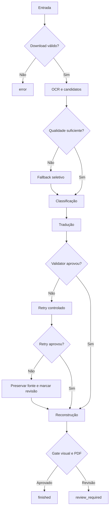

# Qualidade e validação

Este documento descreve como o Tradutor.IA decide entre aceitar um resultado, tentar outra estratégia ou solicitar revisão humana.

> [Voltar ao README](../README.md)

## Princípio do sistema

O pipeline não possui um único “score mágico”. Ele combina gates independentes para download, OCR, tradução, reconstrução e PDF. Um gate pode concluir que o processamento técnico terminou e, ao mesmo tempo, que a qualidade precisa de revisão.

O objetivo é tornar incertezas observáveis. Nenhuma dessas verificações garante correção linguística ou visual absoluta.

## Neste guia

- [Download gate](#download-gate)
- [Qualidade do OCR](#qualidade-do-ocr)
- [Classificação antes da tradução](#classificação-antes-da-tradução)
- [Validator de tradução](#validator-de-tradução)
- [Retries e rejeição](#retries-e-rejeição)
- [Validação da reconstrução](#validação-da-reconstrução)
- [Quality gate final](#quality-gate-final)
- [Estados terminais](#estados-terminais)
- [Relatórios úteis](#relatórios-úteis)

## Download gate

O downloader registra URLs observadas, itens ignorados, arquivos salvos e validações. O gate compara o conjunto esperado com as imagens válidas e verifica, entre outros sinais:

- imagens ausentes;
- arquivos inválidos;
- duplicação ou divergência de ordem;
- contagem incompatível com o escopo solicitado;
- término e teardown do Selenium.

Uma reprovação do download impede que um capítulo incompleto seja tratado como entrada válida do pipeline. Os detalhes ficam em `downloaded_images.json` e `download_report.json`/`.html`.

## Qualidade do OCR

Cada linha de OCR carrega texto, confidence, caixa, engine e metadados. Depois do agrupamento, `score_group_ocr_quality()` avalia o texto e produz razões específicas para sinais suspeitos.

No modo `fast`, há dois níveis de fallback:

1. **Fallback de página:** RapidOCR pode ser substituído por Paddle Mobile quando a página inteira não atende às salvaguardas.
2. **Fallback regional:** grupos suspeitos são recortados e comparados com Paddle Mobile; Paddle completo é usado apenas quando ainda pode melhorar a decisão.

A seleção considera score de qualidade, confidence, coerência lexical e penalidades do candidato. Confidence alta isolada não garante vitória. O sinal de discordância lexical entre linhas, por exemplo, combina contexto confiável e queda relativa de confidence para pedir comparação entre engines.

### Reparo de OCR

O reparo em modo `conservative` trata padrões estruturais limitados, como junções evidentes. Ele:

- não traduz;
- não usa frases de capítulos como regras;
- não substitui diretamente um candidato por uma resposta conhecida;
- preserva texto original, texto reparado e motivo;
- pode ser rejeitado quando piora a qualidade.

## Classificação antes da tradução

Os grupos recebem classe, confidence, motivo e evidências. As classes principais são fala, narração, SFX, decorative e unknown.

A decisão usa texto, geometria, proximidade, orientação e características do container. Isso evita regras simplistas como “todo texto curto é SFX”. Com o default `TRANSLATE_SFX=False`, SFX confirmados são preservados e não enviados ao provedor de tradução.

Elementos decorativos também podem ser ignorados. Fala e narração elegíveis seguem para tradução.

## Validator de tradução

`validate_translation_text()` recebe source e candidate sem modificar o candidate. A análise normaliza tokens apenas internamente e procura sinais como:

- candidate vazio ou sem conteúdo útil;
- texto essencialmente igual ao source;
- inglês residual inequívoco;
- espanhol residual;
- mistura de idiomas;
- fragmentos hifenizados parcialmente traduzidos;
- pontuação ou estrutura incompatíveis com a resposta esperada.

Palavras válidas em português, nomes próprios e tokens ambíguos não são rejeitados apenas por capitalização ou sufixo. Da mesma forma, permitir um token ambíguo não esconde outras palavras inglesas reais na mesma frase.

O validator não reescreve espaços, hífens ou a tradução final. Ele retorna um booleano e um motivo observável.

## Retries e rejeição

Quando `TRANSLATION_VALIDATION=True` e a razão permite retry, o pipeline pode solicitar nova tradução até `TRANSLATION_MAX_RETRIES` vezes.

O fluxo é:

1. validar o candidate inicial;
2. registrar a razão da falha;
3. solicitar retry, quando permitido;
4. validar novamente;
5. aceitar a primeira resposta que cumpra o contrato;
6. se nenhuma cumprir, preservar o source, guardar a tradução rejeitada e marcar revisão manual.

Os registros incluem candidate, razão, tentativa e resultado. Eles alimentam o relatório de qualidade e a agregação de itens multilíngues.

## Validação da reconstrução

Depois da tradução, o redraw precisa caber na região segura e não degradar a arte. As verificações incluem:

- overflow da caixa de texto;
- alterações fora da máscara;
- componentes novos grandes;
- dano de borda do balão;
- manchas claras fora de containers;
- manchas escuras sobre arte texturizada;
- relação desproporcional entre máscara e texto;
- OCR pós-render no modo rápido.

Quando uma tentativa visual é insegura, o grupo pode ser revertido e marcado para revisão. O sistema não deve preservar uma tradução à custa de corromper a página.

## Quality gate final

`_validate_quality()` aprova a execução apenas quando todas estas condições são verdadeiras:

- as páginas finais são imagens válidas;
- a contagem de páginas do PDF corresponde à esperada;
- páginas com maior volume de tradução continuam válidas;
- a política de preservação de SFX está consistente;
- não há falhas de validação visual;
- não há grupos marcados para revisão manual;
- não há overflow acima do limite.

O resultado é persistido em `quality_report.json` e resumido em `timing_report.json`.

## Estados terminais

| Estado | Condição | PDF pode existir? |
| --- | --- | --- |
| `finished` | Sucesso técnico e quality gate aprovado | Sim |
| `review_required` | Sucesso técnico, mas gate reprovado ou revisão manual presente | Sim |
| `error` | Falha técnica ou artefato essencial ausente | Pode não existir |
| `cancelled` | Cancelamento explícito | Pode haver artefatos parciais |

`review_required` não é sinônimo de crash. Também não deve ser convertido em exit code não zero apenas por causa da qualidade. É válido que o processo termine com exit code `0` e o status seja `review_required`.

## Launcher e códigos técnicos

O launcher oficial grava `exit_code.txt` somente depois que o filho termina:

| Código | Significado no launcher |
| --- | --- |
| código do filho | Conclusão normal, inclusive `0` |
| `130` | Cancelamento por interrupção |
| `251` | Falha ao criar ou iniciar o filho |
| `252` | Falha crítica de cleanup/controle da árvore |

Arquivos legados ausentes, vazios ou inválidos são lidos como código desconhecido, não como sucesso.

## Relatórios úteis

- `progress.json`: estado, páginas e run signature;
- `timing_report.json`/`.txt`: tempos, contagens, status e caminhos;
- `quality_report.json`/`.html`: grupos, fallbacks, validações e revisões;
- `download_report.json`/`.html`: coleta e teardown;
- `resource_report.json`/`.html`: memória e CPU, quando habilitado;
- `classification_profile.json`/`.csv`/`.html`: perfil opcional da classificação;
- `launcher_events.jsonl`: ciclo de vida do processo quando o launcher é usado.

## Limites conhecidos

- O validator é heurístico e não substitui revisão linguística.
- SFX estilizados e texto integrado à arte continuam difíceis de classificar e reconstruir.
- Uma tradução gramaticalmente válida pode ainda soar pouco natural.
- Fontes incomuns, texto curvo e backgrounds detalhados elevam o risco visual.
- O comportamento do provedor pode variar entre execuções.
- O contrato end-to-end atual foi auditado no Windows.

Para investigar uma execução sem apagar evidências, consulte [Troubleshooting](TROUBLESHOOTING.md).
