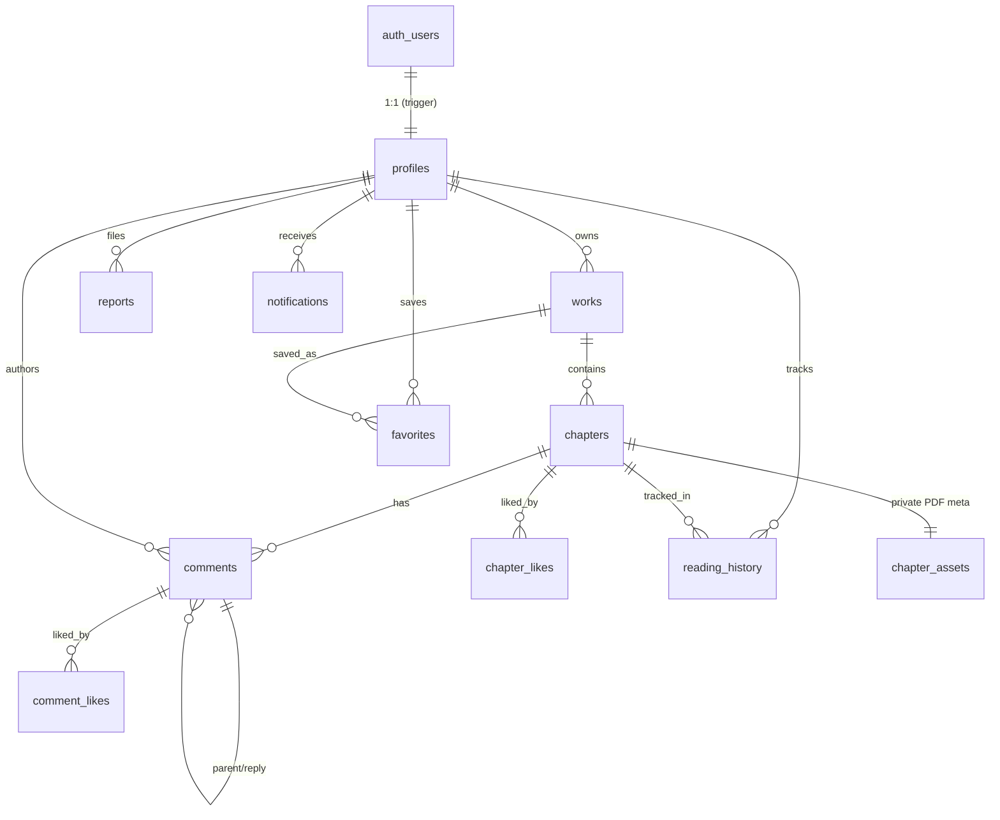

# Fundação do banco social (Supabase / PostgreSQL)

Esta fase cria **apenas o banco**: schema, constraints, índices, triggers, RLS e testes.
Nenhuma interface, upload, Storage, migração de dados locais ou role administrativa é
introduzida aqui. As migrations são **puramente aditivas** (sem `DROP`/`TRUNCATE`).

## Entidades

| Tabela | Papel |
|---|---|
| `public.profiles` | Um perfil por usuário `auth.users`, criado automaticamente no signup. |
| `public.works` | Obras (mangás/webtoons) com dono, slug e status. |
| `public.chapters` | Capítulos de uma obra; **nunca** guardam o file id do Drive. |
| `public.comments` | Comentários e respostas (threaded), soft-delete, do autor. |
| `public.chapter_likes` | Curtidas de capítulo (uma por usuário/capítulo). |
| `public.comment_likes` | Curtidas de comentário (uma por usuário/comentário). |
| `public.favorites` | Obras favoritas por usuário. |
| `public.reading_history` | Progresso de leitura por usuário/capítulo. |
| `public.reports` | Denúncias criadas pelo próprio usuário. |
| `public.notifications` | Notificações do destinatário (inserção só pelo backend). |
| `private.chapter_assets` | Metadados sensíveis do PDF (Drive file id) — **schema privado**. |

## Diagrama ER



## Regras de leitura (congeladas)

- **Autenticado é obrigatório**: o schema social não é acessível a `anon`. Toda policy é
  `TO authenticated`.
- **community**: uma obra/capítulo `status = 'community'` (não deletado) é legível por
  **qualquer usuário autenticado**.
- **draft / private**: legível **somente pelo owner** da obra.
- **archived**: não aparece para não-owners.
- **anônimo nunca lê** conteúdo community nem private.
- Capítulo é visível quando `public.can_read_chapter(id)` — owner da obra, ou obra e
  capítulo ambos `community`, ambos não deletados.

## Regras de propriedade

- `owner_id`, `author_id` e `user_id` **derivam de `auth.uid()`** — nunca de payload do
  cliente.
- `owner_id` (works) e `author_id` (comments) são **imutáveis** (trigger `BEFORE UPDATE`).
- `user_id` das tabelas de relacionamento é imutável de fato: as policies exigem
  `user_id = auth.uid()` em `USING` e `WITH CHECK`.
- Cada usuário edita/soft-deleta somente o próprio conteúdo. Um membro comum não
  administra publicação alheia (as policies de `UPDATE` filtram linhas de outros donos).

## Soft delete

- `profiles`, `works`, `chapters`, `comments`, `notifications` e `private.chapter_assets`
  têm `deleted_at`. A exclusão desta fase é **lógica** (`UPDATE deleted_at = now()`) — não
  há `DELETE` físico concedido para essas tabelas.
- `chapter_likes`, `comment_likes`, `favorites`, `reading_history` são relações efêmeras:
  o usuário pode remover a própria linha (unlike/desfavoritar/limpar histórico).
- Um comentário soft-deletado **preserva as respostas** (o registro permanece; o texto
  não deve ser exibido normalmente pela aplicação).

## Schema privado e Google Drive

- `private.chapter_assets` guarda `storage_provider`, `storage_file_id`, `mime_type`,
  `byte_size`, `checksum_sha256`. **Nenhum file id do Drive existe no schema público.**
- `anon` e `authenticated` **não têm** `USAGE` no schema `private` nem grants nas suas
  tabelas; a RLS está habilitada com **zero policies** (falha fechado). O acesso futuro
  será exclusivamente por backend confiável.
- O Google Drive continua privado; nenhuma permissão pública é criada. Esta fase **não**
  conecta ao Drive nem usa `SUPABASE_SECRET_KEY`.

## RLS

RLS habilitada em todas as tabelas `public.*` e em `private.chapter_assets`. Policies
separadas e nomeadas por operação (`select`/`insert`/`update`/`delete`), usando
`(select auth.uid())`. Nenhuma policy `TO public`/`TO anon`; nenhum `USING (true)` ou
`WITH CHECK (true)`. As helpers `public.owns_work` e `public.can_read_chapter` são
`SECURITY DEFINER` com `search_path` travado, apenas de leitura, para expressar a regra de
visibilidade sem recursão de RLS. `notifications` não tem policy de `INSERT` (inserção
reservada ao backend); `reports` não tem policy de `UPDATE` (status não é alterável pelo
usuário comum).

## Como executar

Requer Supabase CLI + Docker (não disponíveis no ambiente onde os arquivos foram criados).

```bash
supabase start            # sobe Postgres local (Docker)
supabase db reset         # aplica todas as migrations do zero
supabase test db          # roda os testes pgTAP em supabase/tests/database
supabase db lint          # lint estático do schema
```

Aplicação remota (aditiva) — somente após testes/CI verdes e working tree limpa:

```bash
supabase link                 # fluxo interativo local; nunca cole senha/token no chat
supabase migration list
supabase db push --dry-run    # revisar o resumo, sem credenciais
supabase db push              # aplica as migrations aditivas
```

## Testes

- `supabase/tests/database/00_structure_test.sql` — tabelas, schemas, colunas/tipos, PKs,
  FKs, unique, RLS habilitada, policies esperadas, e privilégios do schema privado.
- `supabase/tests/database/01_rls_policies_test.sql` — 35 cenários comportamentais com
  `USER_A`, `USER_B` e anônimo (troca de role + claims JWT), tudo em transação com
  `rollback` (não deixa dados). Cobre leitura community/private, propriedade, comentários e
  respostas, likes, favoritos, histórico, denúncias, notificações, imutabilidade de
  `owner_id`/`author_id`, o trigger de profile e `updated_at`.

## Rollback seguro

As migrations são aditivas e nunca destroem dados. Para reverter em produção, **crie uma
nova migration** que faça o inverso (por exemplo, `drop policy` / `drop table` das
entidades recém-criadas) — nunca edite ou apague uma migration já aplicada, nem use
`db reset` remoto. Em desenvolvimento local, `supabase db reset` recria o banco do zero a
partir das migrations.

## Limitações atuais

- Roles admin/moderator **não** implementadas (moderação futura usará o backend / schema
  privado).
- `notifications` e o acesso a `private.chapter_assets` dependem de um backend confiável
  futuro; não há caminho de escrita pelo cliente.
- Os testes pgTAP e `db lint` exigem Docker/CLI para executar; neste ambiente foram
  validados apenas estaticamente (balanceamento e revisão), **sem** execução real.
- A forma exata de `auth.users` pode variar por versão do Supabase; os testes assumem o
  schema real fornecido por `supabase test db`.
