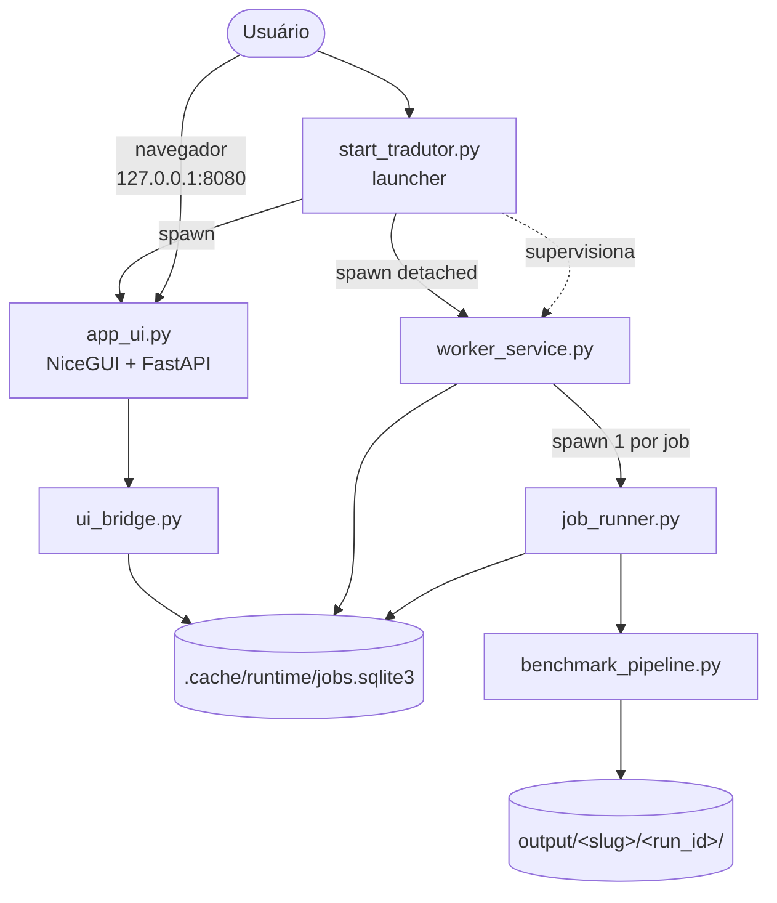
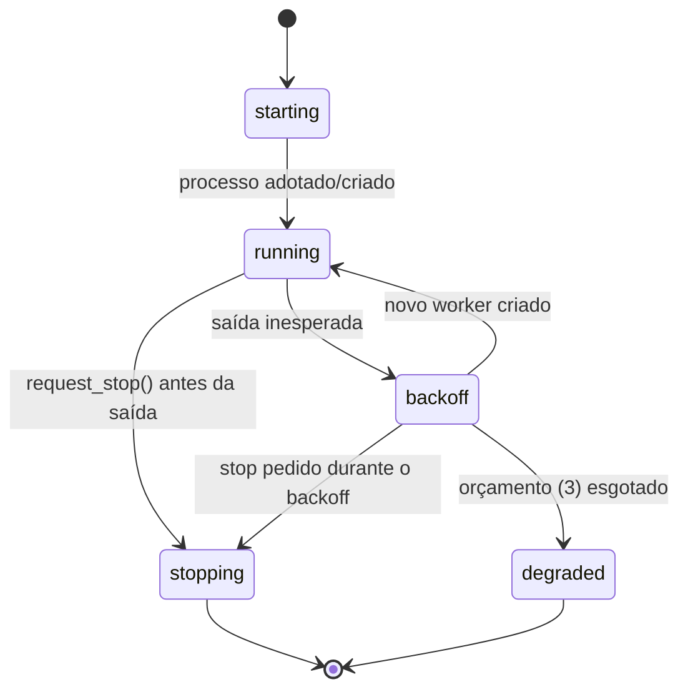
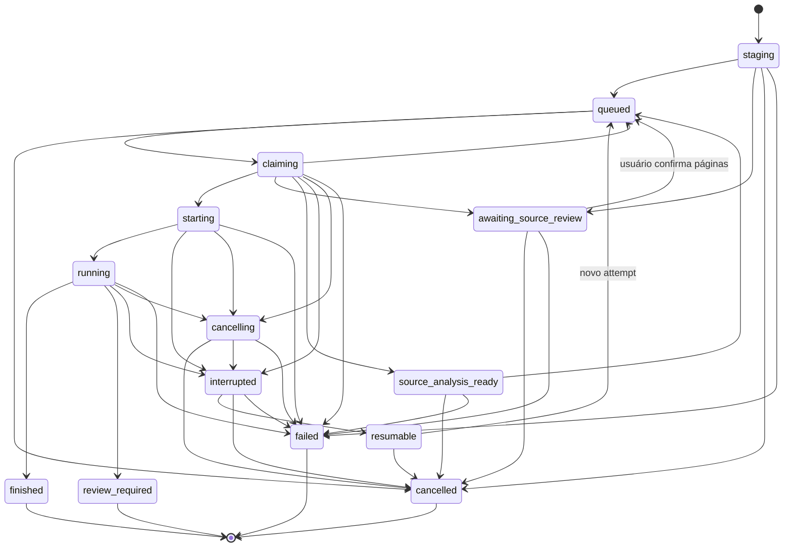
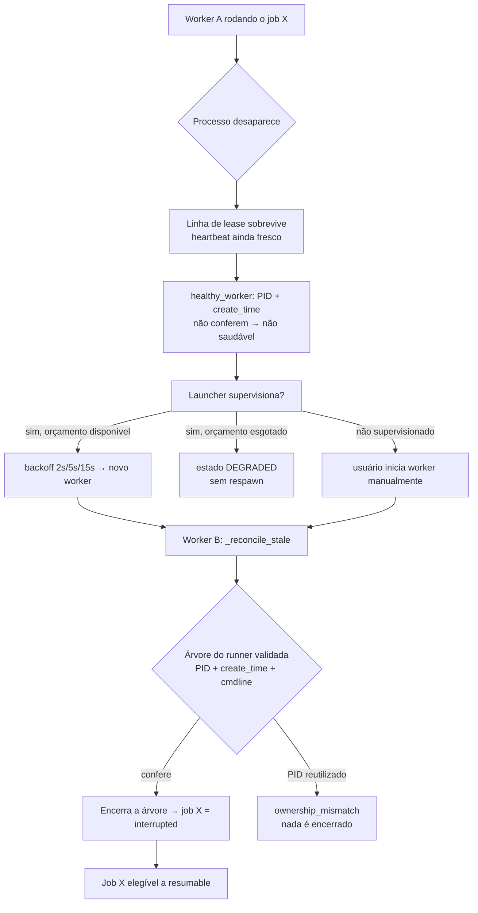
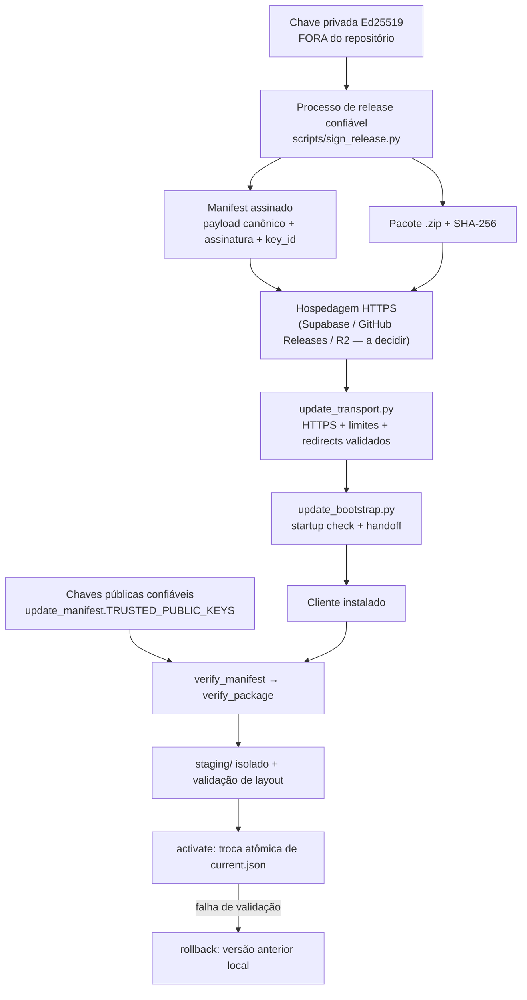

# Tradutor IA — Documentação Técnica

> **Base verificada:** commit deste TDD (branch `fix/main-e2e-findings`)
> **Última revisão:** 2026-08-20
> **Público:** desenvolvedores, mantenedores, suporte técnico e agentes automatizados.

Documentos irmãos: [Guia do Usuário](../user/GUIA_DO_USUARIO.md) ·
[Política de Documentação](../DOCUMENTATION_POLICY.md) · [Índice da documentação](../README.md)

---

## Como ler este documento

Cada afirmação aqui foi conferida contra o código, os testes e a configuração do commit
base. Recursos que ainda não existem aparecem marcados explicitamente:

| Marcador | Significado |
| --- | --- |
| **IMPLEMENTADO** | Existe no código do commit base e é alcançável em execução normal. |
| **PARCIAL** | Existe no backend/núcleo, mas não está completo ou não está exposto ao usuário. |
| **PLANEJADO** | Não existe no repositório. Não documentar como disponível. |
| **DEPRECIADO** | Existe por compatibilidade, mas não é o caminho recomendado. |

---

## Sumário

1. [Visão geral do projeto](#1-visão-geral-do-projeto)
2. [Escopo atual do produto](#2-escopo-atual-do-produto)
3. [Arquitetura de repositório e mapa de componentes](#3-arquitetura-de-repositório-e-mapa-de-componentes)
4. [Arquitetura de execução](#4-arquitetura-de-execução)
5. [Ciclo de vida do launcher e supervisão do worker](#5-ciclo-de-vida-do-launcher-e-supervisão-do-worker)
6. [Ciclo de vida da UI](#6-ciclo-de-vida-da-ui)
7. [Ciclo de vida do worker e do runner](#7-ciclo-de-vida-do-worker-e-do-runner)
8. [Máquina de estados do job](#8-máquina-de-estados-do-job)
9. [Crash, reconciliação e recuperação](#9-crash-reconciliação-e-recuperação)
10. [Job store (SQLite) e sistema de arquivos de runtime](#10-job-store-sqlite-e-sistema-de-arquivos-de-runtime)
11. [Análise de fonte e descoberta de páginas](#11-análise-de-fonte-e-descoberta-de-páginas)
12. [Download de imagens](#12-download-de-imagens)
13. [Smart Split e páginas lógicas](#13-smart-split-e-páginas-lógicas)
14. [Pipeline de OCR](#14-pipeline-de-ocr)
15. [Tradução: abstração de provider](#15-tradução-abstração-de-provider)
16. [Limpeza, inpainting e renderização](#16-limpeza-inpainting-e-renderização)
17. [Qualidade, validação física e proveniência](#17-qualidade-validação-física-e-proveniência)
18. [PDF e histórico](#18-pdf-e-histórico)
19. [Autenticação e autorização](#19-autenticação-e-autorização)
20. [Comunidade e armazenamento](#20-comunidade-e-armazenamento)
21. [Caches](#21-caches)
22. [Configuração e variáveis de ambiente](#22-configuração-e-variáveis-de-ambiente)
23. [Modelo de segurança](#23-modelo-de-segurança)
24. [Arquitetura de testes](#24-arquitetura-de-testes)
25. [Performance](#25-performance)
26. [Logs, saúde e diagnóstico](#26-logs-saúde-e-diagnóstico)
27. [Ambiente de desenvolvimento e comandos](#27-ambiente-de-desenvolvimento-e-comandos)
28. [Troubleshooting técnico](#28-troubleshooting-técnico)
29. [Dívida técnica conhecida](#29-dívida-técnica-conhecida)
30. [Empacotamento, updater e prontidão para Beta](#30-empacotamento-updater-e-prontidão-para-beta)
31. [Glossário](#31-glossário)

---

## 1. Visão geral do projeto

O Tradutor IA é uma **aplicação local** que transforma um capítulo ilustrado
(webtoon/manhwa/mangá em inglês) numa versão traduzida para português do Brasil, com PDF
final e relatórios de qualidade.

Não é um serviço hospedado. Todo o pipeline — download, OCR, tradução, reconstrução
visual e geração de PDF — roda na máquina do usuário. As únicas saídas de rede em
operação normal são: o site de origem do capítulo, o provedor de tradução, o serviço de
autenticação (Supabase) e, quando o usuário publica explicitamente, o armazenamento da
comunidade.

Ambiente auditado: **Windows 64 bits, Python 3.11**. Outros sistemas operacionais não
fazem parte do contrato validado.

## 2. Escopo atual do produto

O produto caminha para a **primeira beta externa com Scans**. Estado por área:

| Área | Estado |
| --- | --- |
| Pipeline ponta a ponta (URL → PDF) | **IMPLEMENTADO** |
| Entrada por pasta local | **IMPLEMENTADO** |
| Fila persistente + worker independente | **IMPLEMENTADO** |
| Detecção de crash duro do worker (TDD #52) | **IMPLEMENTADO** |
| Supervisão do worker pelo launcher (TDD #53) | **IMPLEMENTADO** |
| Isolamento hermético do runtime de testes | **IMPLEMENTADO** |
| Cobertura story-text / gates fail-closed | **IMPLEMENTADO** — **CLOSED** no TDD #76 para story-text Beta; reviews não-story/SFX/OCR ambíguo continuam fail-closed |
| Reconstrução visual de arte | **REVISÃO** — TDD #81 fechou os defeitos sistêmicos (preenchimento plano só com fundo comprovadamente plano, quadrilátero OCR nunca vira máscara sobre ilustração, footprint de glifo cobre corpo/contorno/halo, detector de patch plano). Arte muito estruturada agora cai em `REVIEW_REQUIRED_ART_RECONSTRUCTION` em vez de receber retângulo destrutivo |
| Qualidade semântica/natural PT-BR | **REVISÃO** — TDD #82 separou confiança na fonte OCR, fidelidade de significado e naturalidade PT-BR em três severidades (`blocked`/`verify`/`review`). Replay offline sobre 542 regiões reais persistidas: 531 limpas, 8 em revisão por fonte OCR suspeita, 3 bloqueadas por divergência semântica. Regiões sem candidato alternativo persistido dependem de um E2E real com provedor |
| Leitor PDF integrado | **IMPLEMENTADO** — TDD #83: **LER** é a ação primária do card do Histórico e abre o capítulo na aba **Leitor**, dentro do shell, com paginação, zoom, ajuste à largura/página, miniaturas preguiçosas, teclado e tela cheia. Sem dependência nova: as páginas são os JPEGs já contidos no PDF da execução. Abrir externamente permanece como ação secundária |
| Comunidade social (Supabase + Drive) | **IMPLEMENTADO**, fail-closed se não configurado |
| Licenciamento / expiração de tester | **SCHEMA/RPC REMOTOS IMPLEMENTADOS** — TDD #78 aplica Supabase schema/RLS/RPC atômica, nega usuário sem entitlement e mantém primeiro grant real pendente |
| Retomada de job interrompido | **PARCIAL** — API existe, botão na UI não existe |
| Instalador para usuário final (Setup) | **PLANEJADO** |
| Atualizador automático assinado | **PARCIAL** — integração remota/launcher implementada, sem canal/chave/UI de produção |
| Validação em VM Windows limpa | **PLANEJADO** |

> **Aviso.** Nada em `PLANEJADO` deve ser descrito como disponível em nenhum documento,
> release note ou mensagem de UI.

## 3. Arquitetura de repositório e mapa de componentes

O repositório é **flat**: quase todos os módulos Python vivem na raiz (≈310 arquivos
versionados, dos quais 178 são `test_*.py`). Não há pacote instalável; os entrypoints são
executados diretamente a partir da raiz.

```text
<repo>/
├── start_tradutor.py         # launcher canônico (worker + UI + supervisão)
├── start_tradutor.bat        # atalho Windows para o launcher
├── app_ui.py                 # servidor NiceGUI/FastAPI + rotas HTTP
├── ui_bridge.py              # camada de aplicação da UI (estado, jobs, revisão)
├── ui/                       # ui_shell.html, auth_callback.html
├── static/                   # JS/CSS do frontend + catálogos i18n
├── worker_service.py         # worker independente que drena a fila
├── worker_supervisor.py      # política de reinício limitado do worker
├── job_runner.py             # executa exatamente um job, em subprocesso isolado
├── job_store.py              # SQLite: jobs, leases, transições
├── benchmark_pipeline.py     # orquestrador do pipeline ponta a ponta
├── run_webtoon.py            # entrada CLI simplificada
├── docs/                     # documentação
├── apps/auth-service/        # serviço Better Auth (TypeScript, opcional)
├── supabase/                 # migrations SQL + testes de banco
└── scripts/                  # smokes manuais e migração de auth
```

### Mapa de componentes por domínio

| Domínio | Módulos principais |
| --- | --- |
| Launcher / processos | `start_tradutor.py`, `worker_supervisor.py`, `process_launcher.py`, `process_tree.py`, `process_options.py` |
| UI | `app_ui.py`, `ui_bridge.py`, `ui_helpers.py`, `ui_history.py`, `ui/`, `static/` |
| Fila e jobs | `job_store.py`, `worker_service.py`, `job_runner.py`, `runner_start_gate.py`, `job_failure_diagnostic.py` |
| Fonte de capítulo | `chapter_source.py`, `universal_chapter_adapter.py`, `source_analysis_phase.py`, `source_profile.py`, `source_readiness.py`, `source_support_report.py`, `canonical_source_identity.py`, `webtoons_reader_bridge.py`, `lazy_slot_resolver.py`, `local_folder_*.py` |
| Download | `down.py`, `download_transport.py`, `browser_runtime.py`, `image_validation.py`, `google_drive_transport.py` |
| OCR | `ocr_engine.py`, `ocr_balloon.py`, `ocr_parallel.py`, `ocr_memory_policy.py`, `fast_ocr_policy.py`, `ocr_line_provenance.py` |
| Tradução | `translator_deepl.py`, `translator_nvidia.py`, `translator_nllb.py`, `provider_execution.py`, `provider_transport.py`, `session_context.py`, `natural_ptbr_refinement.py` |
| Reconstrução | `art_text_inpainting.py`, `multiscale_patch_synthesis.py`, `reference_guided_reconstruction.py`, `selective_artifact_reconstruction.py`, `font_fidelity.py` |
| Qualidade | `chapter_quality_revision.py`, `preview_gates.py`, `source_completeness.py`, `source_glyph_envelope.py`, `residual_*.py`, `semantic_fidelity.py`, `linguistic_audit.py`, `region_taxonomy.py` |
| Saída | `pdf.py`, `pdf_naming.py`, `output_manifest.py`, `chapter_asset_repository.py` |
| Comunidade | `community_*.py`, `social_*.py`, `supabase_social.py`, `publish_authorization.py`, `canonical_social_identity.py` |
| Auth | `community_auth.py`, `supabase_auth.py`, `local_test_auth.py`, `apps/auth-service/` |
| Armazenamento legado | `google_drive_*.py`, `legacy_publication_*.py`, `legacy_storage_upload_reservation.py` |
| Updater assinado | `app_version.py`, `update_manifest.py`, `update_installer.py`, `update_transport.py`, `update_bootstrap.py`, `scripts/sign_release.py` |
| Infra de testes | `hermetic_runtime.py`, `offline_test_guard.py`, `conftest.py`, `_test_bootstrap.py`, `sitecustomize.py` |

## 4. Arquitetura de execução

Três processos independentes, mais um subprocesso por capítulo:



Pontos de contrato:

- **A UI nunca executa o pipeline.** Ela cria linhas no banco; o worker as consome. Fechar
  o navegador ou reiniciar `app_ui.py` não interrompe um capítulo.
- **O worker é destacado do launcher** (`DETACHED_PROCESS` + `CREATE_NEW_PROCESS_GROUP` +
  `CREATE_NO_WINDOW` no Windows; `start_new_session` no POSIX).
- **Concorrência de jobs = 1.** O worker reivindica um job por vez com claim atômico.
- **Banco é a única fonte de verdade** do estado dos jobs e do lease do worker.
- **Comunicação entre processos é sempre pelo banco**, nunca por sinais de console — é
  isso que permite parar um worker destacado sem console compartilhado.

## 5. Ciclo de vida do launcher e supervisão do worker

`start_tradutor.py` aceita cinco comandos (verificados no código):

| Comando | Efeito |
| --- | --- |
| `all` (padrão) | Inicia o worker (se não houver um saudável), **supervisiona-o**, e roda a UI em primeiro plano |
| `worker` | Inicia apenas o worker, destacado, e sai — **sem supervisão** |
| `ui` | Inicia apenas a UI |
| `status` | Imprime saúde do worker e da fila (`worker_service.py --status`) |
| `stop` / `stop-worker` | Pede parada graciosa pelo banco; `--force` derruba a árvore validada |

Antes de qualquer comando, o launcher carrega `.env` (e `.env.local` como override) via
`local_environment.load_local_environment_for_entrypoint()`. Um `.env` malformado faz o
launcher sair com código `2` e mensagem `configuration_error:` **sem imprimir valores**.

### Supervisão (`worker_supervisor.py`, TDD #53) — IMPLEMENTADO

A supervisão é deliberadamente estreita: seu único escopo é **disponibilidade do
processo**. Ela nunca marca job como interrompido, nunca retoma job, nunca reordena fila.

| Parâmetro | Valor no código |
| --- | --- |
| Backoff entre reinícios | `2s, 5s, 15s` (`BACKOFF_SECONDS`) |
| Máximo de reinícios do orçamento | `3` (`MAX_RESTARTS`) |
| Tempo de uptime que devolve o orçamento | `120s` (`STABILITY_SECONDS`) |
| Estados | `starting`, `running`, `backoff`, `stopping`, `degraded` |

Regras verificadas:

- O supervisor **bloqueia em `Popen.wait()`** — não há polling nem health probe.
- Ele só dirige o processo que **este launcher** criou. Um launcher que encontra um worker
  saudável pré-existente não o adota (`start_worker` retorna `None`).
- `request_stop()` marca a intenção **antes** de qualquer terminação. Exit code jamais é
  usado para inferir intenção: um worker pode sumir inesperadamente com código 0.
- Esgotado o orçamento, o estado vira `degraded` e **não há mais respawn** — o usuário vê
  um worker offline honesto em vez de uma tempestade de processos.
- Uptime `>= 120s` zera `restarts`, então um crash hoje e outro na semana que vem não
  esgotam ninguém.
- A thread do supervisor é **daemon**: a supervisão vive e morre com o launcher.



Eventos são emitidos como uma linha JSON em `stderr` (`worker_spawned`,
`worker_process_exited`, `worker_restart_scheduled`, `worker_restart_exhausted`,
`worker_expected_stop`, ...).

### Launcher supervisionado de execução única (`process_launcher.py`)

Componente separado e independente do anterior: executa **um** processo filho e persiste o
exit code real. No Windows o filho nasce suspenso, é associado a um Job Object com
`KILL_ON_JOB_CLOSE` e só então é retomado; no POSIX usa nova sessão e grupo de processos.
Grava `exit_code.txt`, `launcher_events.jsonl`, stdout e stderr no diretório de runtime
indicado. É usado para execuções CLI supervisionadas fora da UI; **não** é o launcher da
aplicação.

## 6. Ciclo de vida da UI

`app_ui.py` sobe um app FastAPI/NiceGUI:

- Porta: `TRADUTOR_UI_PORT` (padrão `8080`); host: `configured_bind_host()`.
- Bind externo exige o opt-in explícito `TRADUTOR_ALLOW_EXTERNAL_BIND=1` **e** um provider
  de auth que declare `supports_external_bind`. O provider local nunca satisfaz isso.
- A porta é verificada antes do `ui.run` (`_assert_startup_port_available`).
- Página única em `/`, servindo `ui/ui_shell.html` + `static/`.
- `GET /auth/callback` serve uma página estática fixa (sem echo de query/hash → sem open
  redirect).

### Superfície HTTP

Todas as rotas de aplicação estão sob `/api/ui/*`, `/api/community/*` e `/api/auth/*`.
Duas exceções deliberadamente não autenticadas:

| Rota | Motivo |
| --- | --- |
| `GET /api/health` | Indicador de conexão do frontend; precisa funcionar antes do login. Não expõe estado de usuário. |
| `GET /api/ui/bootstrap` | Read-only; devolve payload vazio para credencial ausente/expirada em vez de quebrar o carregamento. |

Todo o resto passa por `_ui_principal()`, que exige principal autenticado
(`401 authentication_required`) e, para mutações, CSRF (`403 csrf_rejected`). Rotas
ligadas a um job usam `_owned_ui_job()`, que devolve `404 not_found` — deliberadamente
indistinguível de recurso inexistente — quando o job não pertence ao owner.

Famílias de rotas: estado/bootstrap, submissão e cancelamento, revisão de fonte, revisão
de qualidade, revisão de página, rerun de revisão, auditoria linguística, tradução humana
assistida, máscara humana, fila, perfil, histórico, comunidade.

### Início de tradução: camadas de proteção

Todos os pontos de entrada — o botão `#startBtn`, `Enter` no campo de URL, `Enter` no campo
de nome e o botão de repetir — chamam a mesma função `startTranslation()`. Não existe
caminho paralelo. As camadas, da mais superficial para a autoritativa:

| Camada | Onde | O que garante |
| --- | --- | --- |
| Rótulo/`disabled` do botão | `setRunControls`, `dataset.busy` | UX: o usuário vê que já clicou |
| Single-flight | `startInFlight` em `tradutor_ui.js` | uma rajada de cliques compartilha **uma** operação |
| Dedupe de fila | `_pending_duplicate()` em `ui_bridge.py` | resposta amigável `duplicate: true` para reenvio sequencial |
| Índice único parcial | `uq_jobs_active_owner_chapter` | **a garantia real**: o banco recusa a segunda linha |

`startTranslation()` é um wrapper síncrono sobre `runStartTranslation()`, no mesmo formato
já usado por `refreshBootstrap`/`bootstrapInFlight`: o lock é tomado **antes de qualquer
`await`**, então um segundo clique no mesmo tick reaproveita a promise em vez de abrir uma
nova cadeia de análise de fonte, checagem de licença e criação de job.

Desabilitar o botão é UX, não contrato de concorrência. `_pending_duplicate()` sozinho
também não bastava: ele lê a fila e só depois cria o job, sem nada segurando o intervalo —
duas submissões simultâneas viam "sem duplicata" e ambas criavam linha (`START-SPAM-001`).
Quem resolve uma submissão genuinamente simultânea é o banco.

O índice é parcial e tem como chave o **slug do capítulo** (lido de
`configuration_json.$.chapter_slug`, a mesma chave que o bridge usa), nunca `series_slug` —
uma série tem legitimamente vários capítulos e vários outputs de retry em voo ao mesmo
tempo. Status terminais ficam fora do predicado: isso barra submissão duplicada, jamais uma
retradução deliberada mais tarde.

### Tela de prontidão e painel Pipeline

`#loadingSurface` fica **dentro da coluna de "Nova tradução"**, logo acima do painel
Pipeline. `renderBootstrapSurface()` só desenha enquanto o boot está de fato acontecendo:
`closeBoot()` trava `bootHasClosed` e, a partir daí, nenhum `refreshBootstrap()` posterior
repinta a tela de prontidão.

Sem essa trava, qualquer `refreshBootstrap()` — que roda durante toda a vida do aplicativo —
re-percorria `setBootStage(1..7)` e, como `setBootStage` avança por catraca
(`bootHighestStage`), pintava direto o estado final ("Tradutor.IA pronto", "8 de 8 etapas")
sobre a aplicação em uso, deslocando o Pipeline real para fora da tela
(`PIPELINE-UI-REGRESSION-001`).

As verificações de startup (Sessão, Ambiente, Interface) continuam existindo; apenas a
superfície visual deixou de invadir a aplicação já iniciada. Uma falha real de startup
ainda chega a `setBootFailed()` e ao overlay `#boot`, com ação de recuperação.

O painel Pipeline em si é dirigido por estado real (`renderProgress`), com as etapas de
produção atuais — `source_analysis`, `awaiting_source_review`, `download`, `validation`,
`ocr`, `translate`, `render`, `pdf`, `quality_review` — e nunca por animação sintética.

## 7. Ciclo de vida do worker e do runner

`worker_service.py` roda um laço:

| Constante | Valor |
| --- | --- |
| `POLL_SECONDS` | `1.5` |
| `WORKER_HEARTBEAT_SECONDS` | `3.0` |
| `STALE_SECONDS` | `30.0` |
| `STAGING_GRACE_SECONDS` | `5.0` |
| `COMMUNITY_RUNNER_MAX_ATTEMPTS` | `3` |

Sequência por ciclo:

1. Registra/renova o próprio lease (`worker_id` UUID + PID + `create_time` do processo).
2. Reconcilia jobs deixados por um worker morto (`_reconcile_stale`) e publicações de
   comunidade interrompidas (`_recover_interrupted_community_publishes`).
3. Reivindica **um** job `queued` com UPDATE guardado por `status='queued'`.
4. Para fonte por URL, roda a fase de análise (`_prepare_source` →
   `source_analysis_phase`) enquanto segura o claim.
5. Cria o runner: `python -u job_runner.py --job-id ... --db ... --worker-id ... --log ...`.
6. Acompanha o runner, honra cancelamento cooperativo e reconcilia a saída
   (`_reconcile_runner_exit`).

`job_runner.py` executa **um** capítulo: escreve o manifest inicial imediatamente (para que
uma execução interrompida ainda deixe registro), marca `running`, lança o comando do
pipeline com stdout redirecionado para `.cache/runtime/logs/<job_id>.log`, atualiza
progresso e heartbeat, e deriva o status terminal a partir dos artefatos produzidos. Um
crash no runner fica contido em um job — o worker continua.

Desde o TDD #68, a finalização também compara o `commit_hash` do job criado pela UI com o
`commit_hash` gravado pelo `run_manifest.json` físico do pipeline. Se ambos existem e
divergem, o job falha com `reason_code=pipeline_commit_mismatch` e registra
`runtime_commit_mismatch` no `job_manifest.json`. Esse guard é fail-closed: um PDF gerado
por runner/processo antigo pode continuar preservado como artifact, mas não pode mais ser
classificado como evidência de qualidade do commit atual.

Modos: `worker_service.py --once` processa no máximo um job e sai; `--status` imprime saúde
e sai; `--db` aponta para outro banco (usado por testes e manutenção — nesse caso os logs
vão para o diretório do banco, nunca para o cache de produção).

## 8. Máquina de estados do job

`job_store.JobStatus` define **14 estados**. Transições não listadas em
`ALLOWED_TRANSITIONS` são rejeitadas com `TransitionError` (fail-closed).

| Estado | Classe | Significado |
| --- | --- | --- |
| `staging` | preparação | Job sendo montado pela UI, antes de entrar na fila |
| `queued` | fila | Aguardando um worker |
| `claiming` | em voo | Worker reivindicou; pode estar analisando a fonte |
| `starting` | em voo | Runner sendo criado |
| `running` | em voo | Pipeline em execução |
| `cancelling` | em voo | Cancelamento pedido; runner derrubando a árvore |
| `awaiting_source_review` | pausa | Análise de confiança média: usuário precisa confirmar as páginas |
| `source_analysis_ready` | pausa | Fonte analisada; pendência de política de workspace |
| `interrupted` | recuperação | Execução perdida (crash/parada); artefatos preservados |
| `resumable` | recuperação | Interrompido e elegível para novo attempt |
| `cancelled` | **terminal** | Cancelamento explícito |
| `failed` | **terminal** | Falha técnica ou artefato essencial ausente |
| `finished` | **terminal** | Execução concluída e quality gate aprovado |
| `review_required` | **terminal** | Concluído, PDF existe, há revisão de qualidade pendente |

`TERMINAL = {cancelled, failed, finished, review_required}`.
`IN_FLIGHT = {claiming, starting, running, cancelling}` — apenas estes exigem heartbeat.



> **Distinção importante.** `awaiting_source_review` é uma revisão **de seleção de
> páginas, antes do OCR**. `review_required` é **terminal**, após uma execução que já
> gerou artefatos. Nunca confundir os dois em mensagens ao usuário.

## 9. Crash, reconciliação e recuperação

### Liveness que não mente (TDD #52)

Um worker que morre por `os._exit`, terminação forçada, crash nativo ou OOM **não roda seu
shutdown**: a linha de lease sobrevive com um heartbeat que estava fresco há um instante.
Frescor de heartbeat, portanto, não enxerga crash duro.

`job_store.worker_lease_process_alive()` usa a evidência que o resto do repositório já
confia para posse de processo: **PID + `create_time` do processo**. PID sozinho é inseguro
(PIDs são reutilizados); o `create_time` fixa a identidade daquela instância. Um lease sem
`create_time` registrado não carrega identidade verificável e mantém o contrato antigo de
heartbeat, em vez de declarar morto um worker possivelmente vivo.

### Fluxo de crash



Garantias verificadas:

- Nenhum processo é encerrado **por nome**. Toda terminação valida PID + `create_time` +
  substring de linha de comando (`process_tree.matches`).
- PID reutilizado por outro processo nunca é encerrado; o job falha fechado como
  `ownership_mismatch`.
- Nunca há dois attempts ativos para o mesmo capítulo.
- O supervisor **não toca em estado de job**. Reconciliação é do `JobStore` + worker novo.

### Retomada — EXPOSTA NA UI

`POST /api/ui/resume` (`app_ui.api_resume` → `UiBridge.resume()`) cria um novo attempt
(`attempt+1`, com `previous_job_id`) reusando o mesmo diretório de saída e
`resume_from_stage`, reaproveitando checkpoints válidos. A linha original permanece como o
attempt anterior preservado e **nunca volta para a fila**.

**Autoridade de recuperabilidade.** `UiBridge.resume_block_reason(job)` é a única fonte de
verdade e é usada tanto pela operação quanto pela apresentação:

| Código | Significado |
| --- | --- |
| `job_not_found` | Job inexistente |
| `job_type_not_resumable` | Não é job de tradução (publicação de comunidade recupera no worker) |
| `status_not_resumable` | Status fora de `interrupted`/`resumable` |
| `no_recovery_state` | `recoverable=0` — interrupção sem estado continuável (ex.: filho que nunca cruzou o start gate) |
| `already_resumed` | Já existe attempt sucessor (`JobStore.retry_for_job`) |
| `previous_attempt_still_running` | Runner do attempt anterior ainda vivo (`_runner_still_alive`) |

`_job_record()` publica o resultado como a capability booleana **`can_resume`**, presente
em cada entrada de `runtime_state()["resumable"]`. `already_resumed` não é erro: `resume()`
devolve `{"ok": true, "job_id": <sucessor>, "already_resumed": true}` — a operação é
idempotente e um duplo clique nunca enfileira o capítulo duas vezes.

**Frontend.** `renderResumableJobs()` em `static/tradutor_ui.js` renderiza
`#interruptedJobsPanel` (`ui/ui_shell.html`) a partir de `runtime.resumable`, filtrando por
`can_resume === true` — nunca por comparação de status em JavaScript. Cada linha tem um
`<button>` real com `aria-label`, `dataset.jobId` com o identificador canônico vindo do
backend, e estado ocupado (`Retomando…`, `disabled`) via `appState.resumeBusyJobId`, que
garante **uma requisição por ativação**. `resumeInterruptedJob()` usa o helper autenticado
`api()` e, em sucesso ou falha, chama `pollState()` para reconciliar com o estado
autoritativo — nenhum estado é assumido otimisticamente. A UI não inicia worker algum: o
job volta à fila canônica e o supervisor do launcher continua responsável pelo worker.

Cobertura: `test_interrupted_job_resume_ui.py` (capability, transição, checkpoint,
idempotência, reinício da aplicação) e `test_interrupted_job_resume_ui.mjs` (DOM real,
clique real, duplo clique, rejeição do backend, exclusão mútua com **Cancelar**).

## 10. Job store (SQLite) e sistema de arquivos de runtime

`job_store.py` — `SCHEMA_VERSION = 10`, SQLite em modo WAL com `busy_timeout`.

Índices únicos parciais impõem, no próprio banco, invariantes que código de aplicação não
consegue garantir sob concorrência:

| Índice | Invariante |
| --- | --- |
| `uq_jobs_active_review_rerun_parent` | um rerun de revisão ativo por job pai |
| `uq_jobs_retry_parent` | um retry por job anterior |
| `uq_jobs_active_owner_chapter` | uma tradução ativa por owner e capítulo (v10) |

Tabelas: `jobs`, `workers`, `meta`, `quality_review_item_revisions` e tabelas auxiliares
de revisão. Timestamps são epoch em segundos (`REAL`); `NULL` significa "ainda não".

A linha de job (~70 colunas explícitas em `_JOB_COLUMNS`) agrupa:

- **identidade**: `id`, `owner_id`, `run_id`, `operation_kind`, `parent_job_id`, `attempt`,
  `previous_job_id`, `commit_hash`, `branch`;
- **fonte**: `source_url`, `source_type`, `adapter_name`, `adapter_version`,
  `transport_name`, `source_score`, `candidate_count`, `snapshot_ref`,
  `input_root_fingerprint`, `source_analysis_json`, `source_selection_json`;
- **progresso**: `stage`, `progress_current`, `progress_total`, `progress_message`,
  `progress_counter_stage`, `stage_started_at`;
- **posse de processo**: `worker_id`, `worker_pid`, `worker_create_time`, `runner_pid`,
  `runner_create_time`, `exit_code`;
- **artefatos**: `manifest_path`, `progress_path`, `quality_report_path`, `pdf_path`,
  `log_path`;
- **erro**: `error_type`, `error_message`, `error_trace_path`, `reason_code`.

`reason_code` é validado por regex (`^[a-z][a-z0-9_]{0,79}$`) — nunca texto livre.

O registro **não deve** guardar URL completa de recurso, query string, cookie ou pixel de
canvas. Análise de fonte é sanitizada antes de persistir.

### Estrutura de runtime

```text
<repo>/.cache/
├── runtime/
│   ├── jobs.sqlite3          # fila e leases (WAL)
│   ├── logs/<job_id>.log     # log por job
│   └── ui.log                # stdout/stderr da UI
├── ui_history.json           # histórico local da UI
└── ...                       # caches de pipeline

<repo>/output/<slug>/<run_id>/
├── input/                    # imagens de origem ativas
├── pages/                    # páginas finais renderizadas
├── run_manifest.json         # manifest autodescritivo da execução
├── progress.json             # progresso + run_signature
├── downloaded_images.json    # manifest ativo do download
├── download_report.json|html
├── timing_report.json|txt
├── quality_report.json|html
├── resource_report.json|html # só com monitoramento habilitado
└── <obra>_capitulo_<n>.pdf
```

Ambos são ignorados pelo Git.

Novos jobs criados pela UI usam uma pasta endereçada por execução
(`output/<chapter_slug>/<run_id>/`). Isso preserva dois reprocessamentos do mesmo capítulo
como artefatos separados. Saídas legadas em `output/<slug>/` continuam leitura-compatíveis,
mas não são o destino de novos jobs da UI.

## 11. Análise de fonte e descoberta de páginas

`chapter_source.py` sempre tenta primeiro um **adapter específico**. Sem adapter
registrado, uma URL HTTP(S) pública pode passar pelo `UniversalChapterAdapter` — isso é
uma análise controlada, **não** uma declaração de suporte ao site.

Decisão por score, verificada em `docs/UNIVERSAL_CHAPTER_ADAPTER.md` e no código:

| Score | Resultado |
| --- | --- |
| `>= 0,85` | Seleção automática; segue para download |
| `0,60 – 0,84` | Job vai para `awaiting_source_review` — o usuário confirma as páginas |
| `< 0,60` | Falha fechada |

Falham fechados, antes de qualquer OCR: cobertura incompleta (`incomplete_download`),
autenticação exigida, challenge interativo, conteúdo protegido, leitor não observável,
mais de 400 páginas, paginação ambígua (`pagination_incomplete`).

`source_analysis_phase.py` isola a decisão que segue à análise (cobertura incompleta,
revisão manual, resultado não suportado, ambiente ausente, pronto para rodar). Depende
apenas de um `JobStore` e de callables explícitos — não importa a UI nem framework web,
por isso o worker a alcança sem importar a camada de request.

### Leitores lazy (`lazy_slot_resolver.py`) — IMPLEMENTADO

Um leitor lazy entrega placeholders primeiro. Ler o DOM uma vez enxerga uma fração do
capítulo, e tratar o resto como rejeitado encolhe o capítulo silenciosamente.

O resolvedor revisita regiões pendentes, relê os mesmos índices do DOM e atualiza apenas os
slots pendentes, até nada estar pendente ou o orçamento acabar. Ele **nunca busca bytes de
imagem** — observa apenas estado de elemento. Toda operação de browser é injetada, então o
algoritmo é testável sem browser e sem rede.

Para Webtoons, `webtoons_reader_bridge.py` adapta o driver Selenium já aberto e rola apenas
dentro dos bounds do container do reader. Placeholders 1x1 permanecem pendentes, nunca
autorizam host de CDN e nunca entram no manifesto. Resolução incompleta termina a fase como
`incomplete_source_coverage`, sem iniciar runner.

**Otimização fechada (commit `5fce936`):** a parada da descoberta passou a usar evidência
convergente (manifesto canônico do leitor, altura do documento, progresso real de scroll)
com uma sonda final de exaustão, em vez de esgotar sempre as 90 rodadas. Medido no episódio
51: 90 rodadas / 92s de sleep → 10 rodadas / 11s, com as mesmas 171 páginas.

### Pasta local

`LocalFolderChapterAdapter` percorre uma fronteira separada: valida uma raiz permitida
(`LOCAL_INPUT_ROOTS`), arquivos diretos e bytes de imagem, cria snapshot interno com nomes
gerados e entrega ao job apenas uma referência opaca. Não usa browser, `file://` nem
downloader HTTP. Submissão de pasta local pela UI só é aceita quando o servidor está ligado
a loopback (`_local_folder_submit_allowed`).

## 12. Download de imagens

`down.py` usa Selenium + Chrome headless. O downloader deduplica URLs preservando a ordem
observada, valida os bytes das imagens (`image_validation.py`), compara o conjunto esperado
com o disponível, produz um **download gate** com motivos de falha e executa teardown
limitado do navegador registrando o mecanismo usado.

`download_transport.py` abstrai o transporte; todos compartilham limites por capítulo de
redirects, tamanho, quantidade, bytes e duração. A sessão com cookies do navegador é
temporária e opcional. Challenges, autenticação e canvas inacessível **não são
contornados**.

Detalhes em [`docs/DOWNLOAD_TRANSPORTS.md`](../DOWNLOAD_TRANSPORTS.md).

## 13. Smart Split e páginas lógicas

Webtoons entregam fatias muito altas ou com divisões inadequadas para OCR e PDF. `pdf.py`
implementa o **smart split**, que reconstrói páginas lógicas com limites configuráveis
(`SMART_PDF_TARGET_HEIGHT`, `SMART_PDF_MIN_HEIGHT`, `SMART_PDF_MAX_HEIGHT`) e preserva um
relatório das fronteiras escolhidas. Ocorre **antes** do OCR quando
`SMART_WEBTOON_PDF_SPLIT=True`. Para pasta local (arquivos já são páginas lógicas
completas) o smart split faz passthrough.

O relatório `smart_split_report.json` preserva a soma das alturas de origem, a contagem de
páginas lógicas, a altura de cada corte e os motivos (`white_gutter`, corte semântico,
etc.). Uma página lógica visualmente vazia ou majoritariamente branca só é aceitável quando
mantém ancestry contínua de pixels da fonte; ela não pode ser removida por nome, número de
página ou aparência isolada.

**Otimização fechada (commit `2638844`):** a gravação de cada página lógica deixou de usar
`optimize=True` do Pillow (busca exaustiva de filtro/Huffman). Num capítulo real de 171
fatias isso custava ~32,2s dos ~52s do estágio para economizar ~1,3% de bytes. PNG é
lossless nos dois casos — as 100/100 páginas ficaram pixel-idênticas. Estágio 51,98s →
28,52s; encode 32,22s → 8,40s; saída +1,32% em bytes.

## 14. Pipeline de OCR

`ocr_engine.py` oferece interface comum para **RapidOCR** (ONNX Runtime), **PaddleOCR
completo**, **PaddleOCR Mobile** e o caminho opcional de Tesseract.

Modos `fast` e `quality`:

1. RapidOCR processa a página.
2. Reparos conservadores normalizam problemas estruturais **sem traduzir**.
3. Sinais de suspeita podem acionar fallback de página para Paddle Mobile.
4. Grupos individuais recebem score em `ocr_balloon.py` (`score_group_ocr_quality`).
5. Regiões suspeitas são recortadas e comparadas com Paddle Mobile.
6. Paddle completo só entra quando a comparação ainda não resolve o contrato.
7. Vence o candidato com melhor combinação de qualidade, confidence e coerência.

O modo `quality` não troca mais a engine primária para Paddle. Ele mantém RapidOCR como
primário e conserva as validações e escalonamentos mais caros; PaddleOCR é fallback opcional,
usado somente quando disponível e quando a política de fallback justificar. Ausência de Paddle
não é fatal se RapidOCR está disponível. Ausência do OCR primário configurado continua falhando
fechado antes do capítulo.

**Superfície da beta (TDD #84F8).** O usuário agora **vê** qual motor está ativo: a tela de
nova tradução mostra um campo informativo `Motor de OCR` com `RapidOCR · Ativo`, na mesma
linguagem visual de `Motor de tradução: DeepL (Qualidade)`, e as Configurações mostram uma
única linha `RapidOCR — Ativo`. Como a beta tem um motor só e nenhuma substituição em
silêncio, o campo é **informativo e não selecionável**: não há opção Paddle exposta, porque
Paddle não é exigido nem instalado nesta beta.

**Controles da beta (TDD #84F10).** O campo do OCR perdeu a seta de dropdown
(`#ocrEngineSelect { appearance: none }`): uma seta em um campo de opção única promete
alternativas que não existem. O rótulo deixou de ser fixo — `applyOcrEngineStatus()` o
deriva de `settings.ocr_engine`, de modo que `RapidOCR · Ativo` só aparece quando RapidOCR
é de fato o engine configurado; qualquer outro id é reportado como ele é, em vez de a UI
afirmar um motor que o run não vai usar.

**Proveniência efetiva do OCR (TDD #84F19).** O processo da UI não lê mais
`config.OCR_ENGINE` como fonte de verdade para o painel de configuração: esse valor pode ser
apenas o default do processo e não o motor efetivo da beta. `ui_bridge` passa a reportar
`settings.ocr_engine` por `config.effective_ocr_engine()`, o mesmo resolvedor usado antes de
iniciar um run. Com o default canônico da beta, a UI mostra `RapidOCR · Ativo`; um override
explícito e suportado continua sendo reportado pelo próprio id. O campo segue informativo:
sem opção Paddle/Tesseract exposta e sem seta de seletor.

No mesmo movimento, `Modo de processamento` deixou de ser uma grade de três cartões
grandes e virou um `<select id="modeSelect">` com a mesma largura e o mesmo alinhamento de
`Motor de tradução` e `Motor de OCR`, com uma linha de ajuda contextual (`#modeHint`) sob
o campo. **Os valores internos não mudaram** (`quality`, `fast`, `download_only`), o
contrato de start é o mesmo e `DEEPL_MODEL_TYPE=quality_optimized` segue sendo o modelo
canônico da beta; o padrão exibido e selecionado é **Qualidade**. `applyProcessingMode()`
é o único ponto que decide o modo, de modo que o select, um rascunho restaurado e um
replay de histórico não podem discordar sobre o valor que a execução vai carregar.

O fallback **solicita comparação**; ele não fabrica a leitura correta. Os metadados
registram engine original, engine final, confidences, motivos de fallback, reparos e
scores.

### Ciclo de vida e memória

As engines são nativas e backed por modelo: uma contagem de workers inofensiva para um
backend leve pode dobrar o resident set do runner. `ocr_memory_policy.py` mantém a política
de dimensionamento **pura e injetável**, para que os testes a exercitem sem depender da RAM
real do host. `ocr_parallel.py` coordena os workers; `adaptive_scheduler.py` pode ajustar
concorrência a partir de memória e CPU observadas (opt-in por `.env`).

### Agrupamento e classificação

`ocr_balloon.py` agrupa linhas visualmente relacionadas e classifica o grupo com evidências
textuais e de container. Classes: `speech`, `narration`, `sfx`, `decorative` e `unknown`
(evidência insuficiente para decisão segura). SFX são preservados por padrão
(`TRANSLATE_SFX=False`). A classificação também informa a estratégia de máscara e redraw.

### Proveniência e recuperação de OCR

`ocr_line_provenance.py` copia a evidência sempre que uma fronteira é cruzada — o pipeline
reescreve objetos de linha in-place e substitui listas inteiras entre passes (re-OCR de
container de fala, recuperação de região do RapidOCR, fallbacks seletivos, fallback de
página inteira). Sem isso, um grupo que perdesse silenciosamente parte de uma linha de
origem não poderia ser reconstruído depois. O módulo **apenas observa**.

## 15. Tradução: abstração de provider

### Resolução do provider

Dois eixos ortogonais, deliberadamente:

- `TRANSLATION_MODE` (padrão `nvidia`) — eixo **antigo**, seleciona a família
  local/Google/NVIDIA.
- `ui_helpers.DEFAULT_TRANSLATION_PROVIDER` (**`deepl`**) — o resolvedor único que a UI, a
  criação de job e o runner leem.

`TRANSLATION_PROVIDERS = {"deepl", "nemotron", "riva"}`.

Regra em `translator_nllb.get_translator()`:

1. Provider explícito no job vence sempre.
2. Provider ausente **e** `TRANSLATION_MODE == "nvidia"` → `DEFAULT_TRANSLATION_PROVIDER`
   (**DeepL**). O escopo é a família NVIDIA de propósito: uma instalação que roda
   deliberadamente `TRANSLATION_MODE=google` não é sequestrada por um default no qual nunca
   optou.
3. `deepl` é resolvido **antes** de `TRANSLATION_MODE`.

> **O default efetivo do produto hoje é DeepL.** Um job DeepL que não alcança a DeepL
> **falha**; ele não vira job Riva. Nunca há fallback silencioso entre providers.

### DeepL (`translator_deepl.py`) — provider padrão da Beta

Provider de primeira classe, não variante dos outros: possui todo o contrato HTTP
(construção de request, validação de resposta, normalização de erro, telemetria de
caracteres cobrados) e expõe só a interface que o pipeline já fala
(`translate_many` / `translate` / `stats` / `model`).

Ausências deliberadas, cada uma um contrato:

- **Sem `translate_strict`** → o quality gate nunca pede à DeepL para re-traduzir uma
  região.
- **Sem naturalizador anexado** → a saída de benchmark não precisou de um, e acoplar um
  passe de LLM a um caminho de ~2s transformaria silenciosamente o provider num pipeline
  multi-provider lento.
- **Sem fallback** → chave ausente produz nenhuma tradução e nenhum provider substituto.

Variáveis: `DEEPL_API_KEY`, `DEEPL_API_BASE_URL`, `DEEPL_MODEL_TYPE`.

### NVIDIA (`translator_nvidia.py`)

Duas variantes selecionáveis: `nemotron` (API compatível com OpenAI) e `riva` (contrato de
prompt nativo de tradução). Opera em lotes, respeita `NVIDIA_MAX_REQUESTS_PER_MINUTE`, usa
retry/backoff para falhas temporárias e grava cache por entrada e configuração.

### Google / NLLB — DEPRECIADO

`translator_nllb.py` mantém caminhos Google Translate e NLLB local por compatibilidade. Não
são o fluxo recomendado da UI nem da CLI atuais.

### Contexto de capítulo

Com contexto habilitado, `session_context.py` mantém informações do capítulo em
`session_context.json` para manter nomes e termos consistentes entre balões. `--no-context`
desativa; `--delete-context-after` remove o arquivo somente após a geração bem-sucedida do
PDF.

### Proveniência de provider

`provider_execution.py` e `provider_transport.py` registram qual provider realmente
executou. Os rótulos genéricos de estágio e timing **não nomeiam mais NVIDIA** — o provider
efetivo é registrado, não presumido.

## 16. Limpeza, inpainting e renderização

Antes do redraw, o texto traduzido passa por validação lexical e multilíngue (resíduo em
inglês/espanhol, fragmento parcialmente traduzido, mistura de idiomas). Candidatos
inválidos recebem retries controlados; persistindo inválidos, o **texto-fonte é preservado**
e o grupo é marcado para revisão. O validator nunca reescreve a resposta do modelo.

A reconstrução usa:

- **máscara restrita** (`TEXT_MASK_PADDING`, `MAX_MASK_EXPANSION`, `STRICT_MASK_BOUNDS`,
  `MASK_COMPONENT_BASED`);
- **análise de background** — balão branco liso, envelope branco, envelope estilizado e
  arte texturizada têm limiares separados;
- **inpainting** (`art_text_inpainting.py`, `multiscale_patch_synthesis.py`,
  `reference_guided_reconstruction.py`) ou preenchimento compatível;
- **tipografia** com quebra de linha automática e redução de fonte
  (`MIN_FONT_SIZE`, `MAX_FONT_SIZE`, `AUTO_LINE_WRAP`, `AUTO_FONT_SHRINK`,
  `font_fidelity.py`).

`preview_gates.py` é medição, não julgamento por inspeção: um rascunho só é aprovado por
números que um humano pode conferir. As mesmas funções servem a qualquer rascunho — não
dependem de página, região, frase ou capítulo.

### Segurança de preenchimento plano (TDD #81)

Remoção do texto-fonte e reconstrução da arte são **dois veredictos independentes**: o
glifo de origem pode ter sumido e a arte mesmo assim estar destruída.

A classificação coarse de background mede apenas textura de alta frequência. Um degradê
suave — fumaça, sombreado, queda de luz em tecido — não é *ruidoso*, então era lido como
`uniform_light` e autorizava preenchimento de cor única. `_local_background_flatness()`
acrescenta a evidência que faltava: o **spread de luminância (percentis 5–95) do anel
limpo em volta da máscara** (`FLAT_FILL_RING_RADIUS`, `MIN_FLAT_FILL_RING_PIXELS`). Balões
e caixas de narração reais medem até ~24; fumaça, tecido e ilustração aberta começam em
~43. O limite é `MAX_FLAT_FILL_RING_SPREAD` (padrão 30).

Consequências no caminho de produção:

- `_apply_cleanup_mask()` só usa preenchimento de cor única (claro ou escuro) quando o anel
  local prova que o fundo é de fato um tom só; caso contrário reconstrói por inpainting;
- `_uniform_light_line_text_mask()` / `_uniform_dark_line_text_mask()` só podem usar o
  **quadrilátero da linha OCR** como máscara sobre fundo comprovadamente plano. Um
  retângulo não é estratégia de máscara sobre ilustração;
- o fallback `source_scoped` mede cobertura contra os **glifos** de origem
  (`_uncovered_source_text_evidence`), não contra a área do polígono. Medir contra a área
  fazia o fallback disparar em toda região texturizada e substituir a arte pelo próprio
  quadrilátero;
- `_glyph_footprint_padding()` e o raio de suporte do halo escalam com a altura da linha:
  legenda pequena carrega uma borda de anti-aliasing, lettering de destaque carrega
  contorno e brilho de vários pixels. O halo é limitado por `line_limit` e pelo suporte de
  um componente de glifo aceito — crescimento local guiado por evidência, não dilatação
  arbitrária.

### Detector de patch plano

`_flat_patch_artifact_metrics()` reprova uma reconstrução que virou bloco sintético, com
reason `flat_reconstruction_patch_on_textured_background`. Ele compara a energia
Laplaciana **do interior** da máscara (erodido, para a borda não mascarar um preenchimento
perfeitamente uniforme) com a do anel de contexto.

A razão sozinha não decide. O anel ainda contém o lettering de origem, que infla a textura
de referência, e inpainting nunca reproduz grão por pixel: reconstruções legítimas de arte
escura granulada medem ~2,8–3,8 de energia interna. Por isso a reprovação exige também
near-uniformidade **absoluta** (`MAX_FLAT_PATCH_ABSOLUTE_TEXTURE`, padrão 1,0 — os
preenchimentos planos que o gate existe para pegar medem 0,0) e um componente sólido
grande (`MIN_FLAT_PATCH_COMPONENT_AREA`). Mais liso que o original é reconstrução; um tom
chapado é bloco sintético. Um balão branco genuíno passa porque o anel dele também é
plano — a comparação é sempre contra o contexto local, nunca contra uma regra absoluta de
“branco é suspeito”.

### Detector de costura (ART-SEAM-DETECTOR-001)

O detector de patch plano responde “o interior virou bloco sintético?”.
`_reconstruction_seam_metrics()` responde outra pergunta, fechada em **TDD #84**: mesmo
com os glifos de origem removidos, sem retângulo chapado e com resíduo de OCR zero, a
limpeza deixou uma **borda visível** onde a arte não tinha nenhuma? A reprovação usa o
reason `visible_reconstruction_seam_at_mask_boundary`.

Toda evidência é **relativa à reconstrução**, medida numa banda estreita em torno da
máscara. É isso que separa uma costura do contorno de um balão, da borda de um quadro ou
do contorno de um personagem que cruza a máscara:

| Sinal | O que mede | Limite |
| --- | --- | --- |
| `seam_luminance_step` | salto de luminância através da borda **menos** o quanto a luminância já se move na mesma distância na arte intocada ao lado (`seam_natural_luminance_step`) | `MAX_SEAM_LUMINANCE_STEP` (12,0) |
| `seam_texture_ratio` | energia de textura logo dentro da borda contra o contexto intocado | `MIN_SEAM_TEXTURE_RATIO` (0,35) |
| `seam_boundary_halo_delta` | anel que acompanha o contorno e não pertence a **nenhum** dos dois lados | `MAX_SEAM_BOUNDARY_HALO_DELTA` (18,0) |

O sinal de textura é suprimido quando o contexto é comprovadamente plano
(`MAX_FLAT_FILL_RING_SPREAD`): um balão genuíno tem variância ~0 dos dois lados e não pode
ser condenado por isso. O sinal de halo exige divergência dos **dois** lados — um contorno
de origem diverge de apenas um.

**Nenhum limite mágico único.** #81 já provou que uma razão de textura ingênua produz
falsos positivos, então um sinal raspando o limite não retém a reconstrução. A evidência
só é alta confiança quando um segundo sinal corrobora, ou quando um sinal isolado atinge
o dobro do próprio limite (`SEAM_HIGH_CONFIDENCE_SCORE`). Calibração medida: o retângulo
destrutivo real da página 25 marca 1,0; um bloco chapado dentro de um gradiente 1,0; um
halo de inpaint 3,49 — enquanto uma legenda plana de dois tons, cujo preenchimento difere
levemente do vizinho, marca 0,26 e **continua aceita**.

Uma máscara com largura de traço não tem interior para comparar: o resultado é
`mask_too_thin_for_seam_evidence`, registrado como tal em vez de virar veredicto
inventado. O trabalho é recortado para a vizinhança da máscara, nunca para a página
inteira, e roda sobre o resultado da limpeza — o português renderizado ainda não existe,
então lettering novo nunca pode ser confundido com evidência de reconstrução.

O resultado é estruturado (`seam_score`, `seam_suspected`, `seam_reason`, `seam_signals` e
as métricas de borda), nunca um `visual_bad = true` opaco.

### Fallback estruturado

Quando a reconstrução não pode ser feita com segurança, o destino é **revisão
estruturada**, nunca um retângulo opaco. `art_reconstruction_verdict()` classifica o
resultado (`clean` / `review`) de forma independente da cobertura de texto, preservando o
reason específico quando ele pertence a `ART_RECONSTRUCTION_REVIEW_REASONS` e caindo em
`REVIEW_REQUIRED_ART_RECONSTRUCTION` caso contrário. O veredicto viaja em
`TextGroup.art_reconstruction_status` / `.art_reconstruction_reason` e é contabilizado
separadamente no relatório de qualidade.

## 17. Qualidade, validação física e proveniência

O sistema separa **sucesso técnico** de **aprovação de qualidade**. Um PDF pode existir e a
execução terminar como `review_required`.

Gates independentes: download, OCR, tradução, reconstrução e PDF.

### Validação de resíduo físico

`source_glyph_envelope.py` produz envelopes visuais determinísticos e fail-closed para
glifos rasterizados de origem. O modelo é **agnóstico de página**: uma semente de texto
confirmada autoriza uma busca local, mas nunca autoriza um pixel por si só. Evidência de
camada, conectividade, geometria de traço observada e evidência de arte protegida decidem;
discordâncias permanecem incertas.

`residual_analysis_artifacts.py` armazena os pixels residuais exatos e cada entrada do
detector que afeta identidade, de forma endereçada por conteúdo. Não conhece capítulos,
números de página, frases, coordenadas, usuários nem ordinais históricos de componente.

### Completude de origem

`source_completeness.py` implementa o contrato: **conteúdo de origem atribuído a um grupo
não pode desaparecer silenciosamente.** Ele deriva, para um grupo, a evidência lexical que
a própria proveniência diz que o grupo possui, e verifica se a representação downstream
(texto do grupo, entrada de render, geometria de render) ainda dá conta dela.

### Validação visual

`VISUAL_DIFF_VALIDATION` mede alteração fora da máscara
(`MAX_OUTSIDE_CHANGE_RATIO`, `MAX_OUTSIDE_COMPONENT_AREA`), dano de borda de balão
(`REJECT_BALLOON_BORDER_DAMAGE`), overflow de texto (`REJECT_TEXT_OVERFLOW`,
`MAX_TEXT_OVERFLOW_RATIO`), manchas escuras novas em arte texturizada e patch branco fora
do balão.

Desde o TDD #59, texto claro aberto sobre arte/fumaça não herda automaticamente a limpeza de
“balão branco” só por uma pista fraca de container. Quando o contexto ao redor não prova uma
superfície branca uniforme, a região é tratada como overlay/arte texturizada e deve usar
remoção baseada em glyph/inpainting ou falhar para revisão. A limpeza source-scoped deixou
de ser presa ao rótulo visual legado `speech`: a autorização agora vem do contrato de
story text da taxonomia semântica. Isso permite limpar narração, texto de sistema e
`unknown` semântico quando há tradução válida, completude de origem e proveniência de linha,
mas continua excluindo SFX, logos, decorative preservado, entidades preservadas e OCR
ininteligível. A validação física também anexa resíduos OCR não atribuídos que estejam
geometricamente grudados a uma região story já traduzida; mesmo quando o OCR lê o resíduo
como dígitos/pontuação, isso vira `review_required` em vez de desaparecer do relatório
físico.

### Auditoria linguística e taxonomia semântica

`region_taxonomy.py`, `linguistic_audit.py`, `linguistic_triage.py` e `semantic_fidelity.py`
implementam a taxonomia semântica de regiões e a auditoria linguística offline. Nenhuma
delas modifica PDFs, páginas finais, revisões ou publicações, e nenhuma chama provider de
tradução. `audit_registry.py` resolve artefatos por **identidade** (diretório de saída +
`revision_id`), nunca por glob, mtime, título ou heurística de "mais recente"; o hash do
relatório carregado é verificado contra o registro, então arquivo velho ou trocado falha
fechado. Detalhes em [`SEMANTIC_CLASSIFICATION_AUDIT.md`](../../SEMANTIC_CLASSIFICATION_AUDIT.md).

O denominador de qualidade segue a taxonomia semântica, não apenas o rótulo visual legado.
`speech`, `narration`, `unknown` e `decorative` podem ser story text quando o conteúdo é
fala, narração ou texto de sistema da história; scan credits, promos, URLs, logos e SFX
continuam excluídos por política explícita. Assim, uma frase story em fonte estilizada não
escapa por ter sido classificada como decorativa, e uma página de crédito/promo não passa a
ser traduzida só por conter inglês.

Nomes próprios declarados pela própria fala — por exemplo padrões equivalentes a “people
call me …” ou “that’s a strange name” — viram autoridade de preservação de entidade. O
validator rejeita literalização do nome declarado, fragmentos OCR soltos injetados na frase
traduzida e construções PT-BR estruturalmente inválidas como `VOCÊ + infinitivo` em contexto
que exige modo verbal natural.

O TDD #62 adiciona reparos locais estreitos antes da validação final: restaura nomes
declarados que foram literalizados pelo provider, remove fragmentos OCR de uma letra presos
à pontuação quando o source não os contém e corrige o caso gramatical limitado
`você fazer` → `você fizer` em frases equivalentes a “what you do”. Esses reparos não
traduzem regiões novas, não chamam provider e não rebaixam os validadores; se a correção
estreita não tornar o candidate válido, o grupo continua fail-closed/manual review.

O TDD #64 estende essa camada offline sem chamar provider: nomes declarados com casing de
OCR corrompido (`SuNLEsS`) são normalizados apenas quando a sintaxe da fala já provou que
o span é nome próprio; frases longas de story text com OCR suspeito e pontuação podem ser
roteadas ao tradutor em vez de ficarem retidas cruas, mas carregam evidência
`ocr_source_suspicious` e continuam sujeitas ao validator, fidelidade e render gate. Tokens
curtos uninteligíveis continuam fora da tradução.

O TDD #82 separa em `semantic_fidelity.py` três perguntas que antes eram uma só. **Confiança
na fonte**: um token que a língua de origem não escreve (sem vogal ou com três consoantes
seguidas — a mesma forma que o score de OCR já testa) e que sobrevive literalmente para o
português é defeito de OCR, não do provedor; ele vira `source_ocr_suspicious`, complemento
— não duplicata — da evidência `ocr_source_suspicious` que o roteador de OCR já grava.
Tokens colados (`TAKEAFEWHOURS`) deliberadamente não são sinal: 126 de 542 regiões reais
persistidas carregam um e o provedor recupera quase todos. **Fidelidade de significado**:
além de negação, quantidade numérica, entidades e papéis, o gate passa a cobrir quantidade
por extenso (`three days` → `dois dias`) e relação temporal — só a forma subordinante conta
no alvo, porque `depois` sozinho é o advérbio "later". **Naturalidade**: duas formas
inequívocas apenas (infinitivo cru depois de pronome, palavra funcional duplicada).

Severidade nova `review`: nem erro provado nem confiável. O candidato **renderiza**, porque
segurá-lo devolveria inglês à página, mas nunca é contado como limpo — o motivo exato fica
em `semantic_review_reason` no grupo e em `semantic_review*` no `fidelity_stats`.
Modalidade (`might`/`could`) fica fora do validador local: as regras testadas produziram só
falsos positivos e o caso pertence ao adjudicador.

**Sentido lexical contextual (TDD #84F15).** Última regra da camada local, e a única que lê
algo fora da região: `word_sense_conflicts()`. A origem pode estar perfeita, o português bem
formado e todos os invariantes acima satisfeitos, e a palavra ainda significar outra coisa —
`PRECINCT 7` → `7º DISTRITO ELEITORAL` numa página que também diz `EMERGENCY CONTAINMENT
VAULT`. A evidência tem três partes e todas são obrigatórias: (1) a origem escreve um termo
que `AMBIGUOUS_WORD_SENSES` conhece como ambíguo; (2) o candidato **se compromete** com um
sentido, carregando um marcador em PT-BR exclusivo dele; (3) o contexto limitado — a região
mais as demais regiões da mesma página, nunca o capítulo — não sustenta esse sentido. Um
candidato neutro (`DISTRITO 7`) não é marcado, e um termo fora da tabela nunca é olhado: o
código não cita termo nenhum, a tabela é o dado. O achado é `word_sense_context_mismatch`,
`review` de severidade e `review_unusable` de usabilidade, porque o leitor não tem como
recuperar o sentido certo nem perceber que está errado. Sobre todas as regiões persistidas
do run real de #84F9 a regra marca exatamente uma (`p046:BALAO_1`) — medido, não afirmado.

**Recuperação de review inutilizável (TDD #84F17, `SEMANTIC-RECOVERY-001`).** Detectar não
basta. `_fidelity_reason_for()` passa a **devolver** o motivo quando
`semantic_fidelity.is_review_unusable()` é verdadeiro, o que faz a região gastar o retry
seletivo que ela já tinha — `review_renderable` continua não gastando nada.

Antes do retry, `_canonical_retry_source()` tenta reparar a origem, e só para a classe em que
a origem é o defeito. `unique_source_repair()` corrige um token quando o vocabulário da cena —
`source_repair_vocabulary()`, o léxico de diálogo do pipeline (SFX excluídos por construção)
mais os tokens **plausíveis** do contexto limitado — contém **exatamente uma** palavra a uma
edição de distância. Zero candidatas ou duas significam nenhum reparo: um palpite que reescreve
um nome próprio, um termo de fantasia ou uma onomatopeia é defeito pior do que o que tenta
corrigir. `group.text` nunca é sobrescrito; a forma canônica e sua evidência (`raw_source`,
`canonical_source`, `repair_reason`, `repair_confidence`, `repair_evidence`) vivem em
`canonical_source_text` / `source_repairs`, e só o retry as vê — o detector continua lendo o
OCR bruto, então o reparo não pode silenciá-lo.

O retry leva ainda `source_context`: as linhas de origem vizinhas da cena, limitadas por
`semantic_fidelity.scene_context()` (6 linhas / 600 caracteres). No DeepL entram no campo
`context` documentado — lido para desambiguar, nunca traduzido; no NVIDIA, como
`contexto_da_cena` no payload. Evidência descritiva, nunca instrução nomeando a resposta.

Se o segundo candidato não passar a validação inteira, a região volta ao veredito da detecção:
o primeiro candidato renderiza, `semantic_review_reason` é restaurado, e o motivo de review
**não** é gravado em `translation_validation_reason` — esse é o canal de rejeição, e a
contabilidade contaria a região como `semantic_rejected`, que é um veredito diferente e falso.
Máximo real por região: 2 chamadas de tradução (1 inicial + 1 retry), teto de capítulo
`ceil(N/8)` inalterado.

**`SEMANTIC-RUNTIME-001` (TDD #84F1, fechado).** O E2E real de #84 provou que essa
severidade parava no validador: três regiões (`SLLM` p43, `COLLD` p42, `VALLT` p46) saíram
`translated / valid / quality_impact none`, contadas entre as traduzidas limpas, com o
`semantic_review_reason` gravado e inerte. O validador estava certo; a fiação depois dele,
não. A correção é de fiação, em pontos por onde todo desfecho passa:

- `ocr_balloon._set_translation_terminal_state()` — único escritor de
  `translation_quality_impact` — passa a derivar o impacto do veredito semântico junto com
  o estado terminal: `semantic_review_reason` não vazio ⇒ `review_required` e
  `manual_review_required = True`, em qualquer estado terminal. Por construção nenhum grupo
  termina com motivo semântico e impacto `none`.
- A política de render é explícita: **`REVIEW` + `RENDER_WITH_REVIEW`**. O português é
  desenhado (segurá-lo devolveria inglês à página), mas a região é item de revisão
  estruturada, nunca render limpo. `REJECT` (`BLOCKED`) continua fora do render, como em
  #82 — o controle P068 segue rejeitado.
- `benchmark_pipeline._translation_quality_accounting()` ganha os baldes canônicos
  `semantic_checked` / `semantic_clean` / `semantic_review` / `semantic_rejected`,
  exclusivos entre si e derivados do mesmo veredito, e inclui review e reject em
  `requires_review`, de modo que o capítulo termina `review_required`.
- `benchmark_pipeline._render_plan_accounting()` roteia a região com motivo semântico para
  `structured_review_ids` (e para o subconjunto diagnóstico `semantic_review_ids`) em vez
  de `rendered_clean_ids`, mantendo `unaccounted = 0` e `skipped_without_reason = 0`.
- Correção correlata: o retry de terminologia e a naturalização consultam o gate com um
  candidato especulativo; o veredito desse candidato descartado não sobrevive mais à região
  que manteve a tradução anterior.

Contratos permanentes em `test_semantic_runtime_acceptance.py`: replay dos três sentinelas
persistidos de #84, exaustão de retry (nunca reaceita o candidato original), candidato bom
na segunda tentativa e controle de região limpa (capítulo sem achado semântico continua
podendo passar).

O TDD #66 acrescenta contabilidade explícita de plano de render no `quality_report.json`.
`render_plan_accounting` separa story text esperado, candidatos válidos, itens escolhidos
para render, itens pulados com razão estruturada, regiões renderizadas limpas, regiões
renderizadas com resíduo físico, revisão estruturada, preservação de nomes próprios e
qualquer story text sem desfecho. O contrato de qualidade é fail-closed: story text com
candidato válido não pode simplesmente sumir do plano de render; se não for renderizado,
precisa de razão estruturada ou aparece em `unaccounted`/`skipped_without_reason`.

**`ART-RECON-001` (TDD #84F2, fechado localmente / pendente E2E real).** O pipeline passa a
tratar lettering de origem como uma evidência física própria, distinta de tradução e de
costura visual. `ocr_balloon.source_lettering_footprint()` constrói uma máscara local e
limitada à evidência OCR da região, cobrindo corpo do glyph, outline/stroke,
halo/antialias e sombra pertencente ao lettering sem usar dilatação gigante nem exceção por
página/região. `ocr_balloon.residual_source_lettering_metrics()` mede residual antes do
português ser desenhado; se houver residual físico, `art_reconstruction_verdict()` não pode
retornar `clean`. A decisão final fica explícita em `render_disposition()`: tradução
limpa/review, source removido/não removido e arte clean/review/fail produzem
`render_clean`, `render_with_review` ou `do_not_render`. O guard
`large_white_patch_on_nonwhite_background` e o detector de seam continuam independentes e
não foram desabilitados. A validação real P5/P6 ainda depende de novo E2E.

**Por que o guard de patch branco disparava (raiz, não sintoma).** O lettering das regiões
P5/P6 é glifo escuro com contorno branco grosso. A máscara cobria o corpo e só parte do
contorno; o contorno branco sobrevivente ficava na borda da máscara e servia de **fonte**
para o `cv2.inpaint` Telea, que repintava o interior das letras com a cor do contorno. O
guard `large_white_patch_on_nonwhite_background` estava certo — o que ele via era uma
silhueta branca das letras. O mesmo footprint incompleto produzia o ghost da página 6:
`source_owned_geometry_coverage` era medido contra o corpo do glifo (0.993), o contorno não
entrava no denominador e o OCR pós-render não lê contorno sem corpo, então a região saía
`clean` com o lettering original visível. Corrigir o footprint fecha os dois de uma vez;
nenhum guard foi relaxado e não existe exceção por página ou por região.

**Fidelidade vs. segurança.** `_remove_text_for_group()` marca `art_fidelity_uncertain`
quando `flat_patch_texture_ratio < config.MIN_ART_FIDELITY_TEXTURE_RATIO` (0.55) — a mesma
razão de textura já calculada pelo detector de patch chapado, sem medição nova. É um
*finding*, nunca um veredito de segurança: não invalida a máscara e não retém o render. O
finding viaja junto da tentativa que efetivamente foi renderizada (`visual_summary`), e
`art_reconstruction_verdict()` só considera findings de tentativas que passaram — uma
tentativa recusada não condena a reconstrução que o leitor recebeu. Quando
`render_disposition()` devolve `render_with_review`, `_render_analyzed_image()` força
`translation_quality_impact = "review_required"` e `manual_review_required`, de modo que
render com revisão nunca é contabilizado como limpo.

**`P068-RECOVERY-001` (TDD #84F5, fechado offline / pendente E2E real).** No E2E real de
#84F3 a página 68 saiu com o inglês comum visível. A perícia sobre os artefatos persistidos
(`00cc718e-…/progress.json`, `quality_report.json`) mostrou **três** defeitos distintos, e o
primeiro deles nunca chegou ao validador semântico:

1. **Fallback de página destrutivo (raiz do #84F3).** `ocr_metadata` da página 68 registra
   `fallback_reason = "incomplete_group_after_selective_fallback"` e `final_engine =
   "paddle"`. O Paddle devolveu **zero** linhas (`detected_line_count = 0` nas duas
   tentativas) e o resultado foi aceito literalmente: `group_count` foi de 2 para 0,
   `inpainting` e `redraw` ficaram em `0.0` e a página original entrou no PDF intacta. O
   escalonamento existe para ler *uma* região mal lida melhor, nunca para apagar a página.
   `benchmark_pipeline._fallback_discards_source_text()` recusa a substituição quando o
   resultado do fallback traz menos de 60 % das letras que substituiria; nesse caso as
   linhas correntes ficam, nada é gravado no cache de OCR e `ocr_metadata` recebe
   `fallback_used = False` com `fallback_rejected_reason`. Regra genérica, sem exceção por
   página.
2. **Fronteira de termo colada pelo OCR.** O texto que o RapidOCR leu,
   `TAKEAFEWHOURS FORTHENEAREST AWAKENEDTO GET HERE.`, gruda o substantivo de classe do
   próprio capítulo na palavra funcional seguinte — a forma que vira "depois que acordar".
   `ocr_balloon.recover_protected_term_boundaries()` desfaz esse tipo de junção usando como
   âncora um termo que o **próprio capítulo** escreve isolado em pelo menos dois grupos (ou
   um termo que o ledger de terminologia já garante, via `extra_anchors`), e só quando o
   pedaço restante é um token que o pipeline já conhece (`ENGLISH_FUNCTION_TOKENS`,
   `OCR_LEXICAL_REFERENCE_WORDS`). Não há dicionário novo, não há dependência nova e não há
   regra por frase. Se existir **mais de uma** decomposição possível, ou se o resto não for
   confiável (`KNOWNTERMXYZ`), ou se o token for desconhecido (`FOOBARBAZ`), nada é
   reescrito: a região continua visível para os caminhos de suspeição/revisão semântica.
3. **Fonte crua vs. fonte canônica.** A reparação reescreve `group.text` — a representação
   canônica de onde a requisição de tradução é construída — enquanto `group.original_text`
   preserva a leitura crua para perícia. A proveniência sai em `text_repairs` com
   `repair_reason = "protected_term_boundary"`, `protected_term`, `joined_piece`,
   `anchor_group_count` e `confidence` derivada da contagem de evidência. A confiança do
   OCR da região **não** é promovida: uma fronteira reparada diz que aquele token passou a
   ser legível, nunca que o OCR da região era bom.
4. **DeepL não tinha retry nenhum.** `validate_and_retry_translations()` condiciona todo
   retry a `hasattr(translator, "translate_strict")`, e o `DeepLTranslator` — provider
   efetivo do #84F3 (`run_manifest.provider_effective = "deepl"`) — não expunha o método.
   Sob DeepL, portanto, uma rejeição semântica não tinha segunda tentativa: segurança sem
   recuperação. `DeepLTranslator.translate_strict()` passa a existir com o único par de
   alavancas que a DeepL oferece — a fonte canônica (já com a fronteira reparada) e o campo
   `context` documentado da API, alimentado por `set_session_context()` com a terminologia
   do capítulo, que o primeiro passe em lote nunca envia. A DeepL não aceita instrução, então
   o motivo de rejeição não é interpolado em prompt algum; um candidato idêntico ao já
   rejeitado é contado em `strict_retry_duplicate_candidates` e reoferecido a ninguém — o
   validador o rejeita de novo. O orçamento continua de **uma** chamada extra por região,
   tanto em `ocr_balloon` quanto em `provider_execution`.

O retry informado em si já existia e não foi enfraquecido: `translate_strict` recebe
`validation_reason`, e `semantic_fidelity.retry_constraint()` traduz o código de motivo em
uma restrição controlada (`preserve_protected_entity`, `preserve_temporal_relation`, …). Se
todos os candidatos continuarem semanticamente ruins, a região permanece em revisão/rejeição
e o candidato 1 nunca é restaurado.

**`SOURCE-ANALYSIS-OBSERVABILITY-001` e política OCR `quality` (TDD #84F6R, fechado offline /
pendente E2E real).** Depois de #84F5, a tentativa real seguinte parou antes da criação do job:
a análise da fonte falhou e nenhum run/PDF foi produzido. O contrato fechado offline garante que
falhas pré-job sejam visíveis e recuperáveis para o usuário, com log sanitizado (`stage =
source_analysis`, host seguro, classe `source_timeout`/`source_network_error`/parse/internal),
sem traceback ou secrets, e com liberação do lock do Start. A UI mantém o shell normal de "Nova
tradução" e não reintroduz a superfície azul de processamento nesse estado.

O mesmo bloco fixa a fronteira de adapters: VortexScans é selecionado pelo host literal
`vortexscans.org` e não chama `canonicalize_webtoons_url`; Webtoons continua dono do seu
canonicalizer e do lazy reader. Um timeout simulado de Webtoons não bloqueia uma fixture Vortex,
e domínio desconhecido continua no fluxo unsupported/fallback controlado.

Por fim, `quality`/`quality_optimized` é RapidOCR-primário. PaddleOCR é fallback opcional, não
requisito de ambiente para o Beta. Quando Paddle está ausente, o fallback é pulado e a leitura
RapidOCR permanece; quando RapidOCR está ausente como primário, a execução falha fechado. O guard
`_fallback_discards_source_text()` continua no caminho de produção e rejeita fallback vazio que
apagaria texto útil. Não houve job real, rede externa nem provider nesse fechamento.

Contratos permanentes em `test_p068_semantic_recovery.py`: fallback destrutivo recusado,
recuperação genérica de fronteira nas duas direções, token desconhecido e decomposição
ambígua intocados, fonte canônica na requisição, retry estrito da DeepL com contexto e
dedup, e o replay bad-first/good-second pelo caminho de produção. O candidato bom da segunda
tentativa é **fixture de teste**, não um candidato DeepL persistido — a prova real depende
do próximo E2E.

Também desde o TDD #66, linhas OCR curtas e corrompidas que não têm palavra lexical — por
exemplo um filho lido como dígitos/pontuação — podem ser associadas apenas como
`cleanup_lines` de um grupo story pai quando a geometria prova que estão dentro do mesmo
container fechado e o grupo pai tem autoridade de tradução. Elas continuam fora do texto
enviado ao provider e não são anexadas a SFX/open art. A validação física reconhece
`cleanup_line_boxes` renderizadas como cobertura legítima desses filhos, fechando o caminho
local do resíduo de linha órfã sem criar regra por página ou frase.

Estado de qualidade: as correções offline até o #66 fecham contabilidade, razão estruturada
e ownership local de linha órfã observados nos artefatos #60/#63/#65, mas não reclassificam
PDFs históricos como limpos. A perícia #68 mostrou que o artifact #67 foi produzido
fisicamente por `c7795dd`, isto é, por runner/processo anterior ao caminho pós-#66.
Portanto o #67 é evidência de `OFFLINE-PRODUCTION-PARITY-001` (runtime stale), não prova
válida contra a qualidade pós-#66.

O #69 é a primeira prova real pós-guard com `CURRENT_HEAD == job.commit_hash ==
run_manifest.commit_hash`. Ele fecha runtime provenance e binding de artifact no caminho
de produção, mas não fecha qualidade: o PDF final continuou `review_required` com
`physical_gate_passed=false`, 13 regiões story retidas para revisão, 14 resíduos físicos
reportados e story text comum visivelmente restante em páginas sentinela como p002, p005,
p006, p025, p030, p044, p062 e p068.

No TDD #70, a trilha P68 foi reforçada offline sem novo job/provider: linhas OCR curtas e
corrompidas podem entrar em `cleanup_lines` também quando pertencem a uma narração aberta
(`narration_box`) com evidência visual de container, não apenas a balões fechados. A prova
física também passou a expor `source_owned_geometry_coverage` e a reprovar quando a máscara
não cobre um componente de glyph fonte em escala de linha, mesmo que o OCR pós-render leia
o resto como ruído (`77,!!`) ou não reconheça a palavra original. OCR continua sinal
secundário; a cobertura de geometria/máscara fonte é parte do contrato fail-closed.

O mesmo TDD #70 também fechou dois subcasos locais derivados do ledger #69: `JUST... →
SÓ...` não pode virar revisão só porque o OCR pós-render perdeu o acento e leu `SO.`, desde
que a provenance fonte não contenha `SO` e o observado corresponda exatamente à tradução
esperada; e uma frase story longa dentro de balão, com `main_text_score` alto, não fica
retida apenas por `improbable_apostrophe_pattern` quando o defeito é compactação de OCR
(`IFYOURECEIVEANASPECT`, `DON'TDESPAIR`). Promo/crédito/SFX/garbage curto continuam
fail-closed. Para p025-like, uma região clara comprovada por `strict_uniform_light` +
`dominant_white_enclosure`/`stylized_white_enclosure` também não é rejeitada como
`large_white_patch_on_nonwhite_background` só porque o tipo coarse ficou `textured_art`;
sem essa prova positiva, o guard de patch branco permanece ativo. A mesma prova positiva
também permite cobrir a geometria completa das linhas OCR owned em fundo claro comprovado,
evitando que uma máscara por componentes remova apenas o miolo das letras e deixe bordas
grossas de fonte original.

Ainda no caminho `source_scoped`, o limite `MAX_SOURCE_SCOPED_PAGE_AREA_RATIO` mede a área
da máscara efetivamente escrita (`source_scoped_mask_to_page_ratio`), não a área da
evidência/box fonte inteira. A evidência grande continua persistida para auditoria e para
o gate físico; o risco visual que decide se a tentativa pode prosseguir é a área real que
será alterada. Isso fecha o blocker p002-like em que a caixa fonte era grande, mas a máscara
owned era menor e ainda fail-closed pelo gate físico se deixar glyph fonte descoberto.
O mesmo caso p002-like também provou que fundos extremamente escuros e uniformes podem ter
saturação alta sem serem artefato de blotch: o guard agora aceita somente a combinação
estreita de brilho muito baixo, alta razão de pixels escuros e interior uniforme; arte
escura não-uniforme continua reprovada como `dark_blotch_created_on_textured_art`.

Para p044-like, o gate de fidelidade semântica não roteia mais passiva preservada como
`state_action_changed`: `being chosen` pode ser fielmente traduzido como `ser escolhido`.
O caso severo original — uma decisão/ação progressiva virando atributo estático — continua
roteado para adjudicação.

Para p030-like, o agrupamento separa uma linha curta visual/SFX usada como seed quando ela
fica destacada de um bloco story coeso. A linha destacada permanece preservada/revisável
como grupo ignorado explícito (`detached_story_outlier_line`); o bloco narrativo principal
mantém o `BALAO_N` estável, recupera sua caixa real e pode usar o caminho normal de
limpeza/redesenho. Isso impede que um efeito como `ATa` contamine a caixa de
`NATIONALMILITARIES WEREQLICKLY OVERWHELMED.` e gere falso `speed_lines`/white-patch.

Ainda nesse ledger, texto story aberto com forte autoridade visual e pontuação normal pode
prosseguir mesmo se o OCR produzir defeitos recuperáveis como `long_consonant_run` e
`short_improbable_caps_token` (`NOT TH ECHEAP SYNTHETIC STUFF...`), desde que
`main_text_score >= 0.58` e os validadores estruturais continuem satisfeitos. A exceção não
promove promo/crédito/SFX nem garbage sem autoridade story. No sentido oposto, palavra única
sobre falsa região clara, com caixa pequena, baixa confiança textual e textura/traço escuro
compatível com lettering de efeito, é preservada como SFX por
`single_word_effect_over_false_light_enclosure`; isso mantém `STAGGER` fora da tradução como
`TAK`, `TUR` e `TRNDGE`, sem afetar palavras comuns de diálogo nem nomes detectados.
Para P006-like, uma região `decorative` sobre `textured_art` não é automaticamente
preservada se o texto for uma frase comum forte, pontuada, de alta confiança e sem avisos
de OCR: a mesma exceção precisa vencer tanto a política de classificação quanto
`_should_translate_group()` e o gate `source_scoped`. O veto de textura continua ativo
para labels curtos, SFX, créditos/promos, nomes e OCR danificado.
O mesmo perfil de caption claro aberto também é reconhecido quando o fundo é claro,
pouco saturado, quase sem textura/arestas e não forma balão branco puro; nesse caso o
`source_scoped` pode restaurar o fundo claro sem cair no falso
`large_white_patch_on_nonwhite_background`. Para lettering com contorno claro sobre arte, a
máscara source-owned inclui o halo claro dentro da geometria OCR da linha quando necessário,
mas não aplica fallback retangular em fundo escuro uniforme comprovado, preservando o caso
p002-like de máscara pequena sobre evidência grande.

O fechamento forense #71 usa o artifact #69 somente como evidência read-only. A matriz de
produção/paridade roda a análise atual sobre a provenance persistida: P002, P015, P025,
P030, P044, P063 e P068 chegam a `translated` com cobertura física de fonte `1.0`, enquanto
P005, P006_2 e P062 só podem usar saída sintética para provar seleção/cleanup/render porque
o #69 não contém candidato real para essas regiões. Esse é o limite técnico entre defeito
local fechado e dependência de provider: synthetic downstream proof nunca é tratado como
qualidade de tradução real. A prova P68 continua geométrica: máscara parcial sobre
`LINE_004` fica bloqueada mesmo quando OCR degrada `IT'LL` para ruído; máscara completa no
child geometry permite residual zero.

O #72 substitui o #69 como evidência real canônica de qualidade do código corrente:
`CURRENT_HEAD == job.commit_hash == run_manifest.commit_hash` em
`0b40ca23f0d734a345b8a559bf5934f80c01123e`, DeepL `quality_optimized`, RapidOCR,
35 source items e 72 páginas. A execução continuou `review_required`, mas reduziu o ledger
para 104 regiões físicas esperadas, 99 traduzidas/renderizadas, 5 regiões retidas para
revisão e 6 resíduos físicos. P005, P006 e P062 passaram no caminho real; os blockers de
história comum restantes ficaram concentrados em `p063:BALAO_1` e `p068:LINE_004`.

O TDD #73 fecha esses dois roots sem provider/job real. Em P063, o candidato DeepL
persistido `AFINAL DE CONTA, O FEITIÇO PROVOCA PROVAS, NÃO EXECUÇÕES.` preserva a oposição
semântica `TRIALS` versus `EXECUTIONS`; a rejeição era um falso positivo do detector
`repeated_translation_fragment`, que tratava qualquer prefixo longo como duplicação
malformada. O detector agora exige sinal genérico de token danificado antes de bloquear,
mantendo casos como `PROVDE -> PROVINCIA` em review sem rejeitar pares portugueses válidos
como `PROVOCA`/`PROVAS`.

Em P068, a primeira perda de ownership acontecia antes da classificação/background final:
`LINE_004` e o bloco `BALAO_2` compartilhavam a mesma região visual branca aberta, mas o
attachment antigo dependia de sinais de `narration_box` que ainda não existiam naquele ponto.
A associação de cleanup agora aceita, de forma geométrica e sem mesclar texto ao provider,
linhas ignoradas que compartilham `visual_white_region_id` aberto com cobertura suficiente e
um parent com autoridade story. A máscara real passa a consumir a box filha
`[346, 1771, 134, 58]`; a prova continua estrutural, não baseada em OCR pós-render.

O relatório físico também expõe o subgate `ordinary_story_physical_residual_count` e
`ordinary_story_physical_residual_ids`. O contador global `physical_source_residual_count`
continua fail-closed e inclui SFX/OCR ambíguo, mas o subgate separa o que bloqueia qualidade
Beta de história comum do que permanece como revisão legítima não-story.

O TDD #84F10 corrige um falso positivo dessa conta: até então, uma região que enviou sob
`render_with_review` continuava listada em `ordinary_story_physical_residual_ids` apenas por
manter um estado terminal de revisão — mesmo com o PT-BR desenhado e o inglês fisicamente
ausente. O **estado final renderizado** passa a ser a autoridade: `render_disposition` em
`{render_clean, render_with_review}` com `redrawn` significa que a remoção da fonte foi
aprovada por construção (`render_disposition()` devolve `do_not_render` quando a fonte
sobrevive), e a região sai do ledger de resíduo para o contador próprio
`physical_regions_rendered_with_review`, sem deixar de ser revisão estruturada em todos os
outros eixos. Resíduo real continua contando: `do_not_render`, região não redesenhada e as
razões de arte `residual_source_text_after_cleanup` /
`residual_source_lettering_after_cleanup` — em que o inglês está mesmo visível — não são
filtradas.

O mesmo TDD acrescenta a reconciliação de páginas de origem
(`PAGE-ANALYSIS-FAILURE-GATE-001`) e o registro estruturado de erro de página
(`PAGE-ERROR-OBSERVABILITY-001`); ambos estão detalhados em
[Qualidade e validação](../QUALITY_AND_VALIDATION.md#quality-gate-final).

O #74, executado já em `da3bd1033609973fc55659f6e59fffbdfce7dd38`, provou que P063 estava
fechado no runtime real, mas deixou `p068:BALAO_2` como único residual ordinário:
`physical_source_residual_count=5` e `ordinary_story_physical_residual_count=1`. A perícia
#75 identificou o primeiro gate errado: `BALAO_2` tinha classe `narration`, contêiner
`narration_box`, `main_text_score=1.0` e parent text legível
`TAKEAFEWHOURS FORTHENEAREST AWAKENEDTO GET HERE.`, mas a geometria cleanup-only da linha
corrompida `LINE_004` adicionava `ignored_line_inside_text_region` ao score OCR. Como esse
motivo não era recuperável, o gate RapidOCR rejeitava a segunda leitura, deixava o parent fora
do provider e congelava `translation_not_selected`.

O contrato agora distingue completude textual de completude geométrica. Uma child line
corrompida pode continuar fora do texto enviado ao provider, mas sua geometria não pode
tornar inelegível um parent story forte. `ignored_line_inside_text_region` entra no caminho
de warning recuperável somente sob as travas já existentes de `ocr_suspicious_but_translatable`:
classe/autoridade story, pontuação, ausência de dígitos embutidos e pelo menos duas palavras
ordinárias reconhecíveis. SFX/open art e OCR ambíguo curto continuam fail-closed. Como #74
não persistiu candidato DeepL para P068, o #75 provava apenas routing/render/cleanup offline
com candidato sintético.

O TDD #76 executou exatamente um E2E real pós-#75 pela UI visível e validou o contrato de
produto: commit corrente, `jobs.commit_hash` e `run_manifest.commit_hash` bateram em
`594f7f0139f27d7d4e274c46d9a006af352bd31a`; o provider efetivo foi DeepL
`quality_optimized`, OCR RapidOCR, `force=true` e `use_cache=false`. P068 `BALAO_2` foi
roteado ao provider real, recebeu candidato PT-BR, foi validado, renderizado e limpou a
geometria child `LINE_004` sem enviar a child separadamente. O relatório final ficou
`story_expected=104`, `valid_candidate=100`, `render_selected=100`, `rendered_clean=100`,
`render_skipped=4`, `structured_review=4`, `unaccounted=0` e
`ordinary_story_physical_residual_count=0`. Os quatro resíduos físicos restantes
(`p011:BALAO_1`, `p011:BALAO_2`, `p013:BALAO_3`, `p015:BALAO_8`) são revisão preservada de
SFX/OCR ambíguo não-story, então o job pode continuar `review_required` sem reabrir o gate
Beta de história comum.

O TDD #84F19 endurece a auditoria semântica sem criar correção por literal. Quando a
fonte OCR ainda contém uma palavra corrida que pode ser segmentada apenas por palavras
funcionais inglesas comuns, a saída fica marcada como `source_segmentation_incomplete` e a
região permanece em `REVIEW_UNUSABLE`; um retry corretivo pode ser alcançado pelo orçamento
normal, mas não transforma uma fonte ambígua em candidato limpo. Em fontes segmentadas
normalmente, o mesmo caminho ainda permite trocar uma primeira tradução malformada por uma
segunda tradução fiel. O detector PT-BR também passa a bloquear formas gramaticais
malformadas como `passo a ser` em contexto de terceira pessoa, preservando casos ambíguos
ou raros sem evidência local suficiente.

O TDD #84F23 fecha `REVIEW-UNUSABLE-RENDER-001` no limite físico do render: a decisão
semântica de renderização agora precede limpeza, reconstrução e tipografia. Candidatos
`clean` e `review_renderable` continuam podendo desenhar a tradução, mas
`review_unusable` e `reject` param antes do inpaint e preservam os pixels originais da
região. Isso impede que o sistema de fidelidade visual do #84F22 transforme uma tradução
inutilizável em lettering bonito no PDF.

O mesmo TDD registra `P65-SOURCE-RECOVERY-001`: a recuperação de fonte para
`source_segmentation_incomplete` é local, limitada e baseada apenas no crop real lido por
RapidOCR. Pequenas variantes determinísticas do crop podem propor uma fonte canônica
somente quando há concordância independente, confiança suficiente e consistência de
fronteiras de palavras; a tradução alvo nunca é usada como evidência de fonte. Se as
leituras forem ambíguas, o comportamento correto é preservar a fonte original, manter
`REVIEW_UNUSABLE` e bloquear a saída final.

### Manifest autodescritivo

`output_manifest.py` define e valida o `run_manifest.json`. `load_verified_run_manifest()`
é o caminho verificado — o histórico da UI classifica registros por
`manifest_verified` > `e2e_evidence` > `legacy_unverified`.

Para execuções iniciadas pela UI, a identidade canônica da saída é
`output/<chapter_slug>/<run_id>`. O rebuild de comando após source selection preserva essa
forma, e o runner exporta o `run_id` do job para que o `run_manifest.json` não gere um
identificador paralelo. Assim `output_dir`, `command_json`, `job_manifest.json`,
`run_manifest.json`, `pdf_path` e histórico apontam para o mesmo artifact.

Contrato completo em [`docs/QUALITY_AND_VALIDATION.md`](../QUALITY_AND_VALIDATION.md).

## 18. PDF e histórico

`pdf.py` reúne as páginas finais válidas; a contagem do PDF é comparada com a esperada pelo
quality gate.

`pdf_naming.py` é a **única** fonte do nome:

```text
<obra>_capitulo_<numero>.pdf
```

A obra vem do título da série quando o pipeline o conhece e, senão, do slug da série na
URL — o segmento do episódio nunca vira nome de obra. O número vem da metadata do capítulo,
depois da URL, e só recorre ao identificador da execução quando o capítulo não tem número.
O nome é sanitizado para Windows: minúsculas, sem acentos, sem caracteres inválidos, sem
travessia de caminho, sem nomes reservados e com tamanho limitado.

A execução registra `pdf_path` e `pdf_filename` no `run_manifest.json`; a UI abre o arquivo
por esse caminho em vez de remontar o nome. Saídas antigas continuam funcionando (nome
genérico, descoberto pelo caminho persistido ou pelo PDF presente na pasta). **Nenhum PDF
existente é renomeado.**

Dentro de uma pasta de run, o PDF final é promovido de um arquivo temporário por uma etapa
imutável: se o destino não existe, ele é criado; se já existe com os mesmos bytes, a operação
é idempotente; se já existe com bytes diferentes, o pipeline falha fechado e não sobrescreve
o artefato anterior. Isso evita que um run concluído ou em `review_required` perca evidência
física por replay acidental.

`ui_history.py` (`UIHistoryStore`) mantém o histórico local em `.cache/ui_history.json` e
descobre tanto saídas novas em `output/<slug>/<run_id>/` quanto saídas antigas em
`output/<slug>/` que não têm registro no banco. Nada é migrado automaticamente.

### Contrato de atualização do Histórico

O histórico de um usuário autenticado vem do banco
(`_history_payload_for_owner` → `list_jobs_for_owner` com status terminais), **não** da
varredura do sistema de arquivos. A descoberta por diretório permanece apenas como
superfície de recuperação de artefatos legados.

O navegador só refaz o bootstrap — e portanto só redesenha o Histórico — quando o
`history_revision` publicado muda entre dois polls. Esse número é a soma de duas parcelas:

| Parcela | Origem | Cobre |
| --- | --- | --- |
| `UiBridge.history_revision` | contador em memória do processo da UI | mutações feitas pela própria UI (cancelar, confirmar revisão, apagar) |
| `JobStore.terminal_revision(owner_id)` | `COUNT(*) + MAX(updated_at)` sobre jobs terminais | a transição terminal escrita pelo **worker**, em outro processo |

A segunda parcela existe porque a primeira é cega ao worker: a finalização de um capítulo
é gravada direto no SQLite por outro processo, então o contador em memória nunca se movia e
o capítulo pronto ficava fora do Histórico até que alguma ação não relacionada da UI
incrementasse o contador. Era essa a demora de vários minutos observada no Chapter 2
(`HISTORY-REVISION-CROSS-PROCESS-001`).

Ambas as parcelas são monotônicas — a contagem só cresce e `MAX(updated_at)` só avança —
logo a soma nunca retorna a um valor já visto e a comparação `!==` no cliente não pode
perder uma atualização.

**Ordem de finalização.** A perícia do Chapter 2 confirmou que os artefatos são publicados
*antes* do estado terminal no banco: PDF em 20:04:25.68, `run_manifest.json` em 20:04:29.84,
linha do job terminal em 20:04:31.077, com `pdf_path` e `manifest_path` já vinculados. Não
houve corrida de finalização; `review_required` é um estado **com** artefato completo, nunca
"sem PDF".

### Leitor de capítulos embutido (TDD #83)

Ler um capítulo traduzido não exige mais sair do Tradutor IA. O card do Histórico
tem **LER** como ação primária; `ABRIR EXTERNAMENTE` continua existindo como ação
secundária sobre o mesmo `/api/ui/open` de sempre.

**Motor de renderização.** Nenhuma dependência nova foi adicionada. `pdf.py` grava
todo capítulo com Pillow: uma imagem de página inteira por página, `/DCTDecode`
(JPEG baseline), sem operadores de texto, sem criptografia, com tabela xref
clássica. `pdf_reader.py` lê exatamente essa forma — percorre a árvore de páginas,
localiza o único XObject de imagem de cada página e devolve o **JPEG que já está
dentro do artefato**, sem recodificar. Um PDF fora dessa forma levanta
`UnsupportedPdf` e o leitor cai para o visualizador nativo do navegador
(`mode: "embed"`), sem fingir paridade de recursos.

**Vínculo com a execução.** O navegador nunca nomeia um arquivo. Ele envia o
`job_id` opaco que já possui; `_owned_ui_job` prova a posse em SQL primeiro e
`UiBridge.reader_pdf_for_owner` resolve **apenas** o campo `pdf_path` daquela
execução. Duas execuções do mesmo capítulo abrem PDFs distintos porque cada card
carrega o próprio `job_id`.

**Segurança do serviço de PDF.**

| Vetor | Resultado |
| --- | --- |
| Caminho arbitrário do cliente | impossível — nenhum caminho vem do cliente |
| `../`, `..\`, travessia codificada em `job_id` | 404 (`job_id` é chave opaca, não caminho) |
| `pdf_path` gravado apontando para fora de `output/` | recusado (`artifact_not_found`) |
| Outro artefato (`run_manifest.json`, `quality_report.html`) | recusado — só `pdf_path` é resolvido, e o arquivo precisa começar com `%PDF-` |
| Execução de outro dono | 404, indistinguível de inexistente |

Rotas (todas `GET`, todas donas-escopadas):
`/api/ui/reader/{job_id}` (metadados), `.../page/{n}` e `.../thumb/{n}`
(`image/jpeg`, `X-Content-Type-Options: nosniff`) e `.../pdf`
(`application/pdf` via `FileResponse`, que responde `Range`/`206` para o fallback
nativo).

**Transporte autenticado (TDD #84F8).** As rotas do leitor são donas-escopadas como
qualquer outra, e sob o provider real da beta a sessão é um **Bearer em cabeçalho**.
Um ``/`<iframe src>` não consegue enviar cabeçalho, então todo byte que o
leitor mostra é **buscado** por `fetch` com o mesmo token canônico do resto do app
(`window.__tradutorGetCanonicalAccessToken`, via `readerRequestInit`) e entregue ao
elemento como object URL, revogada ao trocar de página ou fechar. `credentials:
'same-origin'` continua enviado, de modo que os providers baseados em cookie
funcionam sem caminho alternativo. **O token nunca aparece em URL**, não existe
credencial exclusiva do leitor e nenhuma verificação de dono foi relaxada. Um `401`
é reportado como sessão expirada, não como PDF ilegível.

**Ciclo de render.** Só a página atual existe no DOM, como um `` com largura
em CSS — não há canvas, worker nem pool a vazar. Miniaturas são geradas por Pillow
com `draft()` (decodificação já reduzida) e só são buscadas quando entram na
viewport (`IntersectionObserver`). Caches são `lru_cache` limitados: 16 documentos
parseados e 256 miniaturas, ambos chaveados por `(caminho, mtime, tamanho)`.

**Estado e corridas.** `createReaderState` (`static/chapter_reader.js`) é puro e
testado em node (`test_chapter_reader.mjs`). Cada abertura incrementa um token;
um resultado que chega com token antigo é descartado, então abrir A e imediatamente
B nunca pinta uma página de A. O `renderToken` combina token + página + escala, de
modo que nem um render de página obsoleta nem um render de zoom obsoleto podem
sobrescrever o atual.

**Zoom e ajuste.** Passos fixos de 25 % a 400 % (sem deriva de ponto flutuante),
`100 %`, `Largura` e `Página`. O modo padrão é ajuste à largura, que é como páginas
verticais de manga se leem; o ajuste é recalculado por página, então páginas de
tamanhos diferentes no mesmo capítulo cabem cada uma. Redimensionar a janela move um
modo de ajuste e **não** desfaz um zoom manual.

**Teclado.** `←`/`PageUp`, `→`/`PageDown`, `Home`, `End`, `+`/`=`, `-`, `W`
(largura), `P` (página). Nenhum atalho dispara com o cursor dentro de um campo de
texto nem fora da aba do leitor.

**Tela cheia.** `requestFullscreen` sobre o contêiner do leitor. Indisponível ou
negado, o leitor segue funcionando normalmente e apenas avisa.

**Somente leitura.** Abrir um capítulo não reescreve o PDF, não toca no manifest,
no relatório de qualidade, nas imagens originais, no status do job nem no hash do
artefato. O arquivo é aberto em modo binário de leitura e lido por offset.

## 19. Autenticação e autorização

`community_auth.build_auth_provider()` — **o default é `supabase`**. Providers suportados:

| Valor de `COMMUNITY_AUTH_PROVIDER` | Descrição |
| --- | --- |
| `supabase` (**padrão**) | JWT de usuário verificado criptograficamente contra o JWKS do projeto |
| `local` | Sessão de operador em loopback, sem dependência de rede |
| `better_auth` | Serviço Better Auth em `apps/auth-service/`, atrás de proxy same-origin |
| `local_test` | Provider exclusivo de teste |

Configuração incompleta **falha fechada**: nunca há queda silenciosa para o provider local.

Trocar de provider não altera nenhuma regra de autorização — o boundary em
`community_authorization.py` continua decidindo acesso a partir de um `RequestPrincipal`.

### Verificação do token Supabase (`supabase_auth.py`)

1. Parsing estrito do header (um único Bearer, JWS compacto, tamanho limitado).
2. `alg` na allow-list (`ES256`/`RS256`) e `kid` obrigatório.
3. Chave pública selecionada **apenas por `kid`** no JWKS do projeto — `jku`/`x5u` do token
   são ignorados.
4. Assinatura, `iss`, `aud`, `exp`, `nbf` (com tolerância pequena de relógio) e `sub`.
5. Só então cria `RequestPrincipal(authenticated=True, auth_source="supabase")` com
   `user_id = sub` e **role comum** — nunca admin/moderator vindos de metadata editável.

O JWKS é buscado sob demanda (nunca no import), com timeout, cache com TTL, limite de
tamanho e no máximo um refresh por rotação de `kid`. Qualquer falha de JWKS **falha
fechado**.

A **secret key nunca** é lida por esse provider: verificação de token precisa apenas do
documento público JWKS.

### Login é obrigatório

`_ui_principal()` protege todas as rotas de aplicação. Sem sessão válida não é possível
criar tradução, ver histórico ou acessar a comunidade.

### Licenciamento Scan Beta (`beta_license.py`)

O TDD #77 adicionou a fundação local/offline do licenciamento de tester. O TDD #78 conectou
essa fundação ao Supabase remoto configurado. Autenticação e
autorização são conceitos separados: um usuário autenticado pelo Supabase não recebe acesso
Beta implicitamente. O contrato canônico usa `BetaAccessDecision`, com `allowed`, estado,
motivo, `user_id`, hash de dispositivo, expiração, horário verificado, origem da decisão e
flag `retryable`. Tokens, refresh tokens, senhas e service-role nunca entram nesse metadado.

Estados suportados: `ACTIVE`, `EXPIRED`, `REVOKED`, `DEVICE_LIMIT_REACHED`,
`DEVICE_REVOKED`, `NOT_ENTITLED`, `LICENSE_UNAVAILABLE`, `MALFORMED_LICENSE`,
`NOT_STARTED`, `AUTH_REQUIRED` e `AUTH_INVALID`. Qualquer ausência, expiração, revogação,
limite, resposta malformada ou indisponibilidade da autoridade de licença falha fechado para
operações protegidas.

Política inicial do Beta: **check online no início da sessão/operação protegida e antes de
novo job de tradução; sem graça offline ilimitada**. O cache local, quando existir, é apenas
informativo e não converte falha de validação em acesso. A semântica de expiração é UTC e
exclusiva: `now < expires_at` permite; `now >= expires_at` expira. O relógio local do
cliente não é autoridade única.

Identidade de dispositivo é minimizada: `stable_install_fingerprint_hash()` deriva um hash
irreversível de um identificador de instalação e, opcionalmente, um sinal limitado. O modelo
não coleta serial de disco, MAC address, chave do Windows ou inventário amplo de hardware. Na
política atual, reinstalar pode consumir novo slot se a identidade de instalação mudar.

O gate autoritativo local fica antes da criação/retomada de jobs em `UiBridge.start()` e
`UiBridge.resume()`. A UI é apenas camada de experiência; segurança não depende de botão
desabilitado. O runner tem defesa em profundidade:
`job_runner._assert_beta_authorization_metadata()` recusa jobs protegidos cujo metadado de
autorização não seja `ACTIVE` e completo, sem fazer lookup privilegiado nem ler segredo.

O contrato remoto está nas migrations:

- `20260824120000_beta_tester_licensing_foundation.sql`
- `20260824130000_beta_tester_authorization_rpc.sql`
- `20260824140000_beta_tester_grants_hardening.sql`

No Supabase remoto `Tradutor IA Community` (`mimrsxnhqbqkffsekxuw`), o conector registrou:

- `20260824192515 beta_tester_licensing_foundation`
- `20260824192601 beta_tester_authorization_rpc`
- `20260824192729 beta_tester_grants_hardening`

Tabelas: `beta_tester_entitlements`, `beta_tester_devices` e
`beta_tester_license_events`, todas com RLS ligada. O cliente autenticado tem somente
`SELECT` protegido por RLS; `anon` não executa a RPC nem acessa tabelas brutas. A RPC
`public.authorize_beta_tester_device(text,text)` é `SECURITY DEFINER`, fixa
`search_path = pg_catalog, public`, deriva usuário exclusivamente de `auth.uid()`, valida hash
SHA-256 hex de 64 caracteres, usa `timezone('utc', now())` como autoridade de tempo e bloqueia
a linha de entitlement `FOR UPDATE` antes de contar/inserir devices. Assim, o contrato remoto
tem serialização por linha de entitlement para o último slot de dispositivo.

O smoke remoto sem auth retorna `AUTH_REQUIRED`; o smoke remoto com contexto JWT simulado no
banco e sem entitlement retorna `NOT_ENTITLED`, `allowed=false`, sem criar entitlement,
device ou evento. Um smoke via sessão autenticada real do produto ainda deve preceder o
primeiro grant.
Mutação administrativa continua fora do cliente. O primeiro grant real de tester é fase
posterior e ainda não foi criado.

### Fluxo de fonte pós-TDD #79

A UX normal de nova tradução é `colar URL → Iniciar tradução`. O botão separado
“Validar origem” foi removido do happy path. No clique em Iniciar, o frontend chama a análise
segura de fonte, persiste um resultado sanitizado e só então submete o start com
`source_validation_required=true` e o `source_analysis_result_id` recém-gerado. O backend
continua recusando start de URL sem análise compatível; validação interna, política de fonte
e licença Beta seguem fail-closed antes de um job protegido.

Estados de erro são separados para UI e auditoria:

- URL malformada: “Informe um link válido.”
- fonte não compatível: oferece envio consentido ao desenvolvedor;
- página não encontrada: informa que a página não foi encontrada;
- indisponibilidade temporária/timeout/rate-limit: pede nova tentativa;
- extração falhou: não cria job e não inicia runner.

`source_support_report.py` define `SourceSupportReporter`, `InMemorySourceSupportReporter`
e `LocalOutboxSourceSupportReporter`. O relatório contém apenas URL normalizada, domínio,
adapter detectado, razão, versão do app, timestamp e nota opcional sanitizada. Não inclui
cookies, JWT, refresh token, Authorization header, storage do navegador, páginas baixadas ou
imagens do capítulo.

## 20. Comunidade e armazenamento

**IMPLEMENTADO**, montado de forma fail-closed: se `build_social_repository()` levantar
`SocialConfigError`, o router social simplesmente não é montado e `_SOCIAL_STATUS` reporta
um `reason_code` de um conjunto fechado — nunca a `SUPABASE_URL`, chave ou exceção crua.

Princípio central: **todo conteúdo do tradutor permanece somente local por padrão.** Nada é
publicado ao concluir tradução, exportar, salvar ou reiniciar. O único caminho para um
arquivo sair da máquina é a ação explícita e autenticada "Publicar na comunidade".

Camadas:

- `social_repository.py` / `supabase_social.py` — o navegador **nunca** fala com a Supabase
  Data API diretamente; chama endpoints do backend, que encaminham o **JWT do próprio
  usuário** ao PostgREST, onde a **RLS** revalida cada linha.
- `community_service.py` — o navegador nunca envia caminho de arquivo; envia
  identificadores, e o backend resolve o PDF server-side no diretório de saída autorizado e
  valida antes de subir. A publicação cria um job `community_publish` que o worker executa;
  o post só fica visível **após o upload ser verificado**.
- `community_storage.py` — providers: `fake`, `memory`, `filesystem`, `local_test`,
  `google_drive` (padrão de fábrica: `fake`, quando nada é configurado).
- Google Drive (`google_drive_*.py`, `COMMUNITY_STORAGE_PROVIDER=google_drive`): segredos
  vêm do ambiente/arquivo de token, **nunca** do config persistido junto ao job.
- `social_asset_retention.py` — um PDF que deixa de ser o arquivo ativo não é apagado:
  vira asset retido com prazo, restaurável pelo owner. Só depois disso uma varredura manual
  pode movê-lo para a lixeira do Drive. Nada nessa fase apaga permanentemente.

Migrations do banco social em `supabase/migrations/` (puramente aditivas, sem
`DROP`/`TRUNCATE`) e testes em `supabase/tests/database/`.

Docs específicas: [`COMMUNITY_AUTHORIZATION.md`](../COMMUNITY_AUTHORIZATION.md),
[`COMMUNITY_STORAGE.md`](../COMMUNITY_STORAGE.md),
[`SUPABASE_SOCIAL_BACKEND.md`](../SUPABASE_SOCIAL_BACKEND.md),
[`SUPABASE_SOCIAL_SCHEMA.md`](../SUPABASE_SOCIAL_SCHEMA.md),
[`SOCIAL_COMMUNITY_UI.md`](../SOCIAL_COMMUNITY_UI.md),
[`EXPLICIT_SOCIAL_PDF_PUBLISHING.md`](../EXPLICIT_SOCIAL_PDF_PUBLISHING.md),
[`SOCIAL_ASSET_RETENTION_RECONCILIATION.md`](../SOCIAL_ASSET_RETENTION_RECONCILIATION.md).

## 21. Caches

`pipeline_cache.py` separa caches de **download**, **precheck sem texto**, **OCR**,
**tradução** e **página renderizada**. As chaves incorporam hash de imagem, engine,
configuração relevante e versões internas do formato — mudar configuração relevante
invalida a entrada, não a reaproveita erradamente.

Flags: `ENABLE_DOWNLOAD_CACHE`, `ENABLE_OCR_CACHE`, `ENABLE_TRANSLATION_CACHE`,
`ENABLE_IMAGE_PROCESS_CACHE`.

Os JSONs críticos usam **escrita atômica**. O `run_signature` em `progress.json` permite
reutilizar páginas concluídas só quando a execução é compatível. `--force` ignora os caches
de download, OCR, tradução e renderização; **não apaga** o cache global.

## 22. Configuração e variáveis de ambiente

`.env` (não versionado) na raiz; `.env.local` (também ignorado) refina toggles de
desenvolvimento local. `local_environment.py` carrega ambos de forma determinística:

- O `.env` base é conservador e **nunca substitui** valores já presentes no processo.
- O `.env.local` pode sobrescrever, mas valores que existiam antes do loader rodar
  permanecem autoritativos.
- Arquivo malformado **falha fechado**, com erro que nunca inclui conteúdo nem caminho
  absoluto.
- `TRADUTOR_IA_HERMETIC_TEST_ENV=1` impede o carregamento — usado pelo runtime de testes.

`.env.example` documenta ~150 variáveis. As categorias principais:

| Grupo | Exemplos | Obrigatório? |
| --- | --- | --- |
| Tradução DeepL | `DEEPL_API_KEY`, `DEEPL_API_BASE_URL`, `DEEPL_MODEL_TYPE` | `DEEPL_API_KEY` obrigatório no default atual |
| Tradução NVIDIA | `NVIDIA_API_KEY`, `NVIDIA_BASE_URL`, `NVIDIA_TRANSLATION_MODEL`, `NVIDIA_TRANSLATION_BATCH_SIZE`, `NVIDIA_MAX_REQUESTS_PER_MINUTE`, `NVIDIA_TRANSLATION_PROVIDER` | Só se usar `nemotron`/`riva` |
| Modo de tradução | `TRANSLATION_MODE`, `TRANSLATE_SFX`, `PRIORITIZE_ENCLOSED_TEXT` | Opcional |
| OCR | `OCR_ENGINE`, `OCR_FALLBACK_ENGINE`, `OCR_HYBRID_FALLBACK`, `RAPIDOCR_*`, `FAST_OCR_*`, `OCR_TEXT_REPAIR*`, `OCR_QUALITY_CONTROL`, `OCR_GROUP_*` | Opcional |
| Máscara / render | `TEXT_MASK_PADDING`, `MAX_MASK_EXPANSION`, `STRICT_MASK_BOUNDS`, `MIN_FONT_SIZE`, `MAX_FONT_SIZE`, `AUTO_LINE_WRAP`, `AUTO_FONT_SHRINK` | Opcional |
| Validação visual | `VISUAL_DIFF_VALIDATION`, `VISUAL_QA_STRICT`, `MAX_OUTSIDE_CHANGE_RATIO`, `REJECT_*`, `WHITE_*` | Opcional |
| Caches | `ENABLE_*_CACHE`, `FULL_FAST_MODE` | Opcional |
| Recursos | `OCR_PARALLEL`, `OCR_WORKERS`, `ADAPTIVE_PARALLELISM`, `RESOURCE_MONITORING`, `MIN/MAX_OCR_WORKERS`, `MEMORY_*`, `CPU_PRESSURE_HIGH_PERCENT` | Opcional |
| PDF | `SMART_WEBTOON_PDF_SPLIT`, `SMART_PDF_TARGET_HEIGHT`, `SMART_PDF_MIN_HEIGHT`, `SMART_PDF_MAX_HEIGHT` | Opcional |
| Auth | `COMMUNITY_AUTH_PROVIDER`, `SUPABASE_URL`, `SUPABASE_PUBLISHABLE_KEY`, `SUPABASE_SECRET_KEY`, `SUPABASE_JWKS_URL`, `SUPABASE_EXPECTED_ISSUER`, `SUPABASE_EXPECTED_AUDIENCE`, `SUPABASE_SITE_URL`, `SUPABASE_REDIRECT_URL` | Obrigatório para login |
| Comunidade | `COMMUNITY_SOCIAL_PROVIDER`, `COMMUNITY_STORAGE_PROVIDER`, `COMMUNITY_DRIVE_ROOT_FOLDER_ID`, `COMMUNITY_LOCAL_*` | Só para comunidade |
| Google Drive | `GOOGLE_OAUTH_CLIENT_ID`, `GOOGLE_OAUTH_CLIENT_SECRET`, `GOOGLE_OAUTH_TOKEN_PATH`, `GOOGLE_OAUTH_SCOPES` | Só com storage Drive |
| Rede / UI | `TRADUTOR_UI_HOST`, `TRADUTOR_UI_PORT`, `TRADUTOR_ALLOW_EXTERNAL_BIND` | Opcional |
| Navegador | `SOURCE_BROWSER_ENGINE`, `SOURCE_BROWSER_EXECUTABLE`, `SOURCE_BROWSER_HEADLESS`, `SOURCE_BROWSER_STARTUP_TIMEOUT`, `SOURCE_BROWSER_NAVIGATION_TIMEOUT`, `SOURCE_BROWSER_PROFILE_MODE`, `TRADUTOR_ALLOW_DRIVER_DOWNLOAD` | Opcional |
| Selenium | `SELENIUM_QUIT_TIMEOUT_SECONDS`, `SELENIUM_CLEANUP_TIMEOUT_SECONDS` | Opcional |
| Debug | `DEBUG_VISUAL`, `SAVE_FULL_DEBUG`, `SAVE_COMPARE_SAMPLES`, `SAVE_DEBUG_ONLY_ERRORS`, `CLASSIFICATION_PROFILING`, `POST_RENDER_OCR_VALIDATION` | Opcional |

Formato seguro para exemplos em documentação:

```dotenv
DEEPL_API_KEY=<sua-chave-deepl>
SUPABASE_URL=<url-do-seu-projeto-supabase>
SUPABASE_PUBLISHABLE_KEY=<sua-publishable-key>
```

> **Nunca** registrar valor real de chave, token, senha, service-role key ou conteúdo de
> token do Drive em documentação, commit, log, issue ou screenshot.

Referência completa por variável: [`docs/CONFIGURATION.md`](../CONFIGURATION.md).

## 23. Modelo de segurança

Fronteiras implementadas — e o que elas **não** garantem
([`docs/SECURITY.md`](../SECURITY.md)).

### Segredos

- Nenhuma **service-role / secret key** chega ao frontend, é retornada por endpoint,
  autoriza um PDF ou fabrica um `RequestPrincipal`. A `SUPABASE_SECRET_KEY` serve apenas a
  operações administrativas locais server-side; recomenda-se removê-la do `.env` após o
  uso.
- `SUPABASE_URL` e `SUPABASE_PUBLISHABLE_KEY` são públicas por design e expostas em
  `GET /api/community/auth/config` só para o browser construir o cliente do SDK.
- Chaves de provider de tradução (`DEEPL_API_KEY`, `NVIDIA_API_KEY`) vivem no `.env`, são
  lidas em processo e **mascaradas antes de qualquer log chegar à interface**
  (`ui_helpers.sanitize_diagnostic_text`).
- Token OAuth do Drive fica no caminho indicado por `GOOGLE_OAUTH_TOKEN_PATH`, fora do Git.
  Nunca é enviado ao browser nem persistido no banco de jobs.
- Diagnósticos persistidos em `jobs.sqlite3` são sanitizados: sem URL completa, query
  string, cookie ou pixel de canvas.

### Rede

- O servidor liga em loopback por padrão. Bind externo exige `TRADUTOR_ALLOW_EXTERNAL_BIND=1`
  **e** um provider de auth que suporte, e é validado no startup (`validate_bind_security`).
- Submissão de pasta local pela UI só é aceita em servidor loopback.
- A validação protege a navegação e as imagens selecionadas, mas **não é um sandbox** de
  todos os subrecursos que o navegador pode carregar, nem fixa o IP final de `requests`.
  Para URLs não confiáveis, um deploy precisaria de política de egress adicional.

### Processos

- Nenhuma terminação por nome de processo. Sempre PID + `create_time` + linha de comando.
- Job Object com `KILL_ON_JOB_CLOSE` no `process_launcher.py` (Windows) impede descendentes
  órfãos.

### Updater assinado — PARCIAL (TDD #57/#58)

**O que existe:** o núcleo de confiança e instalação (`test_signed_update.py`) e a integração
remota de startup (`test_remote_update.py`): versão canônica do produto, transporte HTTPS
delimitado, fetch de manifest, download de pacote, verificação por assinatura/SHA, staging,
ativação atômica, health-check do payload, rollback e handoff pelo launcher antes de worker/UI.
**O que ainda não existe:** canal de release de produção, chave pública de release embutida,
UI de atualização e empacotamento final. Nenhuma chave de release de produção existe ainda, e
por isso a raiz de confiança embutida está **deliberadamente vazia** — o updater falha fechado
em vez de confiar numa chave inventada.

#### Fronteira de confiança

A chave privada de assinatura **nunca** entra no cliente: nem no repositório, nem no `.env`,
nem no instalador, nem no pacote distribuído. O cliente carrega apenas material **público**.
Um segredo compartilhado (HMAC, token de API, service-role key) seria inútil aqui: qualquer
tester poderia extraí-lo do programa e assinar uma atualização maliciosa. Daí a escolha de
assinatura **assimétrica**.



#### Algoritmo

**Ed25519**, via `cryptography` (`cryptography>=42,<50`), dependência **já existente** usada
pela fronteira de autenticação. Nenhuma dependência nova foi adicionada e nenhuma
criptografia caseira foi escrita. Chave pública de 32 bytes e assinatura de 64 bytes cabem
confortavelmente num manifest JSON.

#### Schema do manifest (`schema_version: 1`)

A assinatura fica **fora** do payload assinado, para que os bytes assinados sejam bem
definidos e o formato não seja circular:

```json
{
  "payload": {
    "schema_version": 1,
    "app_id": "tradutor-ia",
    "version": "1.1.0",
    "minimum_version": "1.0.0",
    "published_at": "2026-08-20T12:00:00+00:00",
    "package": {
      "filename": "tradutor-ia-1.1.0.zip",
      "url": "https://<host>/tradutor-ia-1.1.0.zip",
      "sha256": "<64 hex minúsculos>",
      "size": 41234567
    }
  },
  "key_id": "beta-2026",
  "signature": "<base64 da assinatura Ed25519>"
}
```

Não há campo de canal: a Beta tem exatamente um canal (Scan Beta). Adicionar `channel` antes
de existir um segundo canal seria complexidade sem uso.

#### Bytes assinados (canonicalização)

`canonical_payload_bytes` serializa o payload com `sort_keys=True` e sem espaços
(`separators=(",",":")`, `ensure_ascii=True`). O mesmo manifest semântico produz sempre os
mesmos bytes, independentemente da ordem de inserção do dicionário ou de como o JSON foi
formatado em trânsito. Valores `float` são recusados: é o único tipo JSON cuja forma textual
não faz round-trip previsível. Campos desconhecidos dentro do payload **entram** nos bytes
assinados — logo, não podem ser injetados sem invalidar a assinatura.

#### Ordem de verificação (fail-closed)

1. envelope (`payload` objeto, `key_id` bem formado, assinatura base64 de 64 bytes);
2. raiz de confiança presente (senão `UpdateTrustNotConfigured`);
3. `key_id` conhecido e **assinatura válida** sobre os bytes canônicos;
4. `schema_version` suportado (desconhecido ⇒ recusa, nunca interpretação por adivinhação);
5. `app_id` igual a `tradutor-ia`;
6. versões válidas e `minimum_version <= version`;
7. `published_at` ISO-8601 válido; `package.url` HTTPS; `sha256` com 64 hex; `size > 0`;
8. só então a política de versão e, depois, o pacote.

**SHA-256 sozinho não é autenticidade.** Quem controla a hospedagem pode trocar o pacote *e* o
hash publicado ao lado dele. O hash só vale porque chega dentro de um payload assinado offline.
Por isso a assinatura é verificada **antes** de qualquer byte de pacote ser considerado, e
`update_installer.stage_release` só aceita um `UpdateManifest` já verificado.

A URL usada é **a URL assinada**. Nenhuma URL recebida fora do payload assinado é seguida.
HTTPS é obrigatório no transporte de produção, mas HTTPS não substitui a assinatura. Os testes
usam um transporte local injetado para loopback; não existe flag de produção para aceitar HTTP
ou desabilitar verificação TLS.

#### Política de versão

Formato: `MAJOR.MINOR.PATCH` estrito, convertido para tupla de inteiros — `1.10.0 > 1.9.0`
(comparação de string diria o contrário). `decide_update(current, manifest)` retorna:

| Situação | Estado | Instala? |
| --- | --- | --- |
| `version < current` | `downgrade_rejected` | não |
| `version == current` | `up_to_date` | não (sem loop de reinstalação) |
| `version > current` e `current >= minimum_version` | `update_available` | sim |
| `version > current` e `current < minimum_version` | `mandatory_update` | sim, obrigatório |

Downgrade remoto ≠ rollback local: o rollback opera sobre uma release **já instalada e já
verificada** localmente, nunca sobre uma versão antiga rebaixada.

A versão autoritativa do payload local é `app_version.PRODUCT_VERSION` (`MAJOR.MINOR.PATCH`).
Constantes `*_SCHEMA_VERSION` continuam sendo versões de formatos de dados, não do produto.
O campo opcional assinado `minimum_bootstrap_version` permite que uma release recuse launchers
antigos sem tentar uma auto-substituição insegura.

#### Integridade e segurança do pacote

`verify_package` confere o tamanho exato (barato, pega download truncado) e então calcula o
SHA-256 **uma única vez**. Formato do pacote: ZIP (stdlib `zipfile`). `extract_package` valida
**todas** as entradas antes de escrever qualquer byte e recusa: caminho absoluto POSIX,
caminho com letra de unidade (`C:/...`), UNC (`//servidor/...`), `..` em qualquer posição,
barra invertida como travessia e entradas de link/reparse. Cada destino resolvido é ainda
comparado com a raiz de staging como defesa em profundidade.

#### Layout de instalação, ativação atômica e rollback

```
<install_root>/
    versions/1.0.0/     # imutável
    versions/1.1.0/
    staging/            # descartável
    current.json        # ponteiro atômico
    data/               # dados do usuário: jobs DB, histórico, config, logs, saída
```

No Windows não se pode sobrescrever os arquivos de um aplicativo em execução. Por isso
**nenhuma** ativação sobrescreve arquivos: diretórios de versão são imutáveis e ativar troca
apenas algumas dezenas de bytes de `current.json` via `os.replace` (atômico em NTFS), com
`fsync` antes. Não se usa symlink — permissões e empacotamento no Windows não garantem isso
sem prova.

- `stage_release` — verifica o pacote, extrai para `staging/`, valida o layout (metadados
  `release.json` com `app_id`/`version` batendo com o manifest + entrypoint
  `start_tradutor.py`) e só então promove para `versions/<versão>`. Um ZIP vazio com hash
  correto **não** vira versão ativa. Qualquer falha remove a árvore de staging e deixa a
  instalação ativa intocada.
- `activate` — `current` passa a ser a nova versão e `previous` guarda a anterior.
- `rollback` — volta para `previous` (que continua no disco) e zera `previous`, para que uma
  versão quebrada não possa ser reativada por uma segunda falha.
- `read_install_state` — falha fechado quando o ponteiro está corrompido ou aponta para uma
  versão ausente. **Nunca** varre diretórios procurando algo plausível para executar. Resíduo
  de crash (`current.json.*.tmp`, árvore de `staging/` sobrando) é ignorado, não interpretado:
  a instalação continua resolvendo exatamente uma versão corrente.
- `data/` está fora de `versions/` por construção: atualização, rollback e limpeza de staging
  não alcançam banco de jobs, histórico, configuração nem saída do usuário.

#### Transporte e bootstrap de startup (TDD #58)

`update_transport.UpdateTransport` move bytes e nada mais: exige HTTPS em produção, desliga
proxies/CA herdados do ambiente (`trust_env=False`), valida cada redirect contra downgrade,
aplica timeouts de conexão/leitura, orçamento de redirects, teto de manifest e retry limitado
somente para falha transitória de rede. O pacote é escrito em arquivo `.part` no diretório de
destino e só é promovido por `os.replace` depois de tamanho e SHA-256 baterem com o manifest
assinado. Corpo curto, corpo maior que o declarado, hash errado, HTTP não-200, host offline e
redirect inseguro falham sem deixar pacote parcial promovido.

`start_tradutor.py all` chama `update_bootstrap.check_before_start()` antes de iniciar worker
ou UI. Em clone de desenvolvimento ou sem canal configurado, o check retorna
`not_configured` e o launcher segue; em instalação real (`<root>/versions/<version>` +
`current.json`), um manifest assinado pode instalar uma release nova antes da sessão começar.
Após ativação, o bootstrap executa `start_tradutor.py selftest` dentro do payload novo para
provar que a release importa o runtime básico sem iniciar worker, UI, jobs ou banco real. Se o
selftest falhar, faz rollback para a versão anterior. Se passar, o launcher antigo faz handoff
para o `start_tradutor.py` da nova versão com `TRADUTOR_IA_UPDATE_CHECKED=1`, evitando loop e
mantendo exatamente um dono da supervisão do worker.

O launcher em execução **não** se sobrescreve. Auto-substituição do bootstrap/binário está
adiada para a fase de Setup; até lá, o updater atualiza payloads versionados e bloqueia
releases que exigem um bootstrap mais novo (`bootstrap_too_old`).

#### Rotação de chave

`key_id` diz **qual** chave pública embutida verifica aquele manifest. O cliente confia num
conjunto pequeno e explícito de chaves públicas locais. Uma chave nova nunca é aceita vinda do
mesmo canal remoto não assinado — a confiança tem raiz local, e uma rotação chega por uma
release já assinada com a chave antiga. Se a chave privada vazar, a confiança do updater está
comprometida: a resposta é operacional (revogar, rotacionar via release ainda assinada pela
chave antiga, e no pior caso reinstalação manual), não criptográfica.

#### Modelo de ameaça

| Ameaça | Resposta |
| --- | --- |
| Manifest adulterado | Assinatura não verifica ⇒ `SignatureInvalid` |
| Pacote adulterado | SHA-256 assinado não bate ⇒ `PackageHashMismatch` |
| Pacote errado / de outra release | `sha256` + `release.json` conferidos ⇒ recusa |
| Update de outro aplicativo | `app_id` ⇒ `WrongApplication` |
| Downgrade remoto | política de versão ⇒ `downgrade_rejected` |
| Travessia de caminho no ZIP | validação de entradas ⇒ `UnsafeArchive` |
| Download parcial | tamanho exato ⇒ `PackageSizeMismatch` |
| Ativação interrompida | `os.replace` atômico + resíduo ignorado |
| **Hospedagem comprometida, chave privada intacta** | **o atacante não consegue produzir uma atualização aceita** — é a propriedade central deste desenho |
| Chave privada roubada | confiança comprometida; resposta operacional (rotação), não criptográfica |
| Estado local corrompido | `InstallStateCorrupt`, falha fechado |

#### Sem bypass

Não existe flag, variável de ambiente ou modo de desenvolvimento que pule a verificação de
assinatura. `update_manifest.py` e `update_installer.py` não leem `os.environ` (há teste que
prova isso). Os testes injetam uma chave efêmera explícita via parâmetro `trusted_keys`, em
vez de enfraquecer o gate de produção.

#### O que ainda falta

- **Canal e chave de produção**: `TRUSTED_PUBLIC_KEYS` continua vazio até existir uma chave
  pública de release real; sem ela, o updater reporta `trust_not_configured` e não confia em
  nenhum manifest.
- **Empacotamento/Setup**: o layout de instalação final, permissões e bootstrap estável
  dependem do instalador. O código atual não finge auto-substituição do launcher em execução.
- **Diretório de instalação final e permissões**: depende do instalador. O updater não exige
  privilégios de administrador desde que o local escolhido não exija.
- **Espaço em disco e limite de tamanho de pacote**: adiados de propósito — sem o tamanho real
  do bundle de runtime, qualquer limite seria arbitrário.
- **UI de atualização**: inexistente. Quando existir, mapeia as classes de erro para mensagens
  como *"Não foi possível verificar a atualização."*, sem expor detalhe criptográfico.

Eventos estruturados já emitidos (nunca com chave, token ou URL com segredo):
`update_manifest_fetched`, `update_manifest_verified`, `update_available`,
`update_package_downloaded`, `update_package_verified`, `update_staged`,
`update_activation_started`, `update_activation_succeeded`, `update_activation_failed`,
`update_startup_unhealthy`, `update_rollback_succeeded`, `update_applied`.

## 24. Arquitetura de testes

178 arquivos `test_*.py` versionados + 12 arquivos `test_*.mjs` de frontend
(`node --check` e testes Node) + testes SQL em `supabase/tests/database/` + a suíte
TypeScript de `apps/auth-service/`.

`pytest.ini`:

```ini
[pytest]
addopts = -m "not network and not manual"
markers =
    unit / integration / network / manual / slow
```

Testes de rede e smokes manuais são **excluídos por padrão** e exigem opt-in explícito.

### Isolamento hermético (TDD #51, ampliado no TDD #55, `hermetic_runtime.py`)

O estado real do projeto vive em `<repo>/.cache/runtime`. Antes do guard, código de teste
que construísse um componente de runtime sem raiz explícita caía exatamente nesse
diretório — um `python -m unittest discover` podia abrir a fila real, mutar linhas de job
reais e lançar o worker real.

O guard dá ao processo de teste **uma raiz temporária única por processo** e transforma
todo caminho restante para a raiz real em falha imediata (`RealRuntimeAccess`), **antes** do
efeito colateral. Ele intercepta `sqlite3.connect`, `open`, `mkdir`, `unlink`, `rename`,
`scandir`/`listdir` e spawn de processo.

**Escopo protegido:**

| Alvo real | Verbos bloqueados | Constante |
| --- | --- | --- |
| `<repo>/.cache/runtime/**` (fila, leases, logs) | `sqlite3.connect`, `open`, `mkdir`, `unlink`, `rename`, spawn | `REAL_RUNTIME_ROOT` |
| `<repo>/output/**` (capítulos traduzidos do usuário) | `open`, `mkdir`, `unlink`, `rename`, `scandir`/`listdir` | `REAL_OUTPUT_ROOT` |
| `<repo>/.cache/ui_history.json`, `ui_hidden_history.json` | `open`, `unlink`, `rename` | `REAL_UI_HISTORY_PATHS` |

**Normalização de caminho.** A comparação é canônica: caminhos relativos, separadores
mistos, maiúsculas/minúsculas de volume Windows e junções normalizam para a mesma forma.
Desde o TDD #55 a normalização cobre também **URIs SQLite** (`sqlite_uri_path`): um
`sqlite3.connect("file:.../jobs.sqlite3?mode=ro", uri=True)` é reduzido ao caminho de
sistema de arquivos que nomeia — parâmetros de query (`mode`, `cache`, `vfs`, `immutable`),
autoridade `file://localhost/`, forma `file:///C:/…` e percent-encoding não escapam mais do
guard. `:memory:` e `file::memory:?cache=shared` continuam permitidos, assim como qualquer
URI apontando a um banco temporário isolado.

**Isolamento do histórico da UI.** `UIHistoryStore(path, hidden_path, output_root=…)`
resolve `ui_helpers.OUTPUT_ROOT` por default (produção inalterada) e recebe a raiz isolada
do `UiBridge` quando `TRADUTOR_TEST_RUNTIME_ROOT` está definido, de modo que
`discover_outputs()` nunca enumera o `output/` real dentro da suíte. A coleta do pytest
também não desce em `output/` nem `.cache/` (`norecursedirs` em `pytest.ini`).

Nada disso roda em produção: o guard é instalado apenas por `_test_bootstrap`, `conftest` e
o branch de entrypoint de teste do `sitecustomize`.

### Guard de rede (`offline_test_guard.py`)

Bloqueia conexões de socket antes de qualquer request. O padrão da suíte é **offline**;
usa-se fakes e artefatos temporários.

### Contrato dos testes

Um teste **não pode**:

- tocar o banco de jobs de produção (`.cache/runtime/jobs.sqlite3`);
- lançar o worker de produção;
- chamar provider de tradução real;
- alcançar Drive ou Supabase remoto de forma inesperada.

Testes de crash duro (`test_worker_process_loss.py`, `test_worker_supervision.py`) usam
**processos reais**, nunca booleanos mockados: um filho registra o lease com sua identidade
real, faz heartbeat e sai por `os._exit`, exatamente como um segfault, um OOM kill ou uma
terminação forçada parecem para o banco.

> **Cuidado de ambiente.** Esses testes comparam `Popen.pid` com o PID que o filho reporta.
> Um interpretador cujo `python.exe` seja um *trampoline* que re-executa o interpretador
> real (observado em alguns venvs gerados por ferramentas de terceiros) faz esses testes
> falharem por artefato de ambiente, não por regressão. Use o Python 3.11 do venv do
> projeto.

### CI (`.github/workflows/tests.yml`)

`windows-latest`, Python 3.11 + Node 24. Etapas: instalar `requirements.txt` +
`requirements-dev.txt`, **confirmar que os opt-ins de smoke de rede estão desligados**
(`ALLOW_NETWORK_TESTS`, `ALLOW_WEBTOON_SMOKE`, `ALLOW_NVIDIA_SMOKE`), coletar e rodar
pytest, `node --check` em cada JS, typecheck/test/build do serviço Better Auth, e
`py_compile` dos módulos centrais.

Detalhes em [`docs/TESTING.md`](../TESTING.md).

## 25. Performance

Referência de engenharia, não diário de benchmark.

Otimizações fechadas e verificáveis no repositório:

| Item | Commit | Medição registrada |
| --- | --- | --- |
| Parada da descoberta de leitor lazy em completude estável | `5fce936` | Episódio 51: 90 rodadas / 92s de sleep → 10 rodadas / 11s, mesmas 171 páginas |
| Remoção do `optimize=True` do PNG no Smart Split | `2638844` | Estágio 51,98s → 28,52s; encode 32,22s → 8,40s; saída +1,32% bytes; 100/100 páginas pixel-idênticas |

Classe **Full** ponta a ponta, conforme as missões de performance que precederam este
commit: **~405,82s (~6min46s)** contra a classe histórica de **~489,73s** — melhoria de
**~17,1%**.

> Estes dois números de classe Full não são reproduzíveis a partir do repositório (dependem
> de capítulo real, rede e provider). Estão registrados como referência histórica de
> engenharia, não como contrato verificável.

Achado dominante restante: a inferência nativa do OCR domina o tempo. Ganhos futuros
relevantes tendem a vir daí, não da orquestração Python.

## 26. Logs, saúde e diagnóstico

| Superfície | Local |
| --- | --- |
| Log por job | `.cache/runtime/logs/<job_id>.log` |
| Log da UI | `.cache/runtime/ui.log` |
| Eventos do supervisor | linha JSON em `stderr` do launcher |
| Eventos do `process_launcher` | `<runtime>/launcher_events.jsonl` + `exit_code.txt` |
| Saúde do worker/fila | `python start_tradutor.py status` |
| Liveness da UI | `GET /api/health` |
| Diagnóstico na UI | `GET /api/ui/diagnostics`, aba **Logs** |
| Relatórios por execução | `output/<slug>/<run_id>/*_report.json|html` para novos jobs; `output/<slug>/*_report.json|html` em legados |

Todo texto que chega à interface passa por `sanitize_diagnostic_text`. `request_observability.py`
e `job_failure_diagnostic.py` normalizam diagnóstico de falha em códigos fechados.

## 27. Ambiente de desenvolvimento e comandos

Todos os comandos abaixo foram executados ou validados contra o commit base.

### Pré-requisitos

- Windows 64 bits
- Python 3.11
- Git
- Google Chrome (para fontes por URL)
- Chave do provider de tradução em uso (DeepL no default atual)

### Instalação

```powershell
git clone https://github.com/HenriquePvAr/Tradutor.Ia.git
cd Tradutor.Ia

py -3.11 -m venv .venv
.\.venv\Scripts\Activate.ps1
python -m pip install --upgrade pip
pip install -r requirements.txt
pip install -r requirements-rapidocr.txt
pip install -r requirements-ui.txt

Copy-Item .env.example .env
```

Depois edite `.env` e preencha, no mínimo, `DEEPL_API_KEY` e as variáveis do Supabase.

Arquivos de dependências:

| Arquivo | Conteúdo |
| --- | --- |
| `requirements.txt` | Núcleo: numpy, Pillow, opencv-python, selenium, paddleocr/paddlepaddle, torch/transformers, psutil, nicegui, psycopg, PyJWT, google-auth |
| `requirements-rapidocr.txt` | `rapidocr-onnxruntime==1.4.4`, `onnxruntime==1.27.0` |
| `requirements-ui.txt` | `nicegui` |
| `requirements-dev.txt` | `pytest>=9,<10`, `fastapi`, `httpx` |
| `requirements-optional.txt` | `cloudscraper` (transporte opcional, desligado por padrão) |

### Executar a aplicação

```powershell
python start_tradutor.py            # worker (com supervisão) + UI  ← canônico
python start_tradutor.py worker     # só o worker, destacado, sem supervisão
python start_tradutor.py ui         # só a UI
python start_tradutor.py status     # saúde do worker e da fila
python start_tradutor.py stop       # parada graciosa do worker
python start_tradutor.py stop --force
```

No Windows há também `start_tradutor.bat`, que prefere `.venv\Scripts\python.exe`.

A UI escuta em `http://127.0.0.1:8080` por padrão.

### CLI direta

```powershell
python run_webtoon.py "<URL_DO_CAPITULO>" --mode fast
python run_webtoon.py "<URL_DO_CAPITULO>" --mode quality --output "meu_capitulo"
python run_webtoon.py "<URL_DO_CAPITULO>" --download-only
python run_webtoon.py --local-folder "<PASTA_PERMITIDA>" --mode fast
python run_webtoon.py --help
```

Flags reais: `--local-folder`, `--mode {fast,quality}`, `--cache | --force`, `--output`,
`--no-context`, `--keep-context`, `--delete-context-after`, `--open-output`,
`--max-images`, `--download-only`, `--source-candidate-id`,
`--translation-provider {deepl,nemotron,riva}`.

### Worker direto

```powershell
python worker_service.py            # roda até ser parado
python worker_service.py --once     # processa no máximo um job e sai
python worker_service.py --status   # imprime saúde e sai
python worker_service.py --db <caminho>
```

### Testes

```powershell
python -m pytest -q                       # suíte hermética completa
python -m pytest --collect-only -q        # apenas coleta
python -m pytest -q test_worker_supervision.py test_launcher.py
python -m pytest -q test_deepl_translation_provider.py
node --check static/tradutor_ui.js
```

```powershell
# serviço Better Auth
cd apps\auth-service
npm ci
npm run typecheck; npm test; npm run build
```

> `python -m unittest discover` também funciona graças ao `sitecustomize`, mas `pytest` é o
> caminho usado pela CI.

## 28. Troubleshooting técnico

| Sintoma | Causa provável | Diagnóstico não destrutivo |
| --- | --- | --- |
| UI abre, job fica em `queued` | Nenhum worker saudável | `python start_tradutor.py status`; depois `worker` |
| `configuration_error:` na saída do launcher | `.env` malformado | Validar a sintaxe do `.env` — o erro nunca imprime conteúdo |
| Worker some repetidamente e para de voltar | Supervisor em `degraded` (3 reinícios gastos) | Ler os eventos JSON no `stderr` do launcher; investigar a causa antes de reiniciar |
| Job preso em `awaiting_source_review` | Análise de confiança média | Confirmar as páginas na UI; o OCR ainda não começou |
| Job em `interrupted` | Crash/parada do worker ou runner | Artefatos preservados; botão **Retomar** na UI quando `can_resume` é verdadeiro |
| `ownership_mismatch` | PID reutilizado por outro processo | Comportamento fail-closed correto; nada foi encerrado |
| Porta 8080 ocupada | Outra UI rodando | `_assert_startup_port_available` falha no startup |
| Banco bloqueado | Operação concorrente momentânea | WAL + `busy_timeout` resolvem; **não apagar o banco** |
| Processo órfão após crash | Runner sobreviveu ao worker | Iniciar um worker; ele reconcilia e encerra a árvore validada |
| Falha em `test_worker_process_loss` | Interpretador *trampoline* | Usar o Python do venv do projeto (ver §24) |
| `ModuleNotFoundError: psycopg` na coleta | Venv sem `requirements.txt` completo | `pip install -r requirements.txt` |

Guia mais amplo: [`docs/TROUBLESHOOTING.md`](../TROUBLESHOOTING.md).

## 29. Dívida técnica conhecida

Auditada contra o commit base. Itens já fechados foram removidos desta lista.

| ID | Severidade | Descrição | Evidência | Encaminhamento sugerido |
| --- | --- | --- | --- | --- |
| `UI-COPY-NAMES-NVIDIA` | Baixa | A mensagem `environment_not_configured` no frontend diz "Configure o arquivo .env e a `NVIDIA_API_KEY`", mas o provider padrão é DeepL. Copy desatualizada visível ao usuário. | `static/tradutor_ui.js` (`reasonMessages`) | TDD futuro: mensagem neutra de provider |
| `PROVIDER-HTTP-TELEMETRY-GAP` | Baixa | Não há telemetria HTTP unificada entre providers (latência, taxa de erro, retries) — cada provider mantém suas próprias `stats`. | `translator_deepl.py`, `translator_nvidia.py` | TDD futuro, se a Beta exigir observabilidade de provider |
| `PACKAGING-PENDING` | Alta (bloqueia Beta externa) | Não existe nenhum artefato de empacotamento (PyInstaller, Inno Setup, NSIS, spec). | Busca por `setup/installer/pyinstaller/inno/nsis` no índice do Git: nada | Missão dedicada de empacotamento |
| `UPDATER-RELEASE-CHANNEL-PENDING` | Alta (bloqueia Beta externa) | Transporte HTTPS, verificação remota e seam do launcher existem, mas ainda não há hospedagem/canal de release, chave pública de produção embutida nem UI. | `update_transport.py`, `update_bootstrap.py`, `start_tradutor.py`, `update_manifest.py` | Definir junto com Setup/release operacional |
| `LAUNCHER-SELF-UPDATE-DEFERRED` | Média | Um launcher em execução não se sobrescreve; o update atual faz handoff entre payloads versionados e bloqueia payload que exige bootstrap mais novo. Self-update do bootstrap depende do formato do Setup. | `update_bootstrap.py`, `start_tradutor.py` | Resolver na missão de Setup/bootstrapper |
| `UPDATE-TRUST-ROOT-EMPTY` | Média | `update_manifest.TRUSTED_PUBLIC_KEYS` está vazio de propósito (não existe chave de release de produção); o updater falha fechado. | `update_manifest.py` | Preencher quando a chave de release existir, fora do repositório |
| `FIRST-TESTER-GRANT-PENDING` | Alta (bloqueia Beta externa) | Schema/RLS/RPC remotos existem e negam sem entitlement, mas nenhum tester real foi concedido. | `beta_license.py`, migrations `2026082412/13/14`, `test_beta_tester_licensing.py` | Missão controlada para criar exatamente um entitlement real e validar acesso |
| `CLEAN-VM-VALIDATION-PENDING` | Alta (bloqueia Beta externa) | Nenhuma evidência de validação em VM Windows limpa. | — | Executar após o empacotamento existir |

### Limitações conhecidas do produto

- Idioma-fonte suportado no pipeline atual: **inglês** (`get_translator("3")`). Japonês e
  coreano existem no código, mas não são o caminho validado.
- Windows é o único sistema com contrato validado ponta a ponta.
- SFX com tipografia complexa, texto decorativo, fontes incomuns e páginas visualmente
  densas continuam exigindo revisão humana.
- Um site sem adapter específico pode passar pela análise universal, mas isso **não**
  significa que ele é suportado.

## 30. Empacotamento, updater e prontidão para Beta

### Empacotamento — PLANEJADO

Não há artefato de build. Distribuição atual = clone do repositório + venv + `.env`.

### Updater — PARCIAL

O núcleo de confiança está fechado e documentado em
[§23 › Updater assinado](#updater-assinado--parcial-tdd-5758): manifest assinado, verificação
Ed25519, SHA-256 do pacote, política de versão/versão mínima, versão canônica do produto,
transporte HTTPS, extração segura, staging, ativação atômica, selftest, handoff pelo launcher e
rollback — hermético e testado.

Falta para uma atualização real de Beta: hospedagem escolhida, chave pública de release de
produção, pacote/Setup final e UI. **Enquanto isso, o Guia do Usuário continua dizendo que a
atualização automática está em desenvolvimento** — nada de "o programa se atualiza sozinho".

**Bloqueador de empacotamento:** um launcher em execução não pode se sobrescrever com segurança
no Windows. A auto-atualização do próprio launcher exige bootstrapper estável ou helper externo
e só pode ser decidida junto com o formato do Setup.

### Licenciamento de tester — PLANEJADO

Quando existir: documentação técnica ganha arquitetura, fronteira de confiança
servidor/cliente e comportamento de expiração/revogação/dispositivo. O Guia do Usuário
ganha login, status de licença, expiração, mensagem de renovação/revogação e comportamento
de dispositivo. Nenhum segredo administrativo em nenhum dos dois.

### Checklist de release da Beta externa

| Item | Estado |
| --- | --- |
| Pipeline ponta a ponta estável | ✅ |
| Fase de qualidade | ⚠️ correções offline/forenses fechadas até TDD #66; #68 provou runtime antigo em #67; #69 rodou pós-guard com provenance válido, mas qualidade segue aberta |
| Fase de performance | ✅ fechada |
| Isolamento de runtime de testes | ✅ fechado |
| Detecção de crash duro do worker | ✅ fechada |
| Supervisão do launcher | ✅ fechada |
| Documentação técnica + guia do usuário | ✅ (este documento) |
| Instalador para usuário final | ⬜ pendente |
| Updater assinado — núcleo de confiança (manifest, assinatura, SHA, staging, ativação, rollback) | ✅ fechado (TDD #57) |
| Updater assinado — transporte remoto + seam do launcher | ✅ fechado (TDD #58) |
| Updater assinado — canal/chave de produção + UI | ⬜ pendente |
| Licenciamento de tester | ⬜ pendente |
| Validação em VM Windows limpa | ⬜ pendente |
| Screenshots reais no guia do usuário | ⬜ pendente |

## 31. Glossário

| Termo | Significado |
| --- | --- |
| **Job / Trabalho** | Uma unidade de trabalho persistida no banco: um capítulo (ou uma publicação de comunidade) do início ao estado terminal |
| **Worker** | Processo independente que drena a fila; um por instalação, concorrência 1 |
| **Runner** | Subprocesso criado pelo worker para executar exatamente um job |
| **Launcher** | `start_tradutor.py`; inicia worker + UI e supervisiona o worker que criou |
| **Supervisor** | `worker_supervisor.WorkerSupervisor`; reinicia o worker sob política limitada |
| **Lease** | Linha em `workers` com `worker_id`, PID e `create_time`, provando posse do processo |
| **Attempt** | Nova tentativa de um job interrompido, reusando o mesmo diretório de saída |
| **Stage / Etapa** | Fase corrente do pipeline reportada ao usuário |
| **Reason code** | Código fechado (`^[a-z][a-z0-9_]{0,79}$`) que explica um estado ou falha |
| **Quality gate** | Conjunto de verificações que decide entre `finished` e `review_required` |
| **`review_required`** | Terminal: PDF existe, mas há itens pendentes de revisão |
| **`awaiting_source_review`** | Pausa antes do OCR: usuário confirma as páginas encontradas |
| **Smart Split** | Reconstrução de páginas lógicas a partir das fatias do webtoon |
| **Proveniência** | Cadeia de evidência que liga o pixel de origem ao texto final renderizado |
| **Fail-closed** | Diante de evidência insuficiente, recusar em vez de prosseguir |
| **Hermético** | Teste isolado do runtime real, sem rede e com raiz temporária própria |
| **Adapter** | Componente que sabe analisar um leitor específico de capítulo |
| **Adapter universal** | Fallback controlado para URL pública sem adapter específico |

---

## Ver também

- [Guia do Usuário](../user/GUIA_DO_USUARIO.md) — como usar o Tradutor IA
- [Política de Documentação](../DOCUMENTATION_POLICY.md) — quando e como atualizar estes documentos
- [Auditoria de Documentação](../DOCUMENTATION_AUDIT.md) — o que foi verificado e o que ficou em aberto
- [Índice completo da documentação](../README.md)
